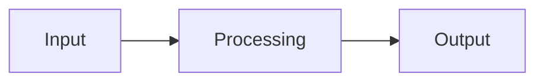

<!--
  Copy this file to README.md inside your own S#-folder before editing.
  Fill in every section. Delete instructional comments (like this one) as you go.
-->

# [Component Name]

**Owner:** [Full Name]
**Sub-topic:** S[#] — [Sub-topic title from assignment sheet]
**Status:** Not Started / In Progress / In Review / Done
**Last Updated:** YYYY-MM-DD

---

## 1. Scope

**In scope:**
-

**Out of scope:**
-

---

## 2. Objective

One paragraph: what this component does and why it exists within Team B's engine.

---

## 3. Design / Architecture

Diagram (Mermaid) and a short walkthrough of how this component works internally.

---

## 4. Interfaces Exposed

What other components (or Team A) can call into this one. Table format:

| Interface | Called by | Purpose |
|---|---|---|
| | | |

---

## 5. Interfaces Consumed

What this component depends on from `contracts/` or from other owners.

| Dependency | Source | Purpose |
|---|---|---|
| | | |

---

## 6. Data Model Additions

Any fields this component needs added to the canonical `consent-data-model.md`. Propose here first, then raise for review before editing the shared contract.

---

## 7. DPDP / GDPR Mapping

| Section / Article | Obligation | How this component addresses it |
|---|---|---|
| | | |

---

## 8. Research Notes & Benchmarks

Reference platforms reviewed (OneTrust, BigID, Privitar, Securiti.ai, TrustArc, etc.), what they do, and what's different about this approach.

---

## 9. Open Questions / Risks

-

---

## 10. Status Log

| Date | Update |
|---|---|
| | |