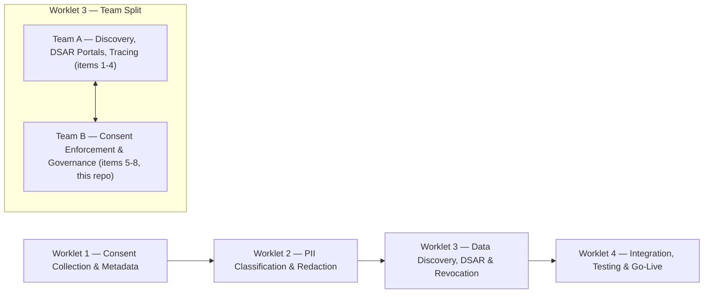
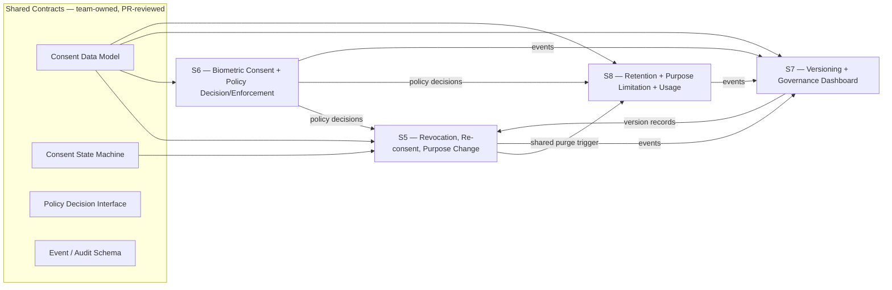

<div align="center">

# Team B — Consent Enforcement & Data Governance

### Worklet 3 (W3) — Data Discovery, DSAR & Revocation
Aegis Agent · AI-Driven Consent Governance & Privacy Enforcement Platform (PRISM CMP)

<br>


</div>

---

> [!IMPORTANT]
> **The thesis in one line.** Team B does not own four separate projects — it owns one **consent enforcement and governance engine** with four modules (revocation, biometric policy, versioning, retention) that read and write the same consent state. The shared contracts in [`/contracts`](./contracts) are the source of truth every module must agree with before it agrees with itself.

---

## Table of Contents

| # | Section |
|---|---|
| 1 | [Team Roster & Components](#1-team-roster--components) |
| 2 | [Where Team B Fits in the Project](#2-where-team-b-fits-in-the-project) |
| 3 | [System Interdependency Map](#3-system-interdependency-map) |
| 4 | [Shared Contracts](#4-shared-contracts) |
| 5 | [Known Overlaps & Working Agreements](#5-known-overlaps--working-agreements) |
| 6 | [Repository Structure](#6-repository-structure) |
| 7 | [Documentation Standard](#7-documentation-standard) |
| 8 | [Status Tracker](#8-status-tracker) |
| 9 | [Timeline — Month 1 Focus](#9-timeline--month-1-focus) |
| 10 | [Regulatory Quick Reference](#10-regulatory-quick-reference) |

---

## 1. Team Roster & Components

| # | Owner | Sub-Topic | Component | Folder |
|---|---|---|---|---|
| 5 | Vishaal Pillay | Revocation Orchestration + Re-consent & Purpose Change Management | Dynamic Consent Management Engine | [`S5-revocation-orchestration`](./S5-revocation-orchestration) |
| 6 | Srikesh Praveen | Biometric Consent & Governance + Consent-Aware Policy Enforcement | Biometric Consent & Policy Enforcement Framework | [`S6-biometric-consent-policy-enforcement`](./S6-biometric-consent-policy-enforcement) |
| 7 | Nilesh Pratap Singh Deora | Consent Versioning & Policy Version Control + Consent Analytics & Governance Dashboard | Consent Governance & Analytics Platform | [`S7-consent-versioning-governance`](./S7-consent-versioning-governance) |
| 8 | N D Jitendra | Data Retention & Purpose Limitation Management + Dataset Usage Tracking & Monitoring | Data Lifecycle & Retention Management | [`S8-retention-purpose-limitation`](./S8-retention-purpose-limitation) |

---

## 2. Where Team B Fits in the Project

Worklet 3 covers Data Discovery, DSAR, and Revocation across the Aegis Agent / PRISM CMP platform.

> [!NOTE]
> **Assumption, to be confirmed with mentors:** Worklet 3's eight assigned sub-topics split into two teams — Team A (items 1–4: data subject / DSAR portals, discovery, tracing, action execution) and Team B (items 5–8, this repository: consent state-change enforcement and governance). Team B's revocation and purge flows are expected to call into Team A's discovery and action-execution layer to locate and act on data. Confirm this boundary explicitly before Month 2 integration work begins.



---

## 3. System Interdependency Map



Read this as: the four components are peers, but they only stay compatible if all four treat `contracts/` as authoritative rather than each maintaining a private copy of the data model or state machine.

---

## 4. Shared Contracts

| File | Defines | Primary drafter | Reviewed by |
|---|---|---|---|
| [`consent-data-model.md`](./contracts/consent-data-model.md) | Canonical ConsentRecord fields (extends W1's model with versioning, purpose, retention, biometric tier) | TBD | All |
| [`consent-state-machine.md`](./contracts/consent-state-machine.md) | States and transitions: Draft → Presented → Active → Suspended → Revoked / Expired → Purged, plus Re-consent | S5 owner | All |
| [`policy-decision-interface.md`](./contracts/policy-decision-interface.md) | Contract for "is this action allowed?" — inputs (subject, consent state, purpose, resource) → allow / deny / redact | S6 owner | All |
| [`event-audit-schema.md`](./contracts/event-audit-schema.md) | Event shape emitted by S5/S6/S8 and consumed by S7's dashboards | S7 owner | All |

> [!WARNING]
> Changes to any file in `contracts/` should go through review by all four owners before merge. This is the single control that prevents the four components from silently diverging.

---

## 5. Known Overlaps & Working Agreements

| Overlap | Components | Proposed split | Status |
|---|---|---|---|
| Deletion cascade | S5 (revocation purge) vs. S8 (retention-expiry purge) | One shared purge orchestrator, triggered by either revocation or retention expiry — not two separate implementations | Proposed, confirm at kickoff |
| Purpose handling | S5 (purpose *change*, triggers re-consent) vs. S8 (purpose *limitation*, enforced at query/usage time) | S5 owns the change event; S8 owns enforcement at point of use | Proposed, confirm at kickoff |
| Dashboards | S7 (governance dashboard) vs. S8 (usage monitoring dashboard) | One dashboard platform, two views, sharing the event schema | Proposed, confirm at kickoff |

---

## 6. Repository Structure

```
Samsung-Prism-Research/
├── README.md
├── CONTRIBUTOR-TEMPLATE.md
├── contracts/
│   ├── consent-data-model.md
│   ├── consent-state-machine.md
│   ├── policy-decision-interface.md
│   └── event-audit-schema.md
├── S5-revocation-orchestration/
│   └── README.md
├── S6-biometric-consent-policy-enforcement/
│   └── README.md
├── S7-consent-versioning-governance/
│   └── README.md
├── S8-retention-purpose-limitation/
│   └── README.md
```

---

## 7. Documentation Standard

Every component folder starts from [`CONTRIBUTOR-TEMPLATE.md`](./CONTRIBUTOR-TEMPLATE.md), copied to `README.md` inside the owner's folder. This keeps all four documents structurally comparable during cross-review — a reviewer should be able to find "what this exposes" and "open questions" in the same place across every doc.

---

## 8. Status Tracker

| Component | Owner | Status | Last Updated |
|---|---|---|---|
| S5 — Revocation Orchestration | Vishaal Pillay | In Progress | — |
| S6 — Biometric Consent & Policy Enforcement | Srikesh Praveen | Not Started | — |
| S7 — Versioning & Governance Dashboard | Nilesh Pratap Singh Deora | Not Started | — |
| S8 — Retention & Purpose Limitation | N D Jitendra | Not Started | — |

---

## 9. Timeline — Month 1 Focus

Per the overall project timeline, Month 1 covers study and benchmarking of reference platforms, requirements gathering, DPDP mapping, and architecture sign-off. For Team B, Week 1 deliverables are design briefs and interface drafts — not implementation:

- Canonical consent data model and state machine drafted in `contracts/`
- Policy Decision Interface first draft (blocks S5 and S8 downstream)
- One-page component brief per owner: scope, interfaces exposed/consumed, DPDP/GDPR mapping, one competitor benchmark

---

## 10. Regulatory Quick Reference

| Framework | Section / Article | Primarily covered by |
|---|---|---|
| DPDP 2023 | S.5–11 (Consent) | S5, S7 (versioning ties to consent validity) |
| DPDP 2023 | S.12–17 (Data Fiduciary — retention, security, accountability) | S8 |
| DPDP 2023 | S.18–22 (Data Subject Rights) | S5 |
| GDPR | Art. 6, 7 (Lawful basis, consent) | S5, S6 |
| GDPR | Art. 15–22 (Data subject rights) | S5 |
| GDPR | Art. 25 (Privacy by design/default) | S6 |