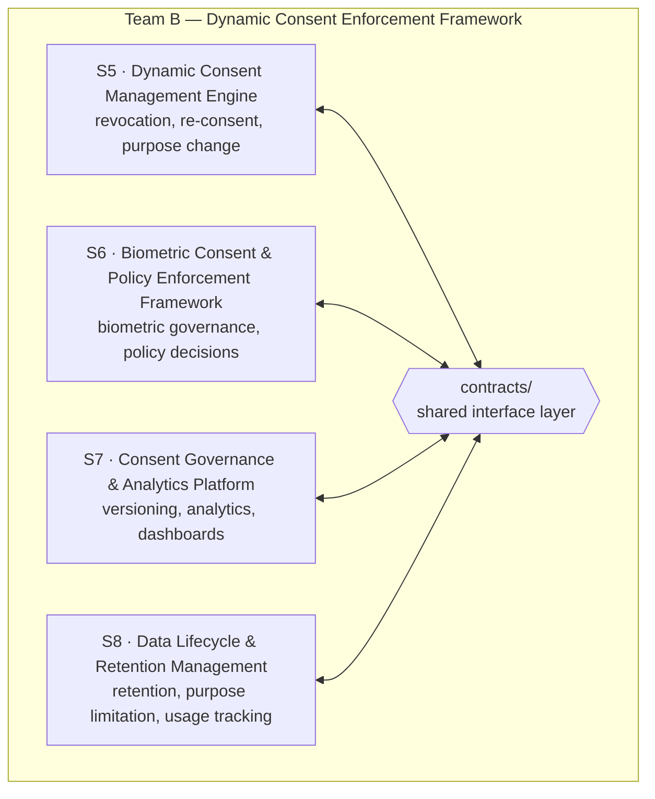
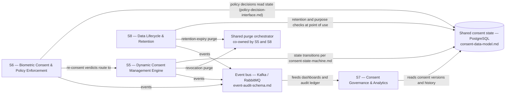

# Aegis Agent — Team B · Consent Enforcement & Data Governance

**Dynamic Consent Enforcement Framework** · Work Packages S5–S8

Part of **Aegis Agent**, an AI-driven Consent Governance & Privacy Enforcement Platform enabling compliant, traceable, privacy-preserving acquisition, management, and use of multimodal data across an enterprise.

 

---

> [!IMPORTANT]
> **Thesis.** Team B is not four separate projects — it is **one consent-enforcement and governance engine** with four modules (revocation, biometric policy, versioning/analytics, retention) that read and write the **same consent state**. The shared interface contracts in `contracts/` are the source of truth every module must conform to before it agrees with itself.

---

## Table of Contents

- [Team Roster & Components](#team-roster--components)
- [Where Team B Fits in the Project](#where-team-b-fits-in-the-project)
- [System Interdependency Map](#system-interdependency-map)
- [Shared Contracts](#shared-contracts)
- [Known Overlaps & Working Agreements](#known-overlaps--working-agreements)
- [Documentation Standard](#documentation-standard)
- [Tech Stack](#tech-stack)
- [Timeline & Milestones](#timeline--milestones)
- [Regulatory Quick Reference](#regulatory-quick-reference)

---

## Team Roster & Components

| WP | Owner | Sub-topic | Component | Folder |
|---|---|---|---|---|
| S5 | Vishaal Pillay | Revocation Orchestration + Re-consent & Purpose Change Management | Dynamic Consent Management Engine | [S5-revocation-orchestration](S5-revocation-orchestration/) |
| S6 | Srikesh Praveen | Biometric Consent & Governance + Consent-Aware Policy Enforcement | Biometric Consent & Policy Enforcement Framework | [S6-biometric-consent-policy-enforcement](S6-biometric-consent-policy-enforcement/) |
| S7 | Nilesh Pratap Singh Deora | Consent Versioning & Policy Version Control + Consent Analytics & Governance Dashboard | Consent Governance & Analytics Platform | [S7-consent-versioning-governance](S7-consent-versioning-governance/) |
| S8 | N D Jitendra | Data Retention & Purpose Limitation Management + Dataset Usage Tracking & Monitoring | Data Lifecycle & Retention Management | [S8-retention-purpose-limitation](S8-retention-purpose-limitation/) |

**Team deliverable:** the Dynamic Consent Enforcement Framework — the enforcement and governance core of the Aegis Agent platform.

---

## Where Team B Fits in the Project

Aegis Agent is built by 16 students across four teams, organized by Work Packages S1–S16. The master project specification (Aegis_Agent) is the authoritative source of truth for scope and boundaries.

| Team | Scope | Work Packages | Team Deliverable |
|---|---|---|---|
| Team A | Regulatory & Consent Governance | S1–S4 | Complete Consent Governance Platform |
| **Team B — this repository** | **Consent Enforcement & Data Governance** | **S5–S8** | **Dynamic Consent Enforcement Framework** |
| Team C | AI Governance & Privacy | S9, S10, S11, S13 | AI Privacy & Governance Platform |
| Team D | Security, Audit & UX | S12, S14, S15, S16 | Secure Enterprise Privacy Platform |

**Platform-level success metrics (from the master specification):** ≥ 99% consent capture & governance accuracy · ≥ 98% traceability between consent records and datasets · 100% auditability of consent, privacy, and DSAR activities.

> [!NOTE]
> **Key assumption, pending mentor confirmation:** S6 and S7 have consent-management overlap with the consent-capture side of the platform. The boundary between Team B (enforcement and governance) and consent capture is assumed but not yet ratified; interfaces must be confirmed with the relevant owners before Month-2 integration.

Within Team B, all four modules are peers arranged around the shared interface layer:

---

## System Interdependency Map

All four modules operate against the same consent state; the map below shows who writes, who reads, who decides, and who observes.

Read this as: the modules stay compatible only if all four treat `contracts/` as authoritative, rather than each maintaining a private copy of the data model, state machine, decision interface, or event schema.

---

## Shared Contracts

The `contracts/` directory is being created as the Week-2 interface-contract deliverable. The four files below are its committed scope; file names are shown unlinked until the directory lands.

| File | Defines | Owner | Reviewed by |
|---|---|---|---|
| `consent-data-model.md` | Canonical `ConsentRecord` and related entities | Shared | All four owners |
| `consent-state-machine.md` | States and legal transitions: Draft → Presented → Active → Suspended → Revoked / Expired → Purged, plus the re-consent path | S5 | All four owners |
| `policy-decision-interface.md` | The "is this action allowed?" contract: inputs (subject, consent state, purpose, resource) → allow / deny / redact / re-consent | S6 | All four owners |
| `event-audit-schema.md` | Event shape emitted by S5, S6, and S8 and consumed by S7 dashboards and the audit ledger | S7 | All four owners |

> [!WARNING]
> **Review gate:** changes to any file in `contracts/` must be reviewed by all four owners before merge. This is the single control preventing the four modules from silently diverging.

---

## Known Overlaps & Working Agreements

| Overlap | Between | Working agreement |
|---|---|---|
| Deletion cascade | S5 (revocation purge) · S8 (retention-expiry purge) | One shared purge orchestrator, co-owned by S5 and S8 — a single implementation triggered by either revocation or retention expiry |
| Purpose handling | S5 (purpose *change*) · S8 (purpose *limitation*) | S5 owns the purpose-change event, which triggers re-consent; S8 owns enforcement of purpose limitation at query/use time |
| Dashboards | S7 (governance dashboard) · S8 (usage-monitoring dashboard) | One dashboard platform with two views, sharing the event schema defined in `event-audit-schema.md` |

---

## Documentation Standard

Each member's design document follows the section structure of [CONTRIBUTOR-TEMPLATE.md](CONTRIBUTOR-TEMPLATE.md): Scope → Objective → Design / Architecture → Interfaces Exposed → Interfaces Consumed → Data Model Additions → DPDP / GDPR Mapping → Research Notes & Benchmarks → Open Questions / Risks → Status Log. A consistent structure keeps all four documents comparable during cross-review: a reviewer finds "what this exposes" and "open questions" in the same place in every document.

Design documents currently live under person-named files, as shown in [Repository Structure](#repository-structure).

---

## Tech Stack

| Layer | Technology | Primary use within Team B |
|---|---|---|
| Backend services | Python, FastAPI | All modules (S5–S8) |
| Database | PostgreSQL | Consent records, policies, audit metadata (S5–S8) |
| Identity & auth | Keycloak, OAuth 2.0, OpenID Connect, JWT | All modules (S5–S8) |
| Eventing | Apache Kafka / RabbitMQ | Events emitted by S5, S6, S8; consumed by S7 |
| Frontend | React / Next.js, Tailwind CSS | S7 dashboard |
| Caching | Redis | S7 dashboard |
| Monitoring | Prometheus, Grafana, ELK | S8 usage tracking & monitoring |
| Object storage | MinIO / AWS S3 | Multimodal media — referenced, not stored, by Team B |
| Tooling | Docker, Git/GitHub, Swagger/OpenAPI, PyTest, Postman | All modules (S5–S8) |

---

## Timeline & Milestones

| Milestone | Week | Deliverable |
|---|---|---|
| M1 | Week 2 | Architecture, design specifications, and tech stack finalized |
| M2 | Week 4 | Core modules & APIs — Team B scope: consent revocation APIs and the biometric consent prototype |
| M3 | Week 8 | Mid-term integrated prototype |
| M4 | Week 12 | Full platform integration |
| M5 | Week 16 | Final platform, documentation, and research outputs |

**Team B weekly beats:**

| Week | Focus |
|---|---|
| W2 | Design briefs & interface contracts |
| W3 | Database implementation, API design, module repositories |
| W4 | Consent revocation APIs + biometric consent prototype |
| W5 | Data lifecycle + monitoring modules |
| W6 | Policy enforcement + consent analytics |
| W9 | Retention enforcement + governance dashboards |

---

## Regulatory Quick Reference

| Obligation | DPDP 2023 | GDPR | Primarily addressed by |
|---|---|---|---|
| Consent & withdrawal | §6, including withdrawal (verify against the bare act) | Art. 7; withdrawal under Art. 7(3) | S5, S6 |
| Purpose limitation | §§4–6 — processing only for the specified lawful purpose (verify against the bare act) | Art. 5(1)(b) | S8 (enforcement at point of use), S5 (purpose-change events) |
| Right to erasure | §12 — correction and erasure (verify against the bare act) | Art. 17 | S5 + S8 (shared purge orchestrator) |
| Restriction of processing | No direct equivalent; nearest analogue is consent withdrawal under §6 (verify against the bare act) | Art. 18 | S5 (Suspended state), S6 |
| Records of processing activities | Data-fiduciary accountability obligations under §8 (verify against the bare act) | Art. 30 | S7 |
| Privacy by design | §8 obligations, including security safeguards (verify against the bare act) | Art. 25 | All four modules |