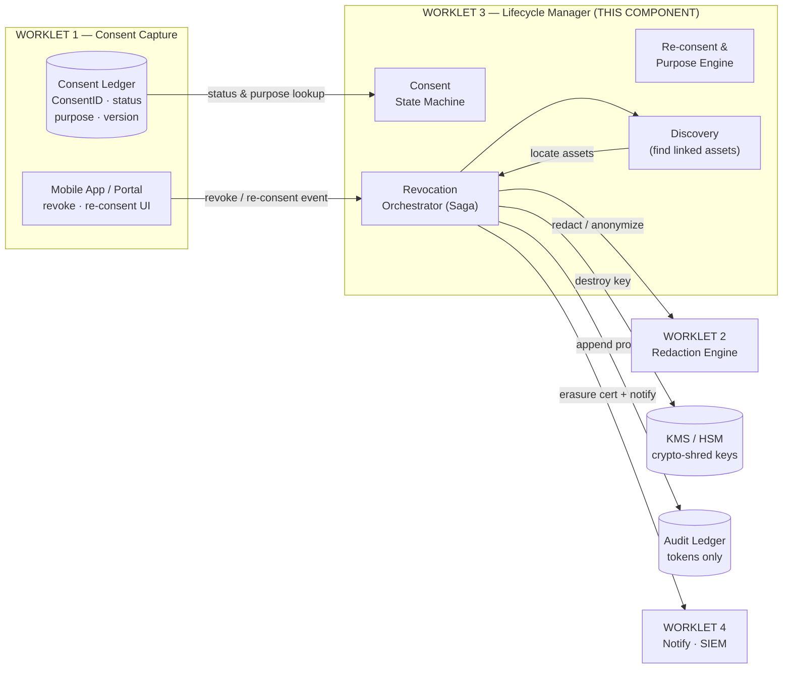
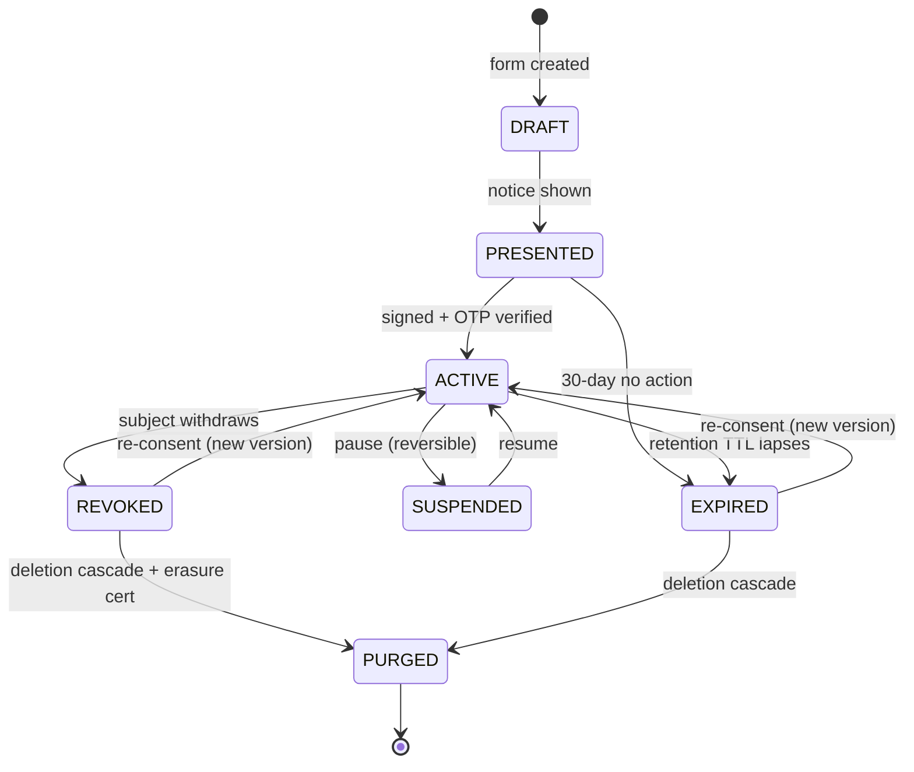
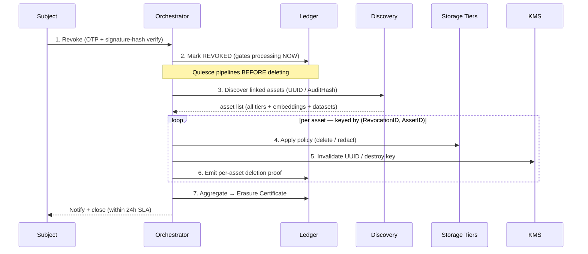
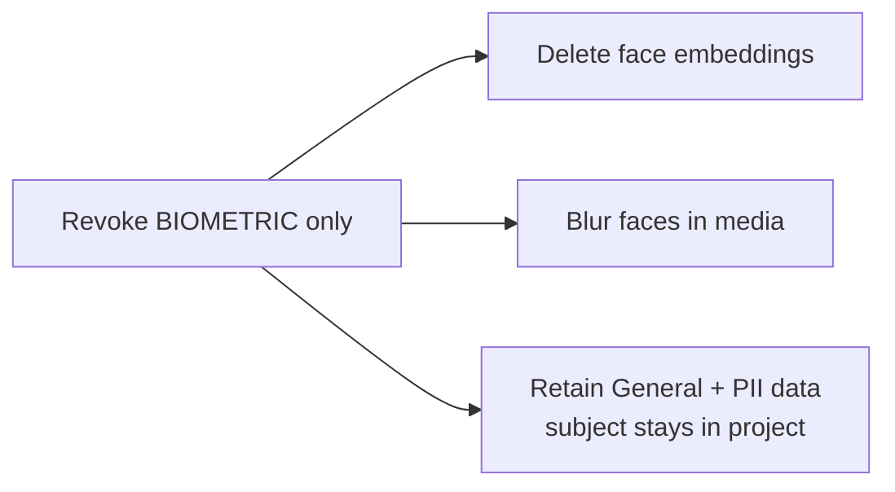
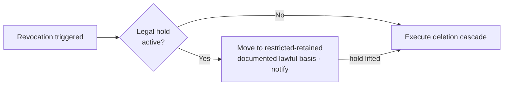
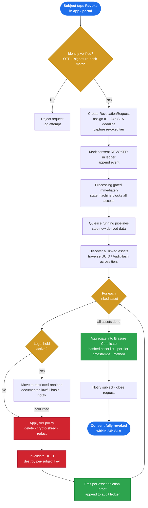

<div align="center">

# Revocation Orchestration + Re-consent & Purpose Change Management

### The consent-state-change enforcement engine of **PRISM CMP**

**Worklet 3 — Data Discovery, DSAR & Revocation**
Aegis Agent · AI-Driven Consent Governance & Privacy Enforcement Platform

<br>


</div>

---

> [!IMPORTANT]
> **The thesis in one line.** Consent has a *lifetime*, not just a creation moment. W1 captures it — **this component enforces every consequence that follows when consent state or scope changes.** Revocation, re-consent, and purpose change are where "privacy-by-design" either holds up or falls apart under scrutiny.

---

## Table of Contents

| # | Section |
|---|---|
| 1 | [What This Topic Actually Is](#1-what-this-topic-actually-is-plain-decode) |
| 2 | [Where This Lives in the Project](#2-where-this-lives-in-the-project) |
| 3 | [The Unified Consent State Machine](#3-the-unified-consent-state-machine) |
| 4 | [Revocation Orchestration: A Distributed Saga](#4-revocation-orchestration-a-distributed-saga) |
| 5 | [The Two Hard Problems](#5-the-two-hard-problems-erasure-vs-immutability) |
| 6 | [Purpose Change Management & Binding](#6-purpose-change-management--binding) |
| 7 | [Granular Revocation & Legal Hold](#7-granular-revocation--legal-hold) |
| 8 | [Data Model & a Stronger AuditHash](#8-data-model--a-stronger-audithash) |
| 9 | [Open Problem & Research Direction](#9-open-problem--research-direction) |
| 10 | [Regulatory Mapping](#10-regulatory-mapping) |
| 11 | [Glossary](#11-glossary) |
| 12 | [Overall Workflow: Tap to Purged](#12-overall-workflow-tap-to-purged) |

---

## 1. What This Topic Actually Is (Plain Decode)

The topic is the **"consent-state-change enforcement"** half of Worklet 3 — everything that happens *after* the grant, when a consent record stops being a simple "Active" state. It has three intertwined pillars:

| Pillar | What it means | What triggers it |
|--------|---------------|------------------|
| **Revocation Orchestration** | A subject withdraws consent. *Not one DB update* — a coordinated, multi-step cascade across edge caches, raw / pre-processed / training-ready tiers, vector-DB embeddings, object storage, backups & third-party copies. Each step retryable, ordered, auditable, provable. | Subject revokes via app / portal |
| **Re-consent** | Re-acquiring a *fresh, valid* grant — new notice version, new signature, new consent-record version — and re-binding data. | Consent expired; legacy reuse; new purpose; material notice change; subject opts back in |
| **Purpose Change Management** | Enforcing **purpose limitation**: data consented for purpose X cannot silently be used for purpose Y. Detect the mismatch, quarantine, trigger re-consent. | Org changes / adds a processing purpose |

> [!NOTE]
> **The unifying idea:** consent **state** *(Active / Revoked / Expired…)* and consent **scope** *(General / PII / Biometric)* are the **access-control truth for all data**. This component is the engine that *enforces consequences* when either one changes.

---

## 2. Where This Lives in the Project

This is the W3 deliverable named **"Revocation & Life Cycle Manager and Integrated Demo."** It is the **dynamic counterpart to W1**: W1 owns the consent *record + its status field and UI*; **W3 owns the workflow that executes the side-effects of a transition**, and enforcement at point-of-use.



> [!NOTE]
> **Architectural boundary.** The revocation trigger originates at W1's UI; W3 owns orchestrating the consequences across every storage tier. The linkage that makes orchestrated purge possible is the **UUID** and **AuditHash** binding every asset to its consent record. Revoke consent → UUID invalidated → downstream data inaccessible → **"zero orphaned data."** This binding is what gets traversed to locate every asset that must be purged.

---

## 3. The Unified Consent State Machine

Two overlapping diagrams in the source deck, reconciled into one rigorous machine:



| Rule | Detail |
|------|--------|
| **The one enforcement rule** | Processing is permitted **only in `ACTIVE`.** Every other state blocks downstream access. |
| **Auto-deletion** | `REVOKED` and `EXPIRED` trigger automated deletion workflows — no manual intervention. |
| **Suspend ≠ delete** | `SUSPENDED` halts processing but **retains** data (≈ GDPR Art. 18 *restriction of processing*). |
| **Implementation** | **Event sourcing** — store consent *events* in an append-only log; compute current state as a projection. Auditability & tamper-evidence come for free. |

> [!WARNING]
> **Policy choice.** If consent is **purged on expiry**, re-consent *cannot resurrect* the data — it only governs future capture. `SUSPENDED`-and-retain vs. `EXPIRE`-and-purge is therefore a deliberate design decision, not an implementation detail.

---

## 4. Revocation Orchestration: A Distributed Saga

A revocation is a **durable, idempotent, multi-system saga** — never a single update.



**The 7-step cascade:** `authenticate` → `mark REVOKED first` → `discover all linked assets` → `apply per-asset policy` → `invalidate UUID / crypto-shred` → `emit per-asset proof` → `aggregate into erasure certificate`.

### Why a durable workflow engine (Temporal.io), not a cron script

| Property | Why revocation needs it | Naïve script |
|----------|-------------------------|--------------|
| **Durable execution** | Survives crashes mid-cascade; resumes exactly where it stopped | Loses state |
| **Retries + timers** | Per-step backoff; an **SLA timer** alerting ~20h | Manual |
| **Saga / compensation** | Coordinated multi-system action with failure handling | None |
| **Signals (human-in-loop)** | Wait for DPO approval, then continue | Hard |
| **Idempotency** | Safe retries via `(RevocationID, AssetID)` keys | Double-acts |

> [!CAUTION]
> **Core guarantees:**
> - **Idempotency** — every step is keyed by `(RevocationID, AssetID)`. Deletion is naturally idempotent; proof emission and counters are not, so they must be keyed too.
> - **Ordered quiescing** — new processing stops **before** deletion begins, so no derived data is created mid-purge.
> - **Forward-recovery, not rollback** — deletion cannot be undone. On unrecoverable failure the request is marked **partially-failed**, the DPO is alerted, and the issue is escalated. Recovery means governance and re-attempt, not undo.

---

## 5. The Two Hard Problems: Erasure vs. Immutability

Two foundational tensions arise when an immutable audit trail must coexist with data-erasure obligations.

<table>
<tr>
<th width="50%">Problem 1 — Erasure vs. Immutable Ledger</th>
<th width="50%">Problem 2 — Erasure vs. Backups & Archives</th>
</tr>
<tr>
<td>

*"How can you honor the right to be forgotten **and** keep a tamper-evident, immutable audit ledger?"*

**Resolution:** the ledger stores **only hashes / tokens / AuditHash — never raw PII.** So you **delete the data and retain the proof.** The ledger isn't subject to erasure *because it contains no personal data* — just cryptographic evidence (asset-ID hashes, timestamps, erasure certificates).

</td>
<td>

*"How do you erase one person from an immutable / write-once backup you cannot surgically edit?"*

**Resolution — crypto-shredding:** encrypt each subject's data under a **per-subject / per-consent key**. To "delete," **destroy the key** → ciphertext is irrecoverable *everywhere, including backups*. Complement with suppression / tombstone lists (restored backups re-apply deletions) + a documented rotation window.

</td>
</tr>
</table>

> [!NOTE]
> Both resolutions are already supported by the platform design: a token-only ledger, per-project cryptographic key management, and AES-256 encryption.

---

## 6. Purpose Change Management & Binding

Purpose is modeled as a **first-class, versioned entity** — not a free-text label.

```mermaid
flowchart TD
    REQ["Processing request<br/>declares PurposeID + Version"] --> CHK{Match active<br/>consent binding?}
    CHK -->|match| ALLOW["ALLOW processing"]
    CHK -->|mismatch| BLOCK["BLOCK + quarantine assets"]
    BLOCK --> COMPAT{Compatibility test<br/>GDPR Art. 6&#40;4&#41;}
    COMPAT -->|compatible| REVIEW["DPO review / documented basis"]
    COMPAT -->|incompatible| RECON["Trigger fresh re-consent"]
```



- Maintain a binding `{ConsentID, AssetUUID, PurposeID, PurposeVersion}`.
- Enforce at **access time** — every pipeline declares a `PurposeID`; mismatch → block.
- **Compatibility test** factors: link to original purpose, context, data nature, consequences, safeguards.
- Under DPDP, consent is purpose-**specific** → a genuinely new purpose generally requires **fresh consent**, not just a compatibility argument.

---

## 7. Granular Revocation & Legal Hold

### Scope-aware cascade — not all-or-nothing

The three-tier consent model (**General / PII / Biometric**) is *independently revocable*, so the deletion cascade is **parameterized by the revoked tier.**



### Legal hold overrides deletion



> [!IMPORTANT]
> A legal hold **blocks deletion even on revocation.** The orchestrator checks for holds first, retains the data under a documented lawful basis, and resumes deletion automatically once the hold lifts.

---

## 8. Data Model & a Stronger AuditHash

### Extended `ConsentRecord` (event-sourced, append-only)

```
ConsentRecord
├─ ConsentID, ConsentVersion, ParentConsentID   ← re-consent lineage
├─ SubjectID, ProjectID
├─ PurposeID, PurposeVersion                     ← purpose binding
├─ ConsentTier  (General | PII | Biometric)      ← granular revocation
├─ Scope, StartAt, ExpiryAt
├─ SignatureHash, OTPVerified
├─ Status  (Draft|Presented|Active|Suspended|Revoked|Expired|Purged)
└─ PrevEventHash                                 ← hash chain

ConsentPurposeBinding { ConsentID, AssetUUID, PurposeID, PurposeVersion }
RevocationRequest     { id, ConsentID, tier, requestedAt, slaDeadline, state }
ErasureCertificate    { RevocationID, ConsentID, assetHashes[], perTierTimestamps, method, signedBy }
AuditEvent            (append-only, hash-chained, tokens only)
```

### AuditHash: Critique and Proposed Improvement

> [!WARNING]
> **Current:** `AuditHash = hash(SubjectList ⊕ ConsentStatus ⊕ ProjectID ⊕ MediaID)`
> The **XOR (⊕) binding is cryptographically weak** — it's commutative/associative (so **input ordering is lost**; Subject vs. Status vs. Project become indistinguishable), and identical inputs cancel out, enabling manipulation.

**Proposed fix:**

```
AuditHash = SHA256( len‖Subject ‖ len‖Status ‖ len‖Project ‖ len‖Media )   ← canonical, length-prefixed
RecordHash = SHA256( AuditHash ‖ PrevRecordHash )                          ← chained, tamper-evident
```

Canonical serialization with domain separation / length-prefixing (or an HMAC), **chaining each record to the previous one** (Merkle / blockchain-style) so the *whole ledger* is tamper-evident — not just individual records.

---

## 9. Open Problem & Research Direction

> [!NOTE]
> **Limitation.** An individual data point cannot easily be removed from an already-trained model.

| Mitigation | How |
|------------|-----|
| **Consent-gated ingestion** | Admit data into training *only after* consent validation → revoked data **never enters** in the first place. |
| **Lineage-based deletion propagation** | Track third-party shares in lineage; send contractual deletion-propagation requests. |
| **Machine unlearning** | The active research frontier → ties directly to the worklet's stated **conference / journal publication + patent** goals. |

---

## 10. Regulatory Mapping

> [!NOTE]
> The **obligations** below are correct; treat exact section numbers as "verify against the bare act" — the source deck's DPDP citations are GDPR-flavored in places.

| Obligation | DPDP 2023 *(verify §)* | GDPR |
|------------|------------------------|------|
| Withdrawal as easy as giving; cease processing on withdrawal | S.6 | Art. 7(3) |
| Erase on withdrawal / purpose served, unless legally required | S.8, S.12 | Art. 17 |
| Purpose limitation (purpose-specific consent) | S.6 | Art. 5(1)(b); 6(4) |
| Restriction of processing (≈ `SUSPENDED`) | — | Art. 18 |

---

## 11. Glossary

| Term | Full form | One-line meaning |
|------|-----------|------------------|
| **SLA** | Service Level Agreement | Time-bound commitment on service delivery (here: 24h purge, ≤15d DSAR). |
| **DSAR** | Data Subject Access Request | Legal request by a person to exercise privacy rights. |
| **DPDP** | Digital Personal Data Protection Act 2023 | India's data-privacy law. |
| **GDPR** | General Data Protection Regulation | EU privacy law; global gold standard. |
| **PII** | Personally Identifiable Information | Any data that can identify a real person. |
| **DPO** | Data Protection Officer | The org's designated privacy-compliance officer. |
| **UUID** | Universally Unique Identifier | Globally unique binding key for every record/asset. |
| **AuditHash** | — | Cryptographic fingerprint linking consent to data assets. |
| **Saga** | — | A long-running, multi-step transaction with per-step compensation. |
| **Crypto-shredding** | — | "Deleting" data by destroying its encryption key. |

---

## 12. Overall Workflow: Tap to Purged

The complete journey — from the moment a subject taps **Revoke** to the data actually being gone, with cryptographic proof, inside the 24-hour SLA. Everything in this document converges here.



### Phase Breakdown

| Phase | Steps | What's being guaranteed |
|-------|-------|--------------------------|
| **1 · Intake & Authenticate** | Revoke → identity check → create request | A destructive action is never executed for an unverified requester. |
| **2 · Gate & Discover** | Mark `REVOKED` → quiesce pipelines → discover assets | Processing stops *before* deletion begins; no orphaned or mid-purge data. |
| **3 · Execute (per asset)** | Legal-hold check → apply policy → invalidate / crypto-shred → emit proof | Scope-aware, idempotent, hold-aware deletion with per-asset evidence. |
| **4 · Prove & Close** | Aggregate erasure certificate → notify → done | Tamper-evident proof of erasure, delivered inside the 24-hour SLA. |

> [!NOTE]
> This diagram is the canonical reference for the complete revocation lifecycle. The **gate-before-delete** ordering, the **legal-hold branch**, and **proof emitted on every asset** are the three guarantees that define the design.

---

<div align="center">

### Key Takeaways

**1.** *"Delete the data, keep the proof"* — token-only ledger + crypto-shredding solves erasure-vs-immutability.
**2.** *Consent state is the access-control truth* — a durable, idempotent saga enforces it across every tier with cryptographic proof.

<br>

**Worklet 3 · PRISM CMP · Samsung Research**

</div>
