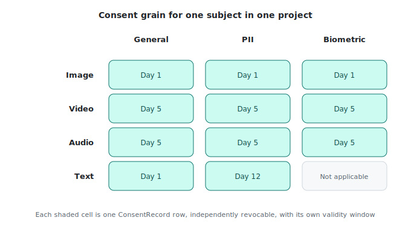
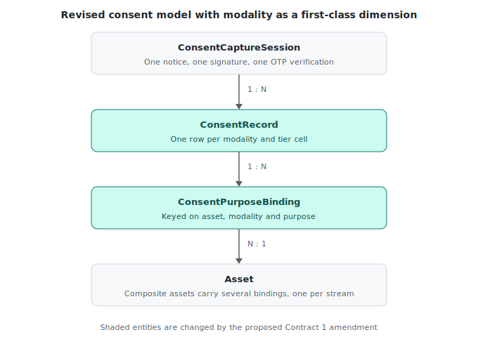
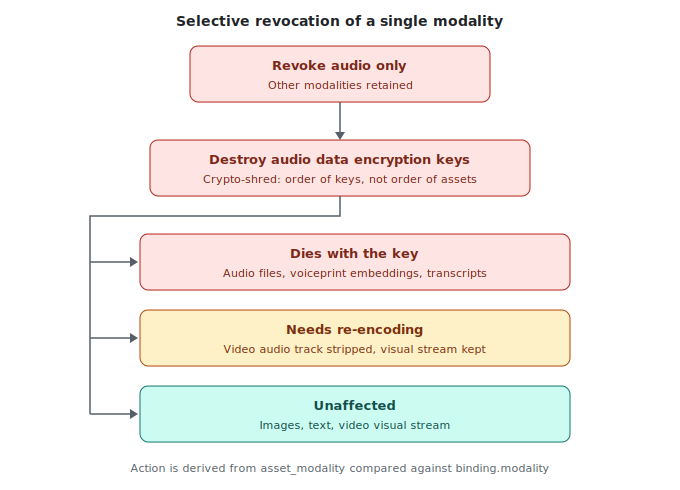
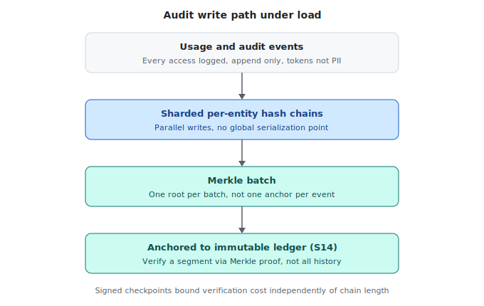

# Week 3 — Consent Grain, Selective Revocation, and Scale

**Work Package:** S5 — Revocation Orchestration, Re-consent and Purpose Change Management
**Team:** B — Consent Enforcement and Data Governance
**Status:** In Progress
**Last Updated:** 2026-07-22


---

## Contents

1. [Questions raised in review and their resolutions](#1-questions-raised-in-review-and-their-resolutions)
   - [1.1 Multiple consents per project](#11-multiple-consents-per-project)
   - [1.2 Selective revocation of a single modality](#12-selective-revocation-of-a-single-modality)
   - [1.3 Scalability and full auditability](#13-scalability-and-full-auditability)
2. [Database implementation plan](#2-database-implementation-plan)
3. [API design](#3-api-design)
4. [Open items requiring sign-off](#4-open-items-requiring-sign-off)
5. [Planned work for Week 4](#5-planned-work-for-week-4)

---

## 1. Questions raised in review and their resolutions

Three questions were raised in the previous review. Each is restated below, followed by the analysis performed and the proposed resolution.

| # | Question | Resolution status |
|---|---|---|
| Q1 | One project may hold multiple consents (video, audio, image, text) captured across multiple days. How are these mapped and managed? | Resolved — requires a Contract 1 amendment |
| Q2 | If a subject revokes only audio for a project and retains the rest, how is that executed? | Resolved — depends on Q1 |
| Q3 | How does the platform sustain 5,000+ multimodal captures per day with 100% auditability of consent, privacy and DSAR activity? | Resolved — three bottlenecks identified and addressed |

---

### 1.1 Multiple consents per project

#### 1.1.1 Problem statement

A single project collects several data modalities from the same subject. Those modalities are not consented simultaneously: a subject may grant image and text consent at enrolment, add video and audio at a later session, and extend text-PII consent later still. The platform must represent this as one coherent project enrolment while keeping each grant independently governable.

#### 1.1.2 Finding

The requirement is not expressible under the current canonical data model.

`contracts/consent-data-model.md` defines the live-consent uniqueness invariant (INV-5) as:

```sql
CREATE UNIQUE INDEX uq_live_consent
    ON consent_record (subject_id, project_id, consent_tier, purpose_id)
    WHERE status IN ('PRESENTED','ACTIVE','SUSPENDED');
```

Modality does not appear in the grain. Two live consent records for the same subject, project, tier and purpose that differ only by modality — for example PII-tier consent for audio alongside PII-tier consent for video — violate this index.

Modality is currently carried inside `scope JSONB`, which is untyped, unindexed, and cannot participate in a uniqueness constraint or in the sub-50 ms policy decision path.

> [!NOTE]
> The original platform specification defined `ConsentRecord.Scope` as `image / video / audio / text`. Modality was a first-class field in the source design and was generalised into the `scope` descriptor during the Week 2 four-owner reconciliation. The reconciliation was correct in intent — it replaced free-text fields with structured ones — but the modality dimension was lost in the process. The proposal below restores it in a typed, indexable form.

#### 1.1.3 The consent grain is a matrix, not a list

Modality and consent tier are orthogonal. A video simultaneously carries biometric data (a face), PII (a visible identity document) and general content. Audio carries biometric data (a voiceprint) and PII (a spoken identifier). The true grain of consent for one subject in one project is therefore a matrix of cells, each independently grantable, each with its own validity window and grant date.



The naive cross-product yields 4 modalities × 3 tiers = 12 cells. `TEXT × BIOMETRIC` is not meaningful, reducing the valid set to **11 cells**.

#### 1.1.4 Options evaluated

| Option | Grain | Assessment |
|---|---|---|
| **A. `modality` column on `ConsentRecord`** | `(subject, project, modality, tier, purpose)` | **Selected.** Flat, indexable, single state machine, no join on the decision path. |
| B. Child `consent_grant` table | Record per signature event; grants per cell | Viable, rejected. Forces a second state machine and a rollup rule for records whose grants disagree. Grants acquire their own validity window, retention state and revocation linkage, converging on Option A with an additional join. |
| C. `modalities modality[]` array | One record per capture session | Rejected. A subset cannot be revoked without forking the record; overlap between live records cannot be enforced declaratively. |
| D. Encode modality into `PurposeVersion` | Unchanged | Rejected. Multiplies the purpose catalogue fourfold, conflates *why* processing occurs with *what* is processed, and pushes the change into an upstream artifact that is read-only to Team B. |
| E. Modality on assets and bindings only | Unchanged | Rejected. Cannot represent "the subject never consented to audio" — absence of bound assets is not equivalent to absence of consent, and per-modality expiry becomes unrepresentable. |

The decisive factor for Option A is that it leaves **Contract 2 (the consent state machine) completely unchanged**. Option B would require redefining record-level status as a function of disagreeing child grants, invalidating the one contract the team has already ratified.

#### 1.1.5 Resolution: flat grain with a capture-session parent

Option A has one genuine weakness. A single signed notice covering several cells would otherwise be represented as several rows carrying a duplicated `signature_hash`, which misrepresents the legal artifact: one signature event becomes six apparent signatures.

The resolution separates the two concepts, which have different cardinality. **`ConsentCaptureSession`** owns the signed artifact — notice version, signature, OTP verification, channel, timestamp. **`ConsentRecord`** owns consent state, one row per matrix cell, referencing the session that created it.



`signature_hash` and `otp_verified` remain on `ConsentRecord` as denormalised immutable copies, with the session as the authoritative source. This is deliberate: S6, S7 and S8 already consume those fields from the canonical JSON representation, and removing them would widen the blast radius of a change that is already major. Denormalising immutable data is an acceptable trade in this instance.

#### 1.1.6 Multi-day collection semantics

Each cell is an independent record with its own `start_at` and `expiry_at`. Two behaviours follow.

**Point-in-time binding.** An asset captured at time *T* binds to the consent version that was `ACTIVE` at *T*, not to whichever version is active at query time. `ConsentPurposeBinding` already stores `consent_version` and `bound_at`, so the model supports this; the resolution logic must be explicitly temporal rather than resolving "the current consent".

**Fail-closed on the coverage gap.** Audio captured on day 3, before audio consent exists on day 5, has no governing consent. The policy decision point resolves this to `RE_CONSENT_REQUIRED / CONSENT_MISSING`. Contract 3 is unambiguous that any unhandled condition or missing data resolves to `DENY`, and that absence of an explicit `ALLOW` is a `DENY`. In practice the edge ingest service must reject or quarantine such a capture before it lands in any storage tier.

---

### 1.2 Selective revocation of a single modality

#### 1.2.1 Problem statement

A subject revokes audio consent for a project while retaining image, video and text consent. The platform must erase everything governed by audio consent, leave everything else intact, and produce evidence of both.

#### 1.2.2 The cross-modal derivative trap

Selective revocation is not a filtered delete over assets whose file type is audio. Audio propagates into artifacts that are not audio files:

| Derived artifact | Physical modality | Governing modality | Required outcome |
|---|---|---|---|
| Voiceprint embedding in the vector store | Vector | AUDIO | Delete |
| Transcript of a recording | TEXT | AUDIO | Delete, despite text consent remaining active |
| Speaker diarisation metadata | Structured | AUDIO | Delete |
| Audio track inside a video container | VIDEO | AUDIO | Strip the stream; retain the container and visual stream |
| Photograph captured in the same session | IMAGE | IMAGE | Retain |

The governing principle is that **a derived asset inherits the most restrictive governing consent of its provenance root**. A transcript is not text the subject consented to; it is audio in a different representation.

#### 1.2.3 Resolution part one: bindings keyed on modality

`ConsentPurposeBinding` uniqueness moves from `(asset_uuid, purpose_id)` to `(asset_uuid, modality, purpose_id)`. A composite asset therefore carries **several bindings** — a video with an audio track holds one binding at `modality = VIDEO` and another at `modality = AUDIO` against the same `asset_uuid`.

The binding records the **governing (provenance-root) modality, not the physical form**. The cascade then derives its action by comparison, with no lineage query required at revoke time:

| `asset_modality` vs `binding.modality` | Cascade action |
|---|---|
| Equal | Delete or crypto-shred the asset |
| Different, composite container | Strip the constituent stream, re-mux, retain the asset |
| Different, derived artifact | Delete — the derivative inherits its parent's governing modality |

#### 1.2.4 Resolution part two: key hierarchy aligned to consent grain

Crypto-shredding is already the platform's answer to the erasure-versus-backups conflict. Extending the key grain to match the consent grain makes selective revocation a key operation rather than an asset enumeration:

```
Project Master Key (KMS / HSM, owned by S12)
└── Subject KEK                        (subject × project)
    └── DEK                            (subject × project × modality × tier)
        └── derived assets encrypted under their PARENT's DEK
```



Three properties follow from this hierarchy:

1. **Revocation is O(keys), not O(assets).** Revoking audio destroys three DEKs (`AUDIO × GENERAL`, `AUDIO × PII`, `AUDIO × BIOMETRIC`) rather than enumerating and deleting *n* assets across seven storage tiers.
2. **Derivatives die structurally.** Because a derived asset is encrypted under its parent's DEK, the transcript problem is solved by construction rather than by a lineage query being correct at execution time.
3. **Composite assets are handled by per-stream encryption.** The video's visual stream is encrypted under the video DEK and its audio stream under the audio DEK. Destroying the audio DEK renders the audio track undecodable in place while the container and visual stream remain valid. A background re-mux then removes the dead stream.

> [!IMPORTANT]
> Crypto-shredding converts the 24-hour purge SLA from a distributed deletion race into a single key-destruction operation followed by lazy garbage collection. Logical erasure becomes immediate and provable; physical reclamation moves off the SLA critical path.

> [!WARNING]
> Property 2 holds only if the derived-asset key inheritance rule is enforced at write time. If any pipeline encrypts a derivative under a freshly generated key rather than its parent's DEK, that derivative silently survives the shred. This must be a hard invariant in the storage layer, not a convention.

---

### 1.3 Scalability and full auditability

#### 1.3.1 Right-sizing the problem

5,000 captures per day is approximately 0.06 per second averaged, or roughly 0.6 per second at a tenfold peak. The capture rate is not the constraint. The load resides in three other places:

| Load source | Approximate daily volume | Why it dominates |
|---|---|---|
| Policy decisions | 10<sup>5</sup>–10<sup>6</sup> | Every read, transform and training-epoch pass invokes the PDP. A 50-epoch training run over 5,000 assets is 250,000 decisions. |
| `UsageRecord` writes | One per access | 100% auditability requires every access to produce an append-only, hash-chained write. |
| Media storage | ~250 GB at 50 MB average | Approximately 90 TB per year; bounded only by S8's retention enforcement. |

#### 1.3.2 Bottleneck one: hash chaining is inherently serial

A chain in which `record_hash[n] = SHA256(... ‖ record_hash[n-1])` carries a strict serial dependency. A single global chain admits one writer at a time and concentrates transaction contention on one chain-head row.

Contract 1 already specifies that `ConsentRecord.record_hash` and `UsageRecord.usage_hash` operate over their own **per-entity chains**, and that S14 anchors record hashes **Merkle-batched** into the immutable ledger. The design below makes that explicit and operational.



- **Shard by `consent_id`**, which is also the Kafka partition key, so chain ordering and event ordering guarantees coincide.
- **Batch event hashes into a Merkle tree** every *N* events or *T* seconds; anchor only the root. Per-event blockchain anchoring is both prohibitively expensive and unnecessary, since a Merkle proof provides per-event verifiability from a single anchored root.
- **Emit signed periodic checkpoints** so that verifying a given month does not require replaying the chain from genesis.

#### 1.3.3 Bottleneck two: policy decisions on the hot path

Contract 3 sets a p99 budget below 50 ms, permits decision caching for up to 30 seconds where `cacheable = true`, and mandates immediate invalidation on `consent.revoked`, `consent.suspended`, `consent.expired` and `notice.version.published{MATERIAL}` — because stale-allow after revocation is the specific failure mode the rule exists to prevent.

Two additions are proposed:

**Epoch tokens rather than pure TTL.** A monotonically increasing `consent_epoch` is maintained per `(subject_id, project_id)`. Every cached decision records the epoch under which it was minted; any consent state change increments the epoch. Validation reduces to an integer comparison and yields immediate correctness rather than a bounded window of incorrectness. TTL is then a memory-reclamation policy, not a correctness mechanism.

**Batch authorisation for pipelines.** A training job submits a dataset manifest once and receives an allow-list plus the current epoch, re-authorising only when the epoch changes. This replaces 250,000 individual calls with one, and provides a natural hook for the pipeline-quiescing step the revocation saga already requires: an epoch increment *is* the quiesce signal.

#### 1.3.4 Bottleneck three: write-path consistency

Contract 4 requires producers to emit asynchronously after the authoritative database write, with the database as source of truth and the bus as propagation. This is a **dual write**: if the database transaction commits and the Kafka publish subsequently fails, the audit stream loses an event and the 100% auditability guarantee is void.

The proposed remedy is the **transactional outbox pattern** — the domain row and an outbox row are written in the same database transaction, and a relay process tails the outbox and publishes with at-least-once delivery. Consumers already deduplicate on `event_id` per Contract 4, so at-least-once delivery is safe.

#### 1.3.5 Mapping to the platform success metrics

| Metric | Mechanism |
|---|---|
| ≥ 98% traceability between consent records and datasets | The `(consent_id, consent_version) → asset_uuid → (purpose_id, purpose_version)` binding, extended with `modality` |
| 100% auditability of consent, privacy and DSAR activity | Outbox → sharded per-entity chains → Merkle batch → S14 anchor; every decision persisted before the caller acts |
| Revocation purge within 24 hours | Crypto-shredding renders logical erasure O(keys); physical garbage collection runs off the critical path |
| ≥ 95% of DSAR requests fulfilled within SLA | DSAR export traverses the same binding graph as revocation discovery; one traversal implementation serves both |

---

## 2. Database implementation plan

### 2.1 Scope and ownership

| Category | Tables | Owner |
|---|---|---|
| Amendments to shared model | `consent_record`, `consent_purpose_binding`, new `modality` enum | Contract 1 — four-owner gate |
| New shared entity | `consent_capture_session` | Proposed by S5, gate-approved |
| S5-owned | `revocation_request`, `revocation_step`, `erasure_certificate`, `reconsent_request`, `purpose_change`, `compatibility_assessment`, `legal_hold`, `event_outbox` | S5 |
| Read model | `subject_project_enrollment` | S5, consumed by S7 dashboard |

### 2.2 Enumerations

```sql
CREATE TYPE modality          AS ENUM ('IMAGE','VIDEO','AUDIO','TEXT');

CREATE TYPE revocation_status AS ENUM (
    'PENDING','DISCOVERING','QUIESCING','PURGING',
    'ON_LEGAL_HOLD','COMPLETED','PARTIAL','FAILED');

CREATE TYPE purge_action      AS ENUM (
    'DELETE_OBJECT','CRYPTO_SHRED_KEY','STRIP_STREAM',
    'DELETE_VECTOR','INVALIDATE_CACHE','NOTIFY_THIRD_PARTY');

CREATE TYPE reconsent_trigger AS ENUM (
    'EXPIRY','POST_REVOCATION_OPT_IN','MATERIAL_NOTICE_CHANGE',
    'PURPOSE_CHANGE','LEGACY_DATA_REUSE');

CREATE TYPE reconsent_status  AS ENUM (
    'REQUESTED','PRESENTED','ACCEPTED','DECLINED','EXPIRED_UNANSWERED');

CREATE TYPE purpose_change_status AS ENUM (
    'SIMULATED','INITIATED','ASSESSING','QUARANTINED',
    'REBOUND','RECONSENT_ROUTED','COMPLETED','ABANDONED');
```

### 2.3 Amendments to the shared consent model

```sql
-- 2.3.1 The signed artifact, lifted out of ConsentRecord
CREATE TABLE consent_capture_session (
    session_id        UUID           PRIMARY KEY,
    subject_id        UUID           NOT NULL,
    project_id        VARCHAR(64)    NOT NULL,
    notice_version_id UUID           NOT NULL
        REFERENCES notice_version(notice_version_id),
    signature_hash    VARCHAR(64)    NOT NULL,
    otp_verified      BOOLEAN        NOT NULL DEFAULT FALSE,
    otp_verified_at   TIMESTAMPTZ    NULL,
    channel           VARCHAR(32)    NOT NULL,   -- MOBILE_APP | WEB_PORTAL | KIOSK
    captured_at       TIMESTAMPTZ    NOT NULL DEFAULT now(),
    session_hash      VARCHAR(64)    NOT NULL,
    CONSTRAINT otp_ts_iff_verified CHECK (
        (otp_verified AND otp_verified_at IS NOT NULL) OR
        (NOT otp_verified AND otp_verified_at IS NULL))
);

-- 2.3.2 ConsentRecord gains modality and session linkage
ALTER TABLE consent_record
    ADD COLUMN modality           modality NULL,
    ADD COLUMN capture_session_id UUID     NULL
        REFERENCES consent_capture_session(session_id);

-- backfill, then tighten (see 2.7)
ALTER TABLE consent_record ALTER COLUMN modality           SET NOT NULL;
ALTER TABLE consent_record ALTER COLUMN capture_session_id SET NOT NULL;

-- 2.3.3 INV-5 revised: modality joins the liveness grain
DROP INDEX uq_live_consent;
CREATE UNIQUE INDEX uq_live_consent
    ON consent_record (subject_id, project_id, modality, consent_tier, purpose_id)
    WHERE status IN ('PRESENTED','ACTIVE','SUSPENDED');

-- 2.3.4 Modality / tier / biometric_type validity matrix
ALTER TABLE consent_record
    ADD CONSTRAINT text_has_no_biometric CHECK (
        NOT (modality = 'TEXT' AND consent_tier = 'BIOMETRIC')),
    ADD CONSTRAINT biometric_type_matches_modality CHECK (
        consent_tier <> 'BIOMETRIC' OR (
            (modality = 'IMAGE' AND biometric_type IN ('FACE','FINGERPRINT')) OR
            (modality = 'VIDEO' AND biometric_type IN ('FACE','GAIT'))        OR
            (modality = 'AUDIO' AND biometric_type = 'VOICE')));

-- 2.3.5 Bindings: modality joins the key, enabling composite assets
ALTER TABLE consent_purpose_binding ADD COLUMN modality modality NOT NULL;
DROP INDEX IF EXISTS uq_active_binding;
CREATE UNIQUE INDEX uq_active_binding
    ON consent_purpose_binding (asset_uuid, modality, purpose_id)
    WHERE revoked_at IS NULL;
CREATE INDEX ix_binding_consent_modality
    ON consent_purpose_binding (consent_id, modality);
```

> [!NOTE]
> If the modality / tier validity matrix must vary per project, the two `CHECK` constraints in 2.3.4 should be promoted to a `modality_tier_allowed` reference table with a foreign key. A `CHECK` constraint is proposed for the first iteration.

### 2.4 S5-owned entities

```sql
-- 2.4.1 Revocation request
CREATE TABLE revocation_request (
    revocation_id     UUID              PRIMARY KEY,
    subject_id        UUID              NOT NULL,
    project_id        VARCHAR(64)       NOT NULL,
    scope_modalities  modality[]        NULL,   -- NULL means all modalities
    scope_tiers       consent_tier[]    NULL,   -- NULL means all tiers
    purpose_id        UUID              NULL,   -- NULL means all purposes
    reason            VARCHAR(256)      NULL,
    requested_via     VARCHAR(32)       NOT NULL, -- SUBJECT_PORTAL | MOBILE_APP | DPO_CONSOLE | DSAR
    requested_at      TIMESTAMPTZ       NOT NULL DEFAULT now(),
    sla_deadline      TIMESTAMPTZ       NOT NULL,
    status            revocation_status NOT NULL DEFAULT 'PENDING',
    workflow_id       VARCHAR(128)      NOT NULL, -- Temporal workflow handle
    completed_at      TIMESTAMPTZ       NULL,
    prev_record_hash  VARCHAR(64)       NULL,
    record_hash       VARCHAR(64)       NOT NULL,
    CONSTRAINT sla_after_request CHECK (sla_deadline > requested_at)
);
CREATE INDEX ix_revocation_subject ON revocation_request (subject_id, project_id);
CREATE INDEX ix_revocation_open    ON revocation_request (sla_deadline)
    WHERE status NOT IN ('COMPLETED','FAILED');

-- 2.4.2 Revocation step ledger; the primary key IS the idempotency guarantee
CREATE TABLE revocation_step (
    revocation_id  UUID         NOT NULL REFERENCES revocation_request(revocation_id),
    step_key       VARCHAR(160) NOT NULL,  -- {target_system}:{asset_uuid|key_id}
    target_system  VARCHAR(64)  NOT NULL,  -- POSTGRES | MINIO | QDRANT | REDIS | KMS | BACKUP | THIRD_PARTY
    action         purge_action NOT NULL,
    asset_uuid     UUID         NULL,
    modality       modality     NULL,
    status         VARCHAR(16)  NOT NULL DEFAULT 'PENDING',
    attempts       SMALLINT     NOT NULL DEFAULT 0,
    last_error     TEXT         NULL,
    completed_at   TIMESTAMPTZ  NULL,
    PRIMARY KEY (revocation_id, step_key)
);
CREATE INDEX ix_step_incomplete ON revocation_step (revocation_id)
    WHERE completed_at IS NULL;

-- 2.4.3 Erasure certificate
CREATE TABLE erasure_certificate (
    certificate_id   UUID         PRIMARY KEY,
    revocation_id    UUID         NOT NULL UNIQUE
        REFERENCES revocation_request(revocation_id),
    subject_id       UUID         NOT NULL,  -- opaque identifier, never raw PII
    project_id       VARCHAR(64)  NOT NULL,
    scope_summary    JSONB        NOT NULL,  -- {modalities:[], tiers:[], purposes:[]}
    asset_count      INTEGER      NOT NULL,
    keys_destroyed   INTEGER      NOT NULL,
    tiers_covered    TEXT[]       NOT NULL,
    issued_at        TIMESTAMPTZ  NOT NULL DEFAULT now(),
    merkle_root      VARCHAR(64)  NOT NULL,
    ledger_anchor_id VARCHAR(128) NULL,      -- S14 anchor reference
    signature        VARCHAR(512) NOT NULL,
    cert_hash        VARCHAR(64)  NOT NULL
);

-- 2.4.4 Re-consent request
CREATE TABLE reconsent_request (
    reconsent_id           UUID              PRIMARY KEY,
    trigger                reconsent_trigger NOT NULL,
    subject_id             UUID              NOT NULL,
    project_id             VARCHAR(64)       NOT NULL,
    cohort_id              UUID              NULL,
    parent_consent_id      UUID              NULL,
    from_notice_version    UUID              NULL,
    to_notice_version      UUID              NOT NULL,
    delta_hash             VARCHAR(64)       NULL,  -- hash of the presented notice diff
    requested_cells        JSONB             NOT NULL, -- [{modality,tier,purpose_id}]
    status                 reconsent_status  NOT NULL DEFAULT 'REQUESTED',
    grace_deadline         TIMESTAMPTZ       NULL,
    created_at             TIMESTAMPTZ       NOT NULL DEFAULT now(),
    resolved_at            TIMESTAMPTZ       NULL,
    new_capture_session_id UUID              NULL
        REFERENCES consent_capture_session(session_id)
);
CREATE INDEX ix_reconsent_cohort ON reconsent_request (cohort_id)
    WHERE cohort_id IS NOT NULL;
CREATE INDEX ix_reconsent_open   ON reconsent_request (grace_deadline)
    WHERE status IN ('REQUESTED','PRESENTED');

-- 2.4.5 Purpose change
CREATE TABLE purpose_change (
    change_id     UUID                  PRIMARY KEY,
    purpose_id    UUID                  NOT NULL,
    from_version  INTEGER               NULL,
    to_version    INTEGER               NOT NULL,
    change_type   VARCHAR(16)           NOT NULL, -- MINOR | MATERIAL
    classified_by VARCHAR(16)           NOT NULL, -- ENGINE | DPO_OVERRIDE
    blast_radius  JSONB                 NULL,     -- {assets,subjects,pipelines,modalities[]}
    status        purpose_change_status NOT NULL DEFAULT 'SIMULATED',
    initiated_at  TIMESTAMPTZ           NOT NULL DEFAULT now(),
    workflow_id   VARCHAR(128)          NULL,
    assessment_id UUID                  NULL
);

-- 2.4.6 Compatibility assessment: the durable "documented lawful basis" artifact
CREATE TABLE compatibility_assessment (
    assessment_id       UUID        PRIMARY KEY,
    change_id           UUID        NOT NULL REFERENCES purpose_change(change_id),
    jurisdiction        VARCHAR(8)  NOT NULL,  -- IN | EU
    f_link_score        SMALLINT    NOT NULL, f_link_note        TEXT NOT NULL,
    f_context_score     SMALLINT    NOT NULL, f_context_note     TEXT NOT NULL,
    f_nature_score      SMALLINT    NOT NULL, f_nature_note      TEXT NOT NULL,
    f_consequence_score SMALLINT    NOT NULL, f_consequence_note TEXT NOT NULL,
    f_safeguards_score  SMALLINT    NOT NULL, f_safeguards_note  TEXT NOT NULL,
    verdict             VARCHAR(16) NOT NULL, -- COMPATIBLE | INCOMPATIBLE
    dpo_id              UUID        NOT NULL,
    signed_at           TIMESTAMPTZ NOT NULL,
    assessment_hash     VARCHAR(64) NOT NULL,
    CONSTRAINT dpdp_requires_fresh_consent CHECK (
        jurisdiction <> 'IN' OR verdict = 'INCOMPATIBLE')
);

-- 2.4.7 Legal hold
CREATE TABLE legal_hold (
    hold_id    UUID        PRIMARY KEY,
    subject_id UUID        NULL,
    project_id VARCHAR(64) NULL,
    asset_uuid UUID        NULL,
    reason     TEXT        NOT NULL,
    authority  VARCHAR(128) NOT NULL,
    placed_by  UUID        NOT NULL,
    placed_at  TIMESTAMPTZ NOT NULL DEFAULT now(),
    lifted_at  TIMESTAMPTZ NULL,
    CONSTRAINT hold_scope_present CHECK (
        subject_id IS NOT NULL OR project_id IS NOT NULL OR asset_uuid IS NOT NULL)
);

-- 2.4.8 Transactional outbox
CREATE TABLE event_outbox (
    outbox_id     BIGSERIAL   PRIMARY KEY,
    event_id      UUID        NOT NULL UNIQUE,
    event_type    VARCHAR(64) NOT NULL,
    partition_key VARCHAR(64) NOT NULL,  -- consent_id, for ordering
    payload       JSONB       NOT NULL,
    created_at    TIMESTAMPTZ NOT NULL DEFAULT now(),
    published_at  TIMESTAMPTZ NULL
);
CREATE INDEX ix_outbox_unpublished ON event_outbox (outbox_id)
    WHERE published_at IS NULL;
```

> [!CAUTION]
> The `dpdp_requires_fresh_consent` constraint in 2.4.6 encodes a legal policy at the schema level: under DPDP 2023 consent is purpose-specific, so a compatibility finding alone is not a sufficient basis for further processing, whereas GDPR Article 6(4) permits it. This asymmetry requires confirmation from mentors or from S2 before merge. See [Section 4](#4-open-items-requiring-sign-off).

### 2.5 Read model

```sql
CREATE MATERIALIZED VIEW subject_project_enrollment AS
SELECT subject_id,
       project_id,
       jsonb_object_agg(
           modality || ':' || consent_tier,
           jsonb_build_object(
               'status',          status,
               'consent_id',      consent_id,
               'consent_version', consent_version,
               'start_at',        start_at,
               'expiry_at',       expiry_at)) AS grant_matrix,
       max(updated_at) AS last_changed_at
FROM   consent_record
WHERE  status IN ('ACTIVE','SUSPENDED','REVOKED','EXPIRED')
GROUP  BY subject_id, project_id;

CREATE UNIQUE INDEX uq_enrollment
    ON subject_project_enrollment (subject_id, project_id);
```

A materialised view is proposed for the first iteration, refreshed concurrently on consent state-change events. If refresh latency proves unacceptable on the dashboard path, it should be replaced by an event-sourced projection table maintained incrementally by the same consumer that maintains the decision cache.

### 2.6 Invariants

| ID | Invariant | Enforcement |
|---|---|---|
| INV-5a | At most one live consent per `(subject, project, modality, tier, purpose)` | Partial unique index (2.3.3) |
| INV-M1 | `TEXT` modality admits no `BIOMETRIC` tier | `CHECK` (2.3.4) |
| INV-M2 | `biometric_type` is consistent with `modality` | `CHECK` (2.3.4) |
| INV-B1 | One active binding per `(asset, modality, purpose)` | Partial unique index (2.3.5) |
| INV-B2 | A derived asset is encrypted under its parent's DEK | Storage-layer invariant, not enforceable in SQL — requires an ingest-side guard and a periodic reconciliation job |
| INV-R1 | A revocation step executes at most once | `PRIMARY KEY (revocation_id, step_key)` (2.4.2) |
| INV-A1 | Audit surfaces carry tokens and hashes only, never raw PII | Review gate plus a schema linter in CI |

### 2.7 Migration sequence

The expand / backfill / contract pattern is used so that the change can be applied without downtime and rolled back at any stage before step 4.

| Step | Action | Reversible |
|---|---|---|
| 1 | Create `modality` enum and `consent_capture_session`; add both new columns as `NULL` | Yes |
| 2 | Backfill `modality` from `scope->>'data_categories'`; synthesise one capture session per existing record | Yes |
| 3 | Deploy application code that writes both old and new fields | Yes |
| 4 | Set both columns `NOT NULL`; swap `uq_live_consent`; add validity `CHECK` constraints | No |
| 5 | Add `modality` to `consent_purpose_binding`; swap the binding uniqueness index | No |
| 6 | Remove modality from `scope` JSONB writes | No |

> [!WARNING]
> Steps 4 and 5 are breaking under the Contract 1 extensibility rule, which classifies new required fields as a major version change. This amendment therefore requires the full four-owner merge gate and a coordinated deployment across S5, S6, S7 and S8.

### 2.8 Polyglot persistence map

| Store | Contents | Revocation obligation |
|---|---|---|
| PostgreSQL | Consent state, bindings, revocation / re-consent / purpose entities, hash chains, outbox | Status transition; binding tombstone |
| Redis | Decision cache, `consent_epoch` counters | Epoch increment and key invalidation on every consent state change |
| Qdrant or Milvus | Face and voice embeddings | Delete by payload filter on `(subject_id, modality)` — filtered deletion must be verified as supported and durable |
| MinIO or S3 | Media objects, per-stream encrypted | Object delete plus DEK destruction; versioned buckets require explicit version purge |
| Vault / KMS-HSM (S12) | DEK hierarchy | Key destruction — the authoritative erasure act |
| Kafka | Event bus, partitioned by `consent_id` | Topic retention must be bounded; payloads carry tokens only |
| Temporal | Saga execution state | Workflow history retention policy must be defined |
| Neo4j | Consent-identity graph, lineage (co-owned with S9) | Relationship removal; lineage traversal supports derivative discovery |

---

## 3. API design

### 3.1 Conventions

| Aspect | Convention |
|---|---|
| Base path | `/api/v1` |
| Authentication | `Authorization: Bearer <keycloak_jwt>` |
| Content type | `application/json`; field names `snake_case` |
| Errors | RFC 7807 `application/problem+json` |
| Idempotency | `Idempotency-Key` header required on all `POST`; response replayed for 24 hours |
| Concurrency | `If-Match` with an `ETag` derived from `(consent_id, consent_version)` |
| Pagination | Opaque cursor: `?cursor=<token>&limit=<n>`, default 50, maximum 200 |
| Long-running work | `202 Accepted` with a resource URI; status polled via `GET` |

### 3.2 Revocation

| Method | Path | Purpose |
|---|---|---|
| `POST` | `/api/v1/revocations` | Submit a revocation request; returns `202` |
| `GET` | `/api/v1/revocations/{revocation_id}` | Status, per-tier progress, SLA remaining, blockers |
| `GET` | `/api/v1/revocations/{revocation_id}/steps` | Step ledger, paginated; operational visibility |
| `GET` | `/api/v1/revocations/{revocation_id}/certificate` | Erasure certificate, JSON or PDF by `Accept` |
| `POST` | `/api/v1/revocations/{revocation_id}/resume` | Resume after a legal hold is lifted; DPO role required |
| `GET` | `/api/v1/subjects/{subject_id}/projects/{project_id}/consent-matrix` | Current grant matrix from the read model |

**Request — selective modality revocation**

```json
POST /api/v1/revocations
Idempotency-Key: 7f1c9e02-3b44-4a8d-9c21-6e5d4a3b2c10

{
  "subject_id": "b1d9e2a0-5c11-4a3e-8f2b-0a1c2d3e4f50",
  "project_id": "cmp-multimodal-2026",
  "scope": {
    "modality": ["AUDIO"],
    "tier": null,
    "purpose_id": null
  },
  "reason": "SUBJECT_WITHDRAWAL",
  "requested_via": "SUBJECT_PORTAL"
}
```

`null` denotes "all values" for that dimension, consistent with the existing convention in which a null tier means all tiers.

**Response**

```json
202 Accepted
Location: /api/v1/revocations/3c8a1f77-0d2b-4e6a-9f10-5b4c3d2e1a09

{
  "revocation_id": "3c8a1f77-0d2b-4e6a-9f10-5b4c3d2e1a09",
  "status": "PENDING",
  "requested_at": "2026-07-22T09:14:02Z",
  "sla_deadline": "2026-07-23T09:14:02Z",
  "affected_consents": 3,
  "workflow_id": "revocation-3c8a1f77"
}
```

**Status response — mid-execution**

```json
200 OK
{
  "revocation_id": "3c8a1f77-0d2b-4e6a-9f10-5b4c3d2e1a09",
  "status": "PURGING",
  "sla_deadline": "2026-07-23T09:14:02Z",
  "keys_destroyed": 3,
  "progress": {
    "DELETE_OBJECT":     { "total": 412, "complete": 412 },
    "DELETE_VECTOR":     { "total": 118, "complete": 118 },
    "STRIP_STREAM":      { "total":  27, "complete":  14 },
    "INVALIDATE_CACHE":  { "total":   1, "complete":   1 }
  },
  "blockers": []
}
```

> [!NOTE]
> `keys_destroyed` reaching its target is the point at which erasure is legally complete. The remaining counters describe physical garbage collection, which proceeds off the SLA critical path.

### 3.3 Re-consent

| Method | Path | Purpose |
|---|---|---|
| `POST` | `/api/v1/re-consents` | Initiate for a subject or a cohort |
| `GET` | `/api/v1/re-consents/{reconsent_id}` | Status |
| `GET` | `/api/v1/re-consents/{reconsent_id}/delta` | Structural notice diff to present to the subject |
| `POST` | `/api/v1/re-consents/{reconsent_id}/accept` | Subject accepts; mints a new consent version |
| `POST` | `/api/v1/re-consents/{reconsent_id}/decline` | Subject declines; triggers the grace-period policy |

**Accept request**

```json
POST /api/v1/re-consents/{reconsent_id}/accept
Idempotency-Key: ...

{
  "signature_hash": "b94d27b9934d3e08a52e52d7da7dabfac484efe37a5380ee9088f7ace2efcde9",
  "otp_reference": "otp-2026-07-22-8841",
  "granted_cells": [
    { "modality": "AUDIO", "tier": "GENERAL",   "purpose_id": "0a1b2c3d-..." },
    { "modality": "AUDIO", "tier": "PII",       "purpose_id": "0a1b2c3d-..." }
  ],
  "declined_cells": [
    { "modality": "AUDIO", "tier": "BIOMETRIC", "purpose_id": "0a1b2c3d-..." }
  ]
}
```

Acceptance creates one `consent_capture_session` and one `ConsentRecord` per granted cell, each at `consent_version + 1` with `parent_consent_id` set to the prior grant. Declined cells produce no record; their absence is itself the enforceable state, since the PDP resolves a missing consent to `RE_CONSENT_REQUIRED / CONSENT_MISSING`.

### 3.4 Purpose change

| Method | Path | Purpose |
|---|---|---|
| `POST` | `/api/v1/purpose-changes/simulate` | Dry run; returns blast radius without side effects |
| `POST` | `/api/v1/purpose-changes` | Initiate the cascade for a published `PurposeVersion` |
| `GET` | `/api/v1/purpose-changes/{change_id}` | Status and blast radius |
| `POST` | `/api/v1/purpose-changes/{change_id}/assessment` | DPO submits the scored compatibility rubric |
| `POST` | `/api/v1/purpose-changes/{change_id}/release-quarantine` | Release assets after re-binding or re-consent |

**Simulation response**

```json
200 OK
{
  "purpose_id": "0a1b2c3d-4e5f-6071-8293-a4b5c6d7e8f9",
  "from_version": 2,
  "to_version": 3,
  "change_type": "MATERIAL",
  "classified_by": "ENGINE",
  "blast_radius": {
    "assets": 41302,
    "subjects": 8217,
    "pipelines": ["training-pipeline-svc", "analytics-etl"],
    "modalities": ["VIDEO", "AUDIO"],
    "projected_quarantine_gb": 2140
  }
}
```

Simulation is a required precondition for initiation. A DPO approving "version 3" and a DPO approving "version 3, which quarantines 41,302 assets and flags 8,217 subjects for re-consent" are making materially different decisions.

### 3.5 Orchestration surface

Long-running work executes as Temporal workflows. These are not public HTTP endpoints; they are listed for interface completeness.

| Workflow | Signals | Key activities |
|---|---|---|
| `RevocationSaga` | `legalHoldLifted`, `abort` | `discoverAssets`, `quiescePipelines`, `destroyDEK`, `deleteObjects`, `deleteVectors`, `stripStream`, `invalidateCache`, `issueCertificate` |
| `ReConsentCohortWorkflow` | `subjectResponded`, `extendGrace` | `computeDelta`, `notifySubject`, `startGraceTimer`, `mintConsentVersion`, `escalateOnLapse` |
| `PurposeChangeCascade` | `dpoApproved`, `dpoRejected` | `classifyChange`, `computeBlastRadius`, `quarantineAssets`, `rebindAssets`, `routeReconsent`, `releaseQuarantine` |

Every activity is idempotent under the key `(workflow_id, step_key)`, matching the `revocation_step` primary key. Retries are therefore safe at any point, and a crash mid-cascade resumes without duplicated side effects.

### 3.6 Events

Emitted through the transactional outbox, partitioned by `consent_id`, payloads carrying tokens and hashes only.

| Event | Emitted when | Primary consumers |
|---|---|---|
| `consent.revocation.requested` | Request accepted | S6 (cache invalidation), S7 (dashboard) |
| `consent.revoked` | State transition committed | S6, S7, S8 |
| `consent.revocation.completed` | All steps complete, certificate issued | S7, S14 |
| `consent.reconsent.requested` | Re-consent initiated | S7, notification service |
| `consent.reconsent.completed` | New consent version minted | S6, S7, S8 |
| `purpose.change.initiated` | Cascade started | S6, S7, S8 |
| `purpose.violation.detected` | PDP returned `PURPOSE_MISMATCH` | S7, DPO console |
| `erasure.certificate.issued` | Certificate signed | S14 (anchoring), subject portal |

**Consumed:** `notice.version.published{MATERIAL}` from S7, `retention.expired` from S8, and `policy.decision.made` carrying the `ROUTE_RECONSENT` obligation from S6.

### 3.7 Error model

| Status | Condition |
|---|---|
| `202` | Long-running request accepted |
| `400` / `422` | Malformed request or schema validation failure |
| `401` | Missing, invalid or expired JWT |
| `403` | Caller lacks the role for this operation |
| `404` | Resource not found, or not visible to this caller |
| `409` | Version conflict on `If-Match`, or a conflicting live revocation already in progress |
| `422` | Scope resolves to zero consents — surfaced explicitly rather than silently succeeding |
| `423` | Locked: an active legal hold prevents the requested action |
| `503` | Downstream store unreachable; the caller must treat this as failure, never as success |

Consistent with Contract 3, a policy denial is a successful `200` response carrying a `DENY` verb; `403` is reserved for callers not permitted to invoke the endpoint at all.

---

## 4. Open items requiring sign-off

| # | Item | Decision needed from |
|---|---|---|
| 1 | Contract 1 major amendment: `modality` enum, column, INV-5a, binding key, `ConsentCaptureSession` | Four-owner gate (S5, S6, S7, S8) |
| 2 | Consent capture writes the new grain — this changes Team A's capture flow, not only Team B's model | Team A (S1, S3) and mentors |
| 3 | Is `DOCUMENT` a distinct modality from `TEXT`? A scanned PDF is an image carrying text | Mentors |
| 4 | DPDP strictness rule encoded in `dpdp_requires_fresh_consent` (2.4.6) — is a compatibility finding ever a sufficient basis for Indian data principals? | Mentors, S2 |
| 5 | Per-stream encryption feasibility for video containers; fallback is delete-and-re-encode, which places a transcode on the SLA path | S12 (Shashvat) |
| 6 | DEK grain extended to `subject × project × modality × tier` | S12 (Shashvat) |
| 7 | `RetentionPolicy` should gain `modality` — video and text warrant different retention on storage-cost grounds | S8 (Jitendra) |
| 8 | Consent capture UI presents 11 cells; bundling strategy needed to limit consent fatigue | Team A, S16 |
| 9 | Filtered deletion in the vector store must be verified as supported and durable | S10, S11 |
| 10 | Purge orchestrator custody remains unresolved between S5 and S8 | Carried forward from Week 2 |

---

## 5. Planned work for Week 4

1. Submit the Contract 1 amendment with migration SQL for four-owner review.
2. Implement the `MINOR` / `MATERIAL` classifier — smallest self-contained deliverable with the largest downstream leverage.
3. Prototype the `RevocationSaga` in Temporal with the step ledger and modality-scoped discovery.
4. Produce a capacity model using real project figures for subjects, assets per subject, and training read amplification, replacing the order-of-magnitude estimates in Section 1.3.1.
5. Agree the derived-asset key-inheritance invariant (INV-B2) with S12 and define the reconciliation job that detects violations.

---

## References

- `Aegis_Agent.docx` — authoritative project structure
- `contracts/consent-data-model.md` — Contract 1
- `contracts/consent-state-machine.md` — Contract 2
- `contracts/policy-decision-interface.md` — Contract 3
- `contracts/event-audit-schema.md` — Contract 4
- DPDP Act 2023, sections 6, 8, 12, 13
- GDPR Articles 5(1)(b), 6(4), 7(3), 17, 18, 25