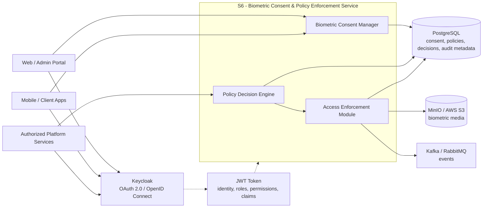
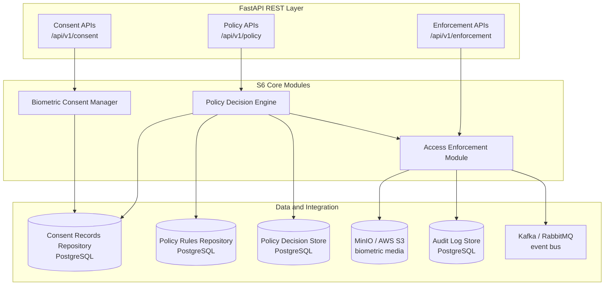
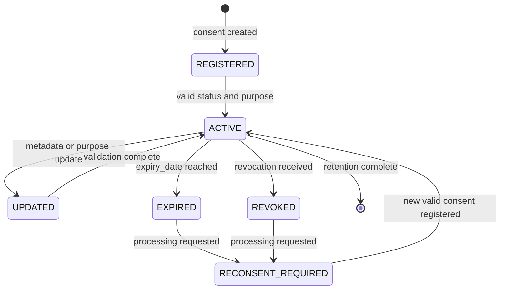
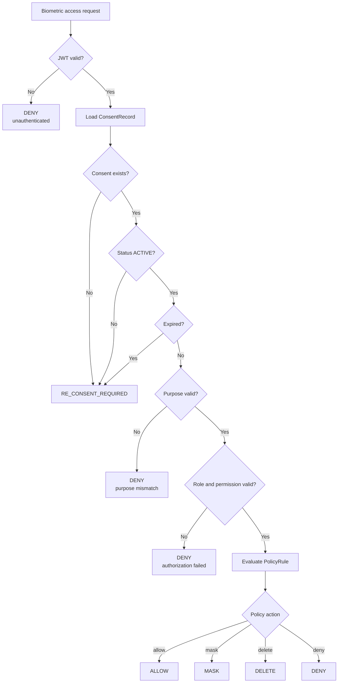
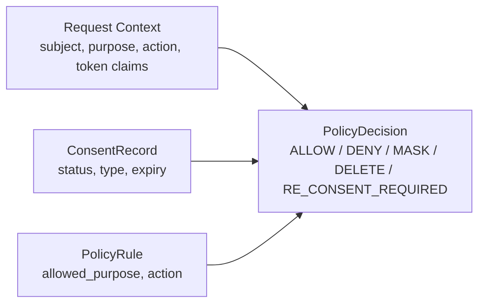
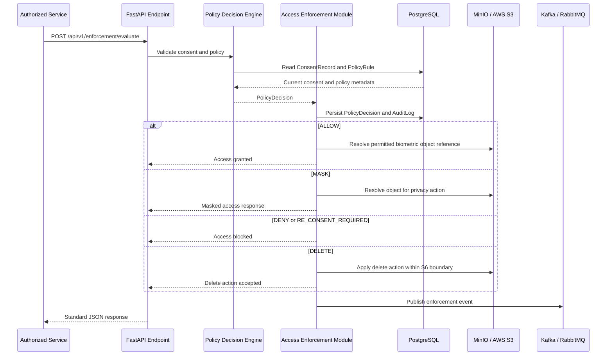
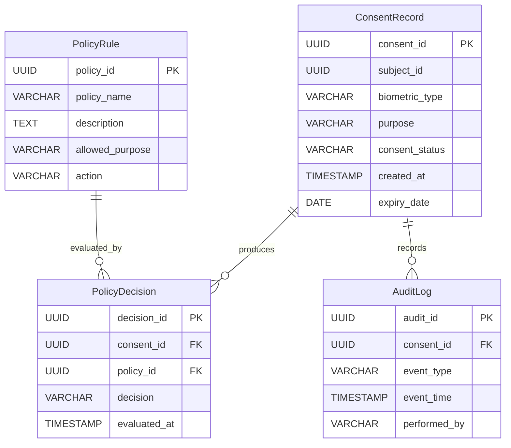
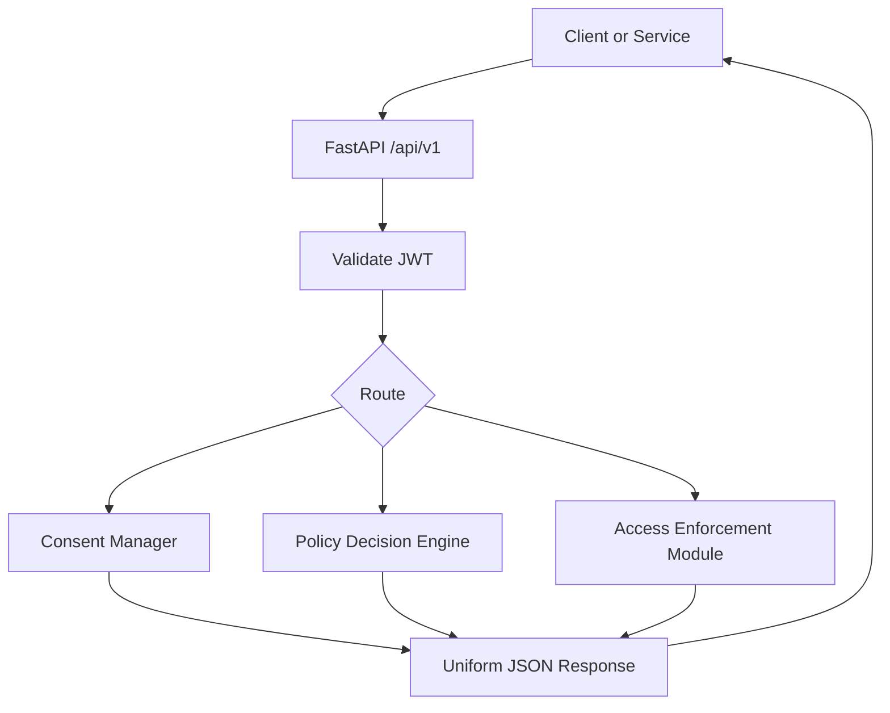
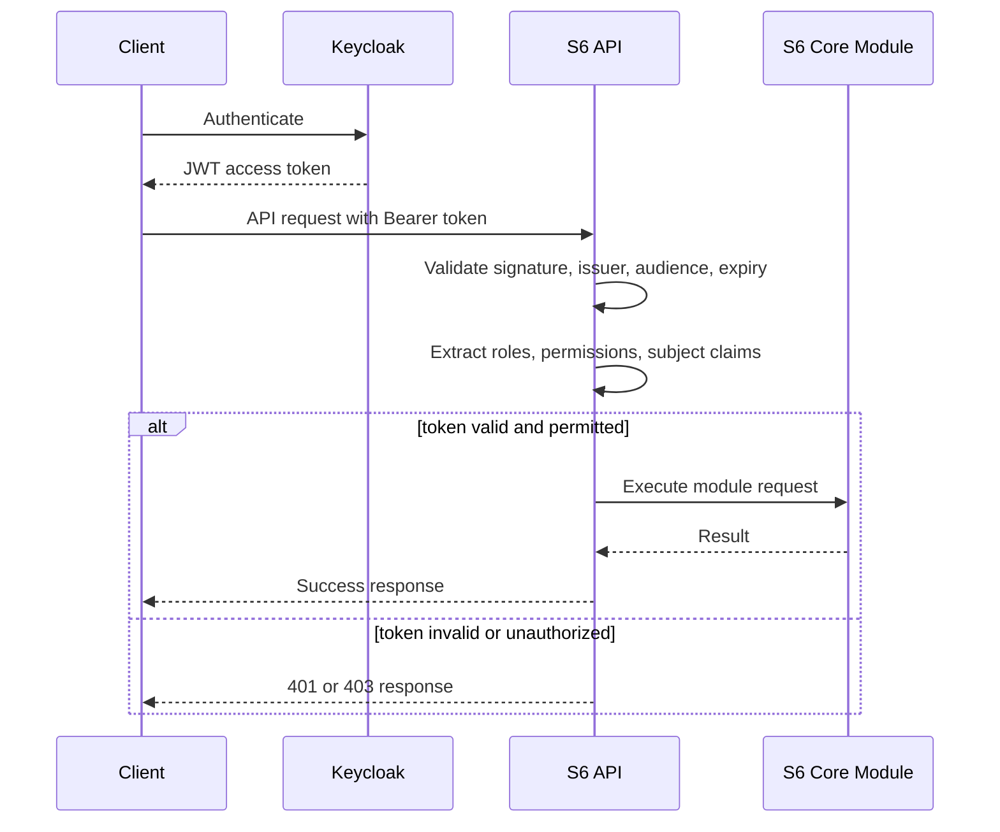
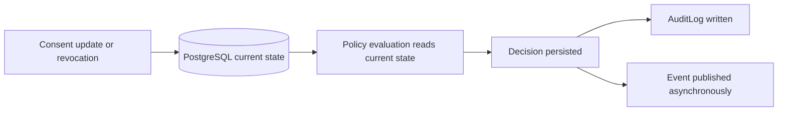

# Biometric Consent & Policy Enforcement Framework

### Consent-aware Runtime Authorization Engine of PRISM CMP

**Samsung PRISM**

**Aegis Agent - AI-driven Consent Governance & Privacy Enforcement Platform**


---

## Cover Page

| Field | Details |
|---|---|
| **Project Name** | Aegis Agent - AI-driven Consent Governance & Privacy Enforcement Platform |
| **Organization** | Samsung Research PRISM |
| **Work Package** | S6 - Biometric Consent & Policy Enforcement Framework |
| **Module Scope** | Biometric Consent Manager, Policy Decision Engine, Access Enforcement Module |
| **Primary Deliverable** | Consent-aware backend design for runtime biometric authorization |
| **Author** | `P.Srikesh` |
| **Repository** | `biometric-policy-enforcement` |


> [!IMPORTANT]
> S6 owns biometric consent lifecycle management, runtime policy decisioning, and access enforcement for biometric data. It consumes authenticated identity and consent inputs from platform services, but it does not perform identity verification, consent mapping, unrelated data discovery, enterprise AI governance, or audit-ledger implementation.

---

## Table of Contents

| # | Section |
|---|---|
| 1 | [What is Biometric Consent?](#1-what-is-biometric-consent) |
| 2 | [Why This Module Exists](#2-why-this-module-exists) |
| 3 | [Position of S6 inside PRISM](#3-position-of-s6-inside-prism) |
| 4 | [High-Level Architecture](#4-high-level-architecture) |
| 5 | [Biometric Consent Lifecycle](#5-biometric-consent-lifecycle) |
| 6 | [Policy Decision Engine](#6-policy-decision-engine) |
| 7 | [Access Enforcement Module](#7-access-enforcement-module) |
| 8 | [Database Design](#8-database-design) |
| 9 | [REST API Overview](#9-rest-api-overview) |
| 10 | [Security Considerations](#10-security-considerations) |
| 11 | [Compliance Mapping](#11-compliance-mapping) |
| 12 | [Engineering Challenges](#12-engineering-challenges) |
| 13 | [Future Enhancements](#13-future-enhancements) |
| 14 | [Glossary](#14-glossary) |
| 15 | [References](#references) |

---

## 1. What is Biometric Consent?

Biometric consent is explicit permission to collect, store, validate, or process biometric identifiers such as face images, voice samples, fingerprints, iris patterns, or other human traits that can identify an individual.
Normal consent can often be limited to a broad data-processing permission. Biometric consent requires stronger handling because the data is persistent, sensitive, and difficult to replace after exposure. A password can be rotated. A face template, voice print, or fingerprint cannot be meaningfully reissued to the same person.
In PRISM CMP, biometric consent is treated as a runtime authorization dependency. A consent record is not just proof that the user agreed during onboarding. It becomes an access-control signal that must be checked before biometric data is processed by any authorized platform service.

> [!NOTE]
> The core design rule for S6 is simple: biometric data must not be processed unless consent status, processing purpose, permissions, and policy rules are valid at the time of access.

### Biometric Consent Characteristics

| Characteristic | Engineering Meaning | S6 Handling |
|---|---|---|
| **Uniqueness** | Biometric identifiers are strongly tied to one person. | Consent records bind biometric type, subject, purpose, and status. |
| **Sensitivity** | Unauthorized exposure can create long-term privacy risk. | Access is mediated by policy decisions and audit logging. |
| **Purpose specificity** | Consent for one processing purpose cannot automatically authorize another. | Purpose validation is part of each policy evaluation. |
| **Lifecycle dependence** | Consent changes over time through update, expiry, and revocation. | Consent state is checked during runtime, not only during registration. |
| **Enterprise traceability** | Privacy actions need evidence for review and compliance. | S6 records decisions and enforcement events as structured metadata. |

### Why AI Systems Need Consent-Aware Processing

AI-enabled platforms operate through pipelines, services, and asynchronous workloads. A single biometric media object can be requested by multiple internal services for verification, analytics, review, or downstream processing. Without a runtime consent gate, stale consent can remain technically usable after its legal or organizational basis has changed.
S6 addresses this gap by placing consent validation and policy enforcement in the access path. The requesting service must declare the subject, biometric type, purpose, and requested action. S6 evaluates those attributes against the latest consent and policy state before allowing the operation to continue.

---

## 2. Why This Module Exists

Traditional consent mechanisms focus on capture. They record that a user accepted a notice, store a timestamp, and make that record available for compliance review. That model is not enough for biometric data in AI systems because the risk appears during processing, not only during collection.
S6 exists to convert biometric consent into an enforceable runtime control. The module makes consent state observable to platform services and ensures biometric access decisions are consistent, auditable, and policy-driven.

### Current Problems

| Problem | Risk | S6 Response |
|---|---|---|
| **One-time consent capture** | Consent is recorded once but not checked before every processing operation. | The Policy Decision Engine evaluates each biometric access request. |
| **Purpose drift** | Data collected for one reason may be reused for another. | Purpose validation is mandatory in the decision flow. |
| **Stale permissions** | User roles, JWT claims, or service privileges may no longer match the requested action. | Authorization checks combine consent status with role and permission evaluation. |
| **Delayed revocation effect** | Revoked consent may remain usable in service paths. | Enforcement blocks runtime access once revocation is reflected in the consent record. |
| **Weak auditability** | Teams cannot reconstruct why access was allowed or denied. | S6 stores policy decisions and enforcement events as structured audit metadata. |

### Runtime Authorization

Runtime authorization means that the access decision is made when a service asks to use biometric data. The decision is based on the current state of the system, not a cached assumption from onboarding.
The minimum runtime inputs are:
- `subject_id`
- `consent_id`
- `biometric_type`
- `purpose`
- `requested_action`
- `service_id`
- JWT identity, role, and permission claims
The output is a decision that the Access Enforcement Module can execute: `ALLOW`, `DENY`, `MASK`, `DELETE`, or `RE_CONSENT_REQUIRED`.

### Enterprise Requirements

S6 is designed as a backend microservice because enterprise privacy enforcement must be consistent across applications. The Web/Admin Portal, mobile or client apps, and other authorized services should not reimplement consent checks locally. They call S6 through versioned REST APIs and receive a uniform result.

> [!WARNING]
> Local service-side shortcuts are a privacy risk. A downstream service must not bypass S6 when the operation involves biometric data.

---

## 3. Position of S6 inside PRISM

S6 sits between authenticated platform clients, the Enterprise Consent Management System, and services that request access to biometric data. It uses Keycloak-issued JWT tokens for identity context, PostgreSQL for structured metadata, MinIO or AWS S3 for biometric media storage integration, and Kafka or RabbitMQ for event publication.
The service boundary is intentionally narrow. S6 does not verify identity, discover PII, build AI datasets, manage dashboards, or orchestrate unrelated privacy work packages. It evaluates whether biometric access is permitted and enforces the resulting action.

### Module Responsibilities

| Component | Owned by S6 | Not Owned by S6 |
|---|---|---|
| **Biometric Consent Manager** | Create, update, retrieve, revoke, expire, and maintain biometric consent history. | Identity proofing, consent mapping, UI ownership. |
| **Policy Decision Engine** | Validate consent status, purpose, policy rules, expiry, role, and permission context. | Enterprise-wide policy authoring outside S6. |
| **Access Enforcement Module** | Execute allow, deny, mask, delete, or re-consent-required decisions for biometric access. | Object storage implementation and unrelated downstream workflows. |
| **Event Publishing** | Publish consent, decision, revocation, and audit events. | Unrelated reporting, analytics, or enterprise governance modules. |

### Incoming Services

| Source | Input to S6 | Usage |
|---|---|---|
| **Authentication Service / Keycloak** | JWT token with identity, roles, permissions, and claims. | Used to authenticate and authorize API requests. |
| **Enterprise Consent Management System** | Consent creation, update, retrieval, and revocation requests. | Used by the Biometric Consent Manager. |
| **Authorized Platform Services** | Biometric access requests with purpose and action. | Used by the Policy Decision Engine and Access Enforcement Module. |
| **Client Applications** | Requests routed through authenticated APIs. | Used for consent and enforcement workflows when permitted. |

### Outgoing Services

| Target | Output from S6 | Purpose |
|---|---|---|
| **PostgreSQL** | Consent records, policy rules, policy decisions, audit logs. | Structured metadata persistence. |
| **MinIO / AWS S3** | Storage references and enforcement actions for biometric media. | Media is stored outside the relational database. |
| **Kafka / RabbitMQ** | Consent events, policy decision events, revocation events, audit events. | Downstream notification and integration. |
| **Swagger / OpenAPI** | API contract generated from FastAPI endpoints. | Developer testing and integration clarity. |

### S6 Context Architecture



---

## 4. High-Level Architecture

The high-level architecture follows the Week 1 specification: a modular FastAPI backend with three core modules, PostgreSQL metadata storage, MinIO or AWS S3 media integration, Keycloak-based authentication, and Kafka or RabbitMQ messaging.

### Technology Stack

| Layer | Technology | S6 Usage |
|---|---|---|
| **Programming Language** | Python | Backend service development. |
| **Backend Framework** | FastAPI | REST API and microservice implementation. |
| **Authentication** | Keycloak, OAuth 2.0, OpenID Connect, JWT | Identity management and secure authorization. |
| **Structured Database** | PostgreSQL | Consent records, policies, decisions, audit metadata. |
| **Object Storage** | MinIO / AWS S3 | Biometric media storage integration. |
| **Workflow & Messaging** | Apache Kafka / RabbitMQ | Downstream event notification. |
| **API Documentation** | Swagger / OpenAPI | API contract, testing, and developer documentation. |
| **Containerization** | Docker | Packaging and deployment. |
| **Version Control** | Git & GitHub | Source code and documentation management. |
| **Testing** | PyTest, Postman | Unit, integration, and API validation. |

### Core Component Diagram



### Design Decisions

| Decision | Reason |
|---|---|
| **FastAPI service boundary** | Keeps S6 independently deployable and aligns with REST-based integration. |
| **PostgreSQL for metadata** | Consent, policy, decision, and audit data are relational and require integrity constraints. |
| **Object storage outside database** | Biometric media can be large and should not be duplicated inside relational tables. |
| **Keycloak and JWT** | Centralized identity and token validation prevent each service from owning authentication logic. |
| **Event bus integration** | Consent and enforcement changes need asynchronous propagation without blocking API response paths. |

---

## 5. Biometric Consent Lifecycle

The Biometric Consent Manager owns the structured lifecycle of biometric consent. It captures consent metadata, maintains current status, applies updates, handles revocation requests, evaluates expiry, and keeps history through audit records.
S6 handles revocation as event reception and local enforcement state. It does not own revocation orchestration for unrelated assets or downstream data governance modules.

### Lifecycle Operations

| Operation | Trigger | S6 Behavior | Result |
|---|---|---|---|
| **Consent Registration** | User or authorized service registers biometric consent. | Generate `consent_id`, persist metadata, emit consent event. | Consent becomes available for validation. |
| **Consent Validation** | Service requests biometric processing. | Check status, purpose, expiry, and policy constraints. | Decision is returned to enforcement. |
| **Consent Update** | Consent metadata or permitted purpose changes. | Update allowed fields, preserve timestamps, log change. | Current consent state reflects latest permission. |
| **Consent Expiry** | `expiry_date` is reached. | Mark consent invalid for processing. | Future decisions require re-consent or deny access. |
| **Consent Revocation** | Revocation event or authorized revoke request. | Mark consent revoked and block processing. | S6 receives and enforces revocation state. |
| **Consent History** | Any lifecycle event. | Create structured audit log metadata. | Engineering and compliance teams can reconstruct state changes. |

### Consent State Diagram



### Consent Metadata

| Field | Type | Meaning |
|---|---|---|
| `consent_id` | UUID | Unique identifier for the consent transaction. |
| `subject_id` | UUID | User or data principal identifier supplied by upstream identity context. |
| `biometric_type` | VARCHAR | Biometric category such as face, voice, fingerprint, or iris. |
| `purpose` | VARCHAR | Authorized processing purpose. |
| `consent_status` | VARCHAR | Current state such as `ACTIVE`, `EXPIRED`, or `REVOKED`. |
| `created_at` | TIMESTAMP | Creation timestamp. |
| `expiry_date` | DATE | Date after which processing requires denial or re-consent. |

> [!TIP]
> A consent record should be treated as the current authoritative metadata for biometric processing. Historical changes are preserved through audit logging rather than overwriting accountability context.

---

## 6. Policy Decision Engine

The Policy Decision Engine is the authorization brain of S6. It receives a biometric access request, loads the current consent record, evaluates the applicable policy rule, checks user or service authorization, validates the requested purpose, and returns a decision that can be enforced.
The engine is deterministic by design. The same request context and stored policy state should produce the same decision. This helps testing, incident review, and compliance traceability.

### Decision Inputs

| Input | Source | Validation |
|---|---|---|
| `consent_id` | Request payload or consent lookup. | Must map to an existing `ConsentRecord`. |
| `subject_id` | JWT claim or request body. | Must match the target consent context. |
| `biometric_type` | Request body. | Must align with the stored consent type. |
| `purpose` | Request body. | Must match the consented purpose or allowed policy purpose. |
| `requested_action` | Request body. | Must be permitted by policy for the caller. |
| JWT roles and permissions | Keycloak token. | Must satisfy service and user authorization rules. |
| `expiry_date` | Consent record. | Must not be expired for normal `ALLOW`. |

### Decision Outcomes

| Outcome | Meaning | Enforcement Action |
|---|---|---|
| `ALLOW` | Consent and policy checks passed. | Permit access to requested biometric operation. |
| `DENY` | Consent, purpose, role, or policy check failed. | Block access and log denial. |
| `MASK` | Access is allowed only with privacy transformation. | Return masked, blurred, or anonymized biometric data where supported. |
| `DELETE` | Policy requires removal of biometric data reference or object action. | Trigger delete action within S6's enforcement boundary. |
| `RE_CONSENT_REQUIRED` | Consent is expired, missing, or insufficient for requested purpose. | Block processing and return re-consent requirement. |

### Policy Evaluation Flow



### Decision Matrix

| Consent Status | Purpose Match | Permission Match | Expiry Valid | Policy Action | Decision |
|---|---:|---:|---:|---|---|
| `ACTIVE` | Yes | Yes | Yes | `allow` | `ALLOW` |
| `ACTIVE` | Yes | Yes | Yes | `mask` | `MASK` |
| `ACTIVE` | Yes | Yes | Yes | `delete` | `DELETE` |
| `ACTIVE` | No | Yes | Yes | Any | `DENY` |
| `ACTIVE` | Yes | No | Yes | Any | `DENY` |
| `EXPIRED` | Any | Any | No | Any | `RE_CONSENT_REQUIRED` |
| `REVOKED` | Any | Any | Any | Any | `RE_CONSENT_REQUIRED` |
| Missing | Any | Any | Any | Any | `RE_CONSENT_REQUIRED` |

### Policy Rule Design

Policy rules are stored as structured metadata in PostgreSQL. Each rule defines a named policy, description, allowed purpose, and action. The database model remains intentionally small for Week 1 scope, allowing the service to prove runtime enforcement without introducing unrelated governance modules.



---

## 7. Access Enforcement Module

The Access Enforcement Module converts a policy decision into an operational result. It is the enforcement point for S6 and is responsible for applying the decision consistently across API responses, storage access, audit logging, and event publication.

### Enforcement Responsibilities

| Responsibility | Description |
|---|---|
| **Decision execution** | Execute `ALLOW`, `DENY`, `MASK`, `DELETE`, or `RE_CONSENT_REQUIRED`. |
| **Runtime gating** | Stop unauthorized biometric processing before media access is granted. |
| **Audit logging** | Record enforcement outcome, timestamp, consent reference, and caller context. |
| **Event publishing** | Publish policy decision, consent, revocation, and audit events to Kafka or RabbitMQ. |
| **Storage integration** | Interact with MinIO or AWS S3 through object references, not relational media blobs. |

### Enforcement Sequence



### Enforcement Result Contract

| Field | Description |
|---|---|
| `decision_id` | Unique policy decision identifier. |
| `consent_id` | Consent record used for evaluation. |
| `decision` | Final enforcement decision. |
| `reason_code` | Machine-readable decision reason. |
| `message` | Human-readable summary for service logs or API clients. |
| `evaluated_at` | Decision timestamp. |
| `audit_id` | Audit log reference. |

> [!IMPORTANT]
> S6 enforcement must happen before biometric media is processed. Logging a denial after data has already been accessed is not enforcement; it is only incident evidence.

---

## 8. Database Design

The database stores structured metadata required for consent governance, policy decisions, and auditability. Biometric media is stored in MinIO or AWS S3. PostgreSQL stores identifiers, state, policy metadata, and audit references only.

### Database Philosophy

- Keep relational storage focused on metadata.
- Avoid duplicate consent information.
- Enforce primary and foreign key relationships.
- Use timestamps and status fields for traceability.
- Index identifiers used in runtime lookups.
- Use consistent snake_case column naming.
- Keep the Week 1 entity model limited to `ConsentRecord`, `PolicyRule`, `PolicyDecision`, and `AuditLog`.

### Entity Relationship Diagram



### Data Dictionary

| Entity | Columns | Design Notes |
|---|---|---|
| `ConsentRecord` | `consent_id` PK, `subject_id`, `biometric_type`, `purpose`, `consent_status`, `created_at`, `expiry_date` | Current consent metadata used during validation and runtime policy checks. |
| `PolicyRule` | `policy_id` PK, `policy_name`, `description`, `allowed_purpose`, `action` | Defines which purpose is allowed and which enforcement action should be applied. |
| `PolicyDecision` | `decision_id` PK, `consent_id` FK, `policy_id` FK, `decision`, `evaluated_at` | Stores the result of policy evaluation for traceability and review. |
| `AuditLog` | `audit_id` PK, `consent_id` FK, `event_type`, `event_time`, `performed_by` | Records consent operations, enforcement actions, and security-relevant events. |

Recommended indexes are `consent_id`, `subject_id`, `allowed_purpose`, `evaluated_at`, and `event_time`, because these fields are used in runtime validation and audit retrieval paths.

---

## 9. REST API Overview

S6 exposes versioned REST APIs under `/api/v1`. Payloads use JSON. Authentication uses JWT bearer tokens issued by Keycloak. API contracts are documented through Swagger / OpenAPI generated by FastAPI.

### API Design Principles

| Principle | S6 Application |
|---|---|
| **RESTful resources** | Consent, policy decisions, and enforcement history are exposed as resources. |
| **Stateless requests** | Each request carries authentication and required request context. |
| **JSON payloads** | Request and response bodies use JSON for service interoperability. |
| **Versioned paths** | `/api/v1` allows future API evolution without breaking existing clients. |
| **Standard status codes** | Responses use common HTTP status codes for predictable client behavior. |
| **Uniform response format** | Success, error, data, and timestamp fields are consistent. |

### Authentication Header

```http
Authorization: Bearer <keycloak_access_token>
Content-Type: application/json
```

### API Summary

| Method | Endpoint | Module | Description |
|---|---|---|---|
| `POST` | `/api/v1/consent` | Biometric Consent Manager | Register biometric consent. |
| `GET` | `/api/v1/consent/{consent_id}` | Biometric Consent Manager | Retrieve consent details. |
| `PUT` | `/api/v1/consent/{consent_id}` | Biometric Consent Manager | Update consent metadata. |
| `DELETE` | `/api/v1/consent/{consent_id}` | Biometric Consent Manager | Revoke biometric consent. |
| `POST` | `/api/v1/policy/evaluate` | Policy Decision Engine | Evaluate consent and policy rules. |
| `GET` | `/api/v1/policy/decisions/{decision_id}` | Policy Decision Engine | Retrieve a policy decision. |
| `POST` | `/api/v1/enforcement/evaluate` | Access Enforcement Module | Evaluate and enforce biometric access. |
| `GET` | `/api/v1/enforcement/history/{consent_id}` | Access Enforcement Module | Retrieve enforcement history for a consent record. |

### Register Consent

```http
POST /api/v1/consent
```

```json
{
  "subjectId": "USR1001",
  "biometricType": "Face",
  "purpose": "Employee Verification",
  "consentStatus": "ACTIVE",
  "expiryDate": "2027-12-31"
}
```

```json
{
  "status": "SUCCESS",
  "message": "Consent registered successfully.",
  "data": {
    "consentId": "CONS-1001"
  },
  "timestamp": "2026-07-02T10:30:00Z"
}
```

### Evaluate Policy

```http
POST /api/v1/policy/evaluate
```

```json
{
  "consentId": "CONS-1001",
  "subjectId": "USR1001",
  "biometricType": "Face",
  "purpose": "Employee Verification",
  "requestedAction": "READ"
}
```

```json
{
  "status": "SUCCESS",
  "message": "Policy evaluation completed.",
  "data": {
    "decisionId": "DEC-9001",
    "decision": "ALLOW",
    "reasonCode": "CONSENT_ACTIVE_PURPOSE_AUTHORIZED"
  },
  "timestamp": "2026-07-02T10:31:00Z"
}
```

### Enforce Access

```http
POST /api/v1/enforcement/evaluate
```

```json
{
  "consentId": "CONS-1001",
  "subjectId": "USR1001",
  "biometricType": "Face",
  "purpose": "Employee Verification",
  "requestedAction": "READ",
  "objectReference": "s3://biometric-media/usr1001/face-001"
}
```

```json
{
  "status": "SUCCESS",
  "message": "Access granted.",
  "data": {
    "decisionId": "DEC-9001",
    "auditId": "AUD-3001",
    "decision": "ALLOW",
    "objectAccess": "PERMITTED"
  },
  "timestamp": "2026-07-02T10:32:00Z"
}
```

### Status Codes

| Status Code | Usage |
|---:|---|
| `200 OK` | Retrieval, policy evaluation, or enforcement completed. |
| `201 Created` | Consent record created. |
| `202 Accepted` | Delete or asynchronous enforcement action accepted. |
| `400 Bad Request` | Invalid request payload. |
| `401 Unauthorized` | Missing or invalid JWT. |
| `403 Forbidden` | Authenticated caller lacks permission. |
| `404 Not Found` | Consent, policy, or decision not found. |
| `409 Conflict` | State conflict, duplicate active consent, or incompatible update. |
| `422 Unprocessable Entity` | Schema validation failed. |
| `500 Internal Server Error` | Unexpected service failure. |

### API Workflow



---

## 10. Security Considerations

S6 handles sensitive biometric consent metadata. Security controls must protect the API surface, database, token validation flow, storage integration, and audit path.

### Keycloak and Token-Based Security

Keycloak provides centralized authentication using OAuth 2.0 and OpenID Connect. S6 validates JWT access tokens on protected endpoints and uses token claims to identify the caller, roles, permissions, and service context.

### Security Control Matrix

| Control | Implementation in S6 |
|---|---|
| **Authentication** | Require Keycloak-issued JWT bearer token for protected APIs. |
| **Authorization** | Enforce role and permission checks before consent, policy, or enforcement actions. |
| **Least Privilege** | Separate read, write, evaluate, and enforce permissions. |
| **Token Validation** | Validate signature, issuer, audience, expiry, and required claims. |
| **Transport Security** | Deploy behind HTTPS-enabled infrastructure. |
| **Database Protection** | Store only metadata and use least-privileged database accounts. |
| **Object Storage Access** | Use controlled service credentials for MinIO or AWS S3 object operations. |
| **Audit Logging** | Record consent operations, policy decisions, enforcement actions, and failures. |
| **Secure API Design** | Validate input schemas, avoid leaking sensitive internals, and return consistent errors. |

### JWT Validation Flow



### Secure API Rules

- Reject requests without valid JWT authentication.
- Do not trust `subjectId` blindly when a token claim should bind the caller to the subject.
- Validate request body using typed FastAPI schemas.
- Do not expose raw stack traces in API responses.
- Log security-relevant events without storing biometric media in logs.
- Use environment-based configuration for secrets and endpoints.
- Keep authorization logic in shared security dependencies or middleware.
- Apply PyTest coverage for positive and negative authorization paths.

> [!WARNING]
> S6 should never store biometric images, videos, audio, or documents directly in PostgreSQL. The relational database stores metadata; media remains in MinIO or AWS S3.

---

## 11. Compliance Mapping

S6 supports compliance by enforcing consent status, purpose limitation, auditability, and privacy-by-design controls for biometric processing. It does not claim full enterprise compliance by itself; compliance is achieved across the broader PRISM platform.

### Regulatory Alignment

| Principle | GDPR Relevance | DPDP Act 2023 Relevance | S6 Implementation |
|---|---|---|---|
| **Explicit consent** | Biometric data is a sensitive category requiring strong legal basis and safeguards. | Consent-based processing must be specific and informed. | Consent registration and validation are explicit S6 workflows. |
| **Purpose limitation** | Personal data should be processed for specified purposes. | Processing should align with the stated purpose. | Purpose is checked in policy evaluation. |
| **Withdrawal / revocation effect** | Consent withdrawal must affect further processing. | Consent withdrawal and erasure rights influence processing continuity. | Revoked consent blocks runtime biometric access. |
| **Data minimization** | Processing should be limited to what is necessary. | Collection and use should remain purpose-bound. | S6 stores metadata in PostgreSQL and leaves media in object storage. |
| **Privacy by Design** | Privacy controls should be built into processing systems. | Accountable processing requires operational controls. | Consent-aware authorization is built into the service path. |
| **Auditability** | Organizations need evidence of processing controls. | Fiduciaries need demonstrable accountability. | Policy decisions and enforcement outcomes are logged. |

### Privacy by Design Mapping

| Design Principle | S6 Engineering Control |
|---|---|
| **Proactive protection** | Consent checks are part of normal processing flow. |
| **Default restriction** | Missing, expired, revoked, or mismatched consent prevents access. |
| **Embedded privacy** | Policy enforcement is built into S6 APIs instead of handled manually. |
| **Visibility and transparency** | Decision and audit metadata can be reviewed. |
| **Security throughout lifecycle** | JWT validation, RBAC, audit logging, and database constraints protect operations. |

> [!NOTE]
> S6 compliance mapping is limited to biometric consent and runtime policy enforcement. Broader obligations such as data subject request portals, dataset governance, and enterprise reporting are handled by other platform modules.

---

## 12. Engineering Challenges

Runtime privacy enforcement creates practical engineering constraints. S6 must make decisions quickly, remain consistent under concurrent access, and integrate with multiple platform services without expanding beyond its work package.

### Challenge Matrix

| Challenge | Engineering Risk | Mitigation |
|---|---|---|
| **Runtime latency** | Consent checks can slow biometric service calls. | Use indexed PostgreSQL lookups, compact policy rules, and minimal synchronous dependencies. |
| **Policy scalability** | Rule count and purpose variations can grow. | Keep policy metadata structured and evaluate rules deterministically. |
| **Token expiration** | Long-running workflows may use expired JWTs. | Validate tokens per request and require callers to refresh tokens. |
| **Consent expiry** | Expired consent may be used if cached incorrectly. | Evaluate expiry from the current consent record during policy checks. |
| **Microservice communication** | Synchronous failures can affect downstream services. | Keep core decision path small and publish events asynchronously. |
| **Audit volume** | High request volume can generate many decision logs. | Index `consent_id` and `evaluated_at`; separate decision and audit tables. |
| **Revocation timing** | Services may request access soon after revocation. | Treat revoked status as a hard block in policy evaluation. |

### Runtime Decision Latency

S6 should keep the decision path short:
1. Validate JWT.
2. Load consent by `consent_id` or subject context.
3. Load applicable policy rule.
4. Evaluate purpose, status, expiry, and permissions.
5. Persist decision and audit metadata.
6. Return enforcement result.
The policy decision should not depend on heavy media processing or unrelated analytics. Those operations belong outside the authorization path.

### Consistency Considerations



The database should be the source of truth for current consent and policy metadata. Events help other services react, but S6 should not rely on eventual event delivery for its own decision correctness.

---

## 13. Future Enhancements

Future work should improve policy expressiveness and operational efficiency while preserving the S6 boundary. Enhancements should remain focused on biometric consent and policy enforcement.

### Enhancement Roadmap

| Enhancement | Value | Boundary |
|---|---|---|
| **Attribute-Based Access Control** | Evaluate richer context such as department, service type, region, or risk level. | Extends policy decisioning without owning identity verification. |
| **Dynamic Policy Rules** | Allow authorized policy updates without code changes. | Uses existing `PolicyRule` ownership. |
| **Context-Aware Authorization** | Include request time, environment, purpose, and service sensitivity. | Remains a runtime authorization feature. |
| **AI-Assisted Policy Recommendation** | Recommend policy changes from observed decision patterns. | Advisory only; final policy remains human-approved. |
| **Decision Cache with Invalidation** | Reduce latency for repeated low-risk checks. | Must invalidate on consent update, expiry, or revocation. |
| **Expanded Test Harness** | Add automated Postman and PyTest suites for negative privacy paths. | Improves S6 engineering quality. |

> [!IMPORTANT]
> Future enhancements must not move S6 into unrelated work packages. The module can become more precise at biometric authorization, but it should not become a general enterprise governance or analytics system.

---

## 14. Glossary

| Term | Definition |
|---|---|
| **ABAC** | Attribute-Based Access Control; authorization based on subject, object, action, and context attributes. |
| **Access Enforcement Module** | S6 component that executes policy decisions at runtime. |
| **AuditLog** | Database entity that records consent and enforcement events. |
| **Biometric Consent** | Explicit permission to process biometric identifiers for a defined purpose. |
| **Biometric Consent Manager** | S6 component responsible for consent registration, update, revocation, expiry, and history. |
| **Biometric Type** | Category of biometric data such as face, voice, fingerprint, or iris. |
| **ConsentRecord** | Database entity that stores current biometric consent metadata. |
| **Consent Status** | Current lifecycle state of a consent record, such as active, expired, or revoked. |
| **DPDP Act 2023** | India's Digital Personal Data Protection Act, relevant to digital personal data processing. |
| **GDPR** | European Union privacy regulation relevant to personal and biometric data processing. |
| **JWT** | JSON Web Token used to carry identity, role, permission, and claim information. |
| **Keycloak** | Identity and access management system used with OAuth 2.0 and OpenID Connect. |
| **OAuth 2.0** | Authorization framework used in the Keycloak-based security model. |
| **OpenID Connect** | Identity layer used to authenticate users and services. |
| **PolicyDecision** | Database entity that stores the result of a policy evaluation. |
| **Policy Decision Engine** | S6 component that evaluates consent, purpose, role, permission, and policy rules. |
| **PolicyRule** | Database entity that defines allowed purpose and enforcement action. |
| **Purpose Limitation** | Privacy principle requiring data to be used only for the purpose for which consent was granted. |
| **Re-Consent Required** | Decision outcome indicating current consent is missing, expired, revoked, or insufficient. |

## References

| Area | Official Source |
|---|---|
| FastAPI | [FastAPI Documentation](https://fastapi.tiangolo.com/) |
| Keycloak | [Keycloak Documentation](https://www.keycloak.org/documentation) |
| PostgreSQL | [PostgreSQL Documentation](https://www.postgresql.org/docs/) |
| OpenAPI | [OpenAPI Specification](https://spec.openapis.org/oas/latest.html) |
| OWASP REST API Security | [OWASP REST Security Cheat Sheet](https://cheatsheetseries.owasp.org/cheatsheets/REST_Security_Cheat_Sheet.html) |
| NIST Privacy Framework | [NIST Privacy Framework](https://www.nist.gov/privacy-framework) |
| GDPR | [Regulation (EU) 2016/679](https://eur-lex.europa.eu/eli/reg/2016/679/oj) |
| DPDP Act 2023 | [Digital Personal Data Protection Act, 2023 - MeitY PDF](https://www.meity.gov.in/static/uploads/2024/06/2bf1f0e9f04e6fb4f8fef35e82c42aa5.pdf) |
