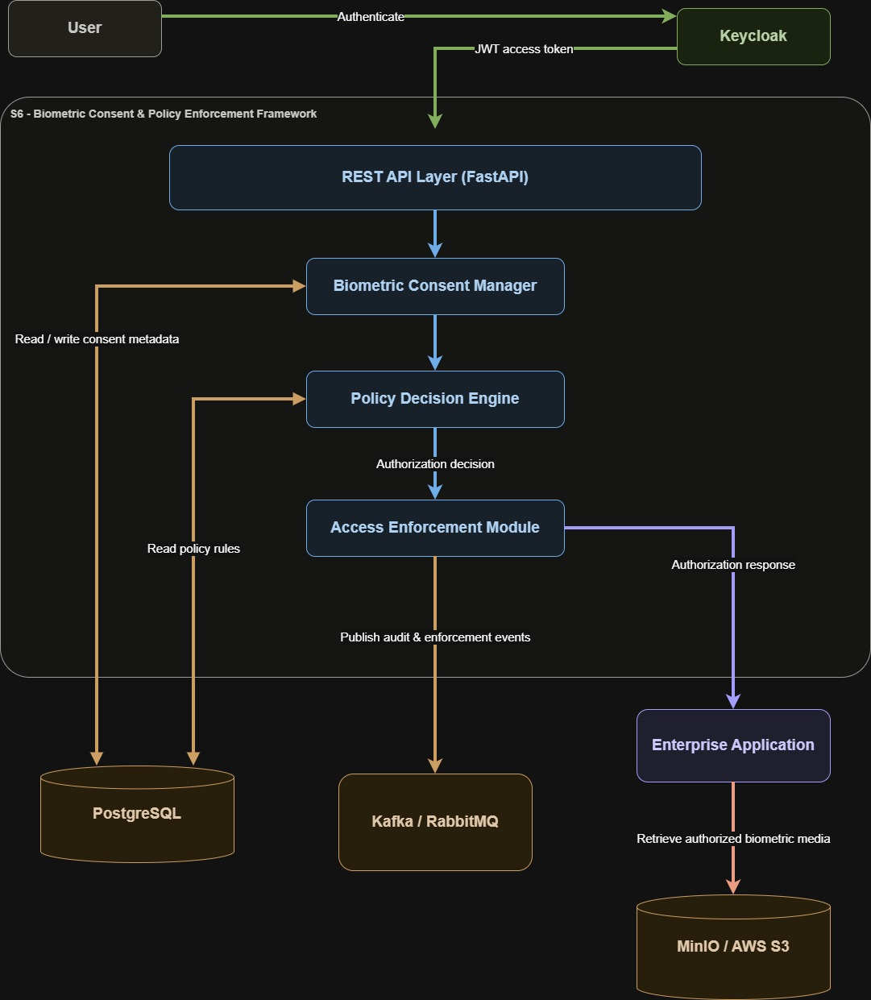
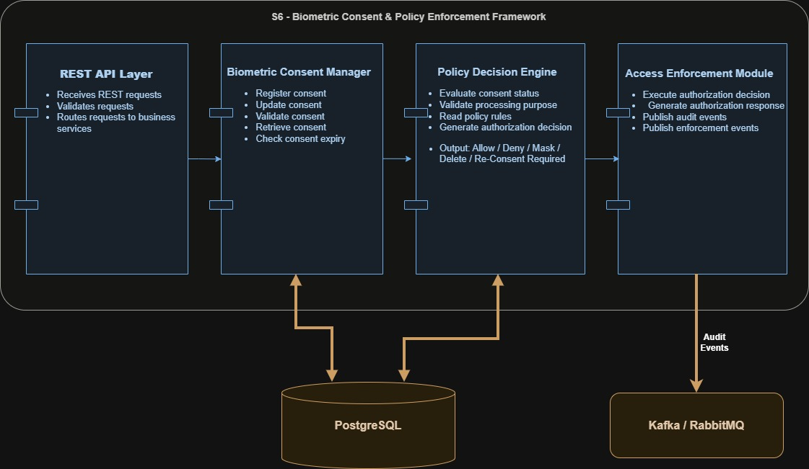
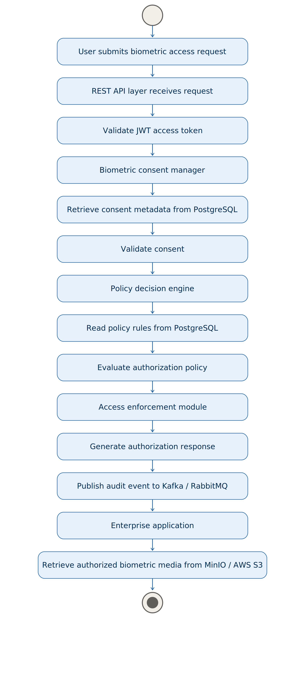
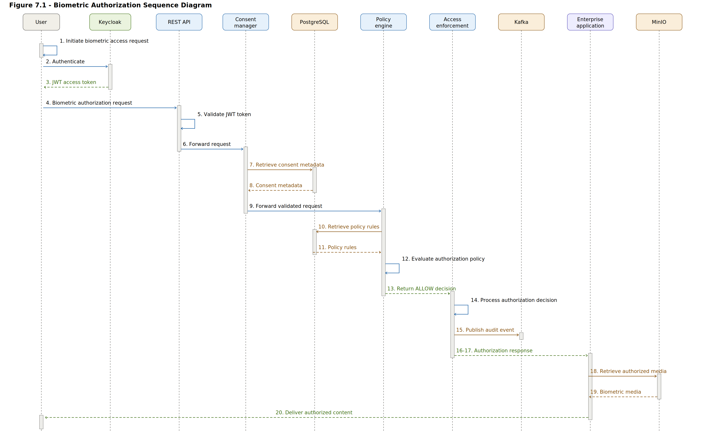

#  Samsung PRISM – Week 2 Documentation

## Aegis Agent – AI-driven Consent Governance & Privacy Enforcement Platform

---

## 📋 Project Information

| **Property** | **Details** |
|--------------|-------------|
| **Project** | Aegis Agent – AI-driven Consent Governance & Privacy Enforcement Platform |
| **Organization** | Samsung Research PRISM |
| **Work Package** | S6 – Biometric Consent & Policy Enforcement Framework |
| **Author** | Srikesh |
| **Reporting Period** | Week 2 |
| **Focus** | Software Design & Architecture |

---

## Document Overview

This document summarizes the software design and architectural work completed during Week 2 for the S6 – Biometric Consent & Policy Enforcement Framework. The work focuses on defining the overall system architecture, component organization, and runtime execution workflow that will serve as the foundation for subsequent implementation phases.

---

# Biometric Consent Architecture and Policy Enforcement Design

## 1. Module Scope & Design Objectives

### 1.1 Module Overview

The Biometric Consent & Policy Enforcement Framework (S6) enforces consent-aware access control for biometric data within the Aegis Agent platform. The module validates biometric consent at runtime, evaluates organizational policy rules, and enforces authorization decisions before biometric data is accessed or processed.

The framework is designed as a modular microservice that integrates with the enterprise authentication service, consent repository, object storage, and event-driven messaging services. It provides a centralized policy enforcement mechanism while maintaining compatibility with the overall PRISM architecture.

### 1.2 Design Scope

The S6 module focuses on three core components:

- **Biometric Consent Manager:** Manages biometric consent registration, retrieval, validation, updates, and expiry status.
- **Policy Decision Engine:** Evaluates access requests based on consent status, processing purpose, and organizational policies.
- **Access Enforcement Module:** Executes authorization decisions, blocks unauthorized operations, and generates audit events.

The module operates only on consent metadata and policy information. Biometric media files remain outside the module and are referenced through external object storage services.

### 1.3 Design Boundaries

**In Scope**

- Runtime biometric consent validation
- Policy-based authorization
- Consent status verification
- Access enforcement
- Audit event generation
- Integration with authentication, database, and messaging services

### 1.4 Design Objectives

The architecture is designed to:

- Provide centralized biometric consent enforcement.
- Perform real-time policy evaluation before data access.
- Support modular integration with adjacent work packages.
- Maintain scalability through a microservice-based architecture.
- Ensure secure communication using Keycloak, JWT, and OAuth 2.0.
- Generate auditable authorization decisions for compliance.

---

## 2. High-Level Architecture

### 2.1 Architecture Workflow

The architecture follows a sequential request-processing pipeline consisting of authentication, consent validation, policy evaluation, and enforcement.

### 2.2 Step 1: User Authentication

The process begins when a user initiates a request to access a biometric-enabled enterprise application. The request is first forwarded to Keycloak, which authenticates the user using the configured identity provider.

Upon successful authentication, Keycloak generates a JWT containing the authenticated user's identity and authorization claims. The JWT is attached to subsequent requests and serves as the primary authentication credential for the S6 framework.

### 2.3 Step 2: REST API Layer

Authenticated requests enter the REST API Layer, implemented using FastAPI. This layer acts as the entry point for the S6 module. It validates incoming requests, extracts the JWT, performs request validation, and forwards requests to the internal business components.

The REST API Layer does not contain authorization logic. Its responsibility is to coordinate communication between external applications and internal services.

### 2.4 Step 3: Biometric Consent Manager

The request is processed by the Biometric Consent Manager, which is responsible for consent-related operations. It retrieves the user's consent metadata from PostgreSQL, verifies whether valid biometric consent exists, checks consent expiry, and confirms that the requested biometric type and processing purpose are covered by the recorded consent.

If consent information is invalid or unavailable, the request can be rejected before entering the policy evaluation stage.

### 2.5 Step 4: Policy Decision Engine

Once consent has been validated, the request is forwarded to the Policy Decision Engine. This component evaluates the request against predefined organizational policies stored in PostgreSQL.

The evaluation considers:

- Consent status
- Processing purpose
- Applicable policy rules
- Authorization constraints

Based on this evaluation, the engine generates an authorization decision such as **Allow**, **Deny**, **Mask**, **Delete**, or **Re-Consent Required**.

### 2.6 Step 5: Access Enforcement Module

The authorization decision is passed to the Access Enforcement Module, which acts as the enforcement point of the framework. This component applies the decision generated by the Policy Decision Engine and determines whether the requested biometric operation should proceed.

For approved requests, the module returns an authorization response to the enterprise application. For rejected requests, it blocks further processing and prevents unauthorized biometric access.

The module also publishes audit and enforcement events to Kafka/RabbitMQ, enabling asynchronous logging, monitoring, and downstream processing.

### 2.7 Step 6: Enterprise Application and Biometric Storage

After receiving a successful authorization response, the enterprise application retrieves the required biometric object from MinIO/AWS S3.

S6 does not store or directly access biometric media. It authorizes access to biometric resources while the actual biometric files remain securely stored in external object storage. This separation improves security and keeps authorization logic independent of storage infrastructure.

---

## 3. Component Architecture

### 3.1 Component Responsibilities

The S6 module is organized into independent components with clearly defined responsibilities. Each component participates in the consent validation and access enforcement pipeline while maintaining separation of concerns.

| Component | Responsibility |
| --- | --- |
| REST API Layer | Receives REST requests, validates input, extracts authentication context, and routes requests to business services. |
| Biometric Consent Manager | Registers, updates, validates, retrieves, and checks expiry status for biometric consent metadata. |
| Policy Decision Engine | Evaluates consent status, validates processing purpose, reads policy rules, and generates authorization decisions. |
| Access Enforcement Module | Executes authorization decisions, generates authorization responses, and publishes audit and enforcement events. |
| PostgreSQL | Stores consent metadata and policy rules used by the consent and policy components. |
| Kafka/RabbitMQ | Receives audit and enforcement events for asynchronous processing and monitoring. |

### 3.2 REST API Layer

The REST API Layer provides the external interface for the S6 framework. It receives REST requests, validates request structure, verifies required metadata, and routes valid requests to the internal service layer.

Key responsibilities include:

- Receiving biometric access and consent management requests.
- Validating request payloads and required fields.
- Extracting authentication context from JWT access tokens.
- Routing requests to consent and policy services.

### 3.3 Biometric Consent Manager

The Biometric Consent Manager centralizes all consent metadata operations. It ensures that biometric access requests are evaluated against current and valid consent records.

Key responsibilities include:

- Registering biometric consent records.
- Updating existing consent metadata.
- Retrieving consent records for runtime checks.
- Validating consent status and expiry.
- Confirming that the requested processing purpose is covered by the recorded consent.

### 3.4 Policy Decision Engine

The Policy Decision Engine evaluates whether a biometric operation is permitted under the applicable consent state and policy rules.

Key responsibilities include:

- Evaluating consent status.
- Validating the requested processing purpose.
- Reading policy rules from PostgreSQL.
- Applying authorization constraints.
- Producing an authorization decision.

Supported decision outcomes include:

- **Allow**
- **Deny**
- **Mask**
- **Delete**
- **Re-Consent Required**

### 3.5 Access Enforcement Module

The Access Enforcement Module acts as the policy enforcement point. It applies the decision returned by the Policy Decision Engine and determines the response sent to the consuming enterprise application.

Key responsibilities include:

- Executing authorization decisions.
- Blocking unauthorized biometric operations.
- Returning authorization responses.
- Publishing audit events.
- Publishing enforcement events.

---

## 4. Runtime Workflow: Successful Execution Path

### 4.1 Workflow Overview

The successful runtime workflow defines the execution path followed when a biometric access request is authenticated, consent is valid, applicable policy rules allow access, and the enterprise application is authorized to retrieve biometric media.

### 4.2 Execution Sequence

1. The user submits a biometric access request.
2. The REST API Layer receives the request.
3. The REST API Layer validates the JWT access token.
4. The request is forwarded to the Biometric Consent Manager.
5. The Biometric Consent Manager retrieves consent metadata from PostgreSQL.
6. The Biometric Consent Manager validates the consent record.
7. The request is forwarded to the Policy Decision Engine.
8. The Policy Decision Engine reads policy rules from PostgreSQL.
9. The Policy Decision Engine evaluates the authorization policy.
10. The Access Enforcement Module receives the policy decision.
11. The Access Enforcement Module generates the authorization response.
12. The module publishes an audit event to Kafka/RabbitMQ.
13. The enterprise application receives the authorization response.
14. The enterprise application retrieves authorized biometric media from MinIO/AWS S3.

### 4.3 Successful Path Result

In the successful execution path, biometric media access is permitted only after the request has passed authentication, consent validation, policy evaluation, and enforcement. The final media retrieval operation is performed by the enterprise application and remains outside the S6 service boundary.

---

---

**End of Week 2 Documentation**

---

# Chapter 5 - Policy Decision Workflow

## 5.1 Policy Decision Workflow Overview

The Policy Decision Workflow defines how the S6 module evaluates a biometric access request before allowing the enterprise application to access biometric data. The workflow is centered on the Policy Decision Engine, which receives validated request details from the Biometric Consent Manager and applies consent-aware authorization rules.

The decision process begins by reading the user's consent metadata from PostgreSQL. The Policy Decision Engine checks whether consent exists, whether the consent status is active, and whether the consent has expired. If the consent record is missing, revoked, inactive, or expired, the request cannot proceed without corrective action.

After validating the consent state, the engine evaluates the processing purpose provided in the access request. The requested purpose must match the purpose recorded in the consent metadata, such as authentication, verification, or secure identity validation. This ensures that biometric data is used only for the purpose approved by the user.

The Policy Decision Engine then reads applicable policy rules from PostgreSQL. These rules define organizational constraints such as permitted applications, allowed operations, access conditions, retention limits, and compliance requirements. The engine compares the incoming request against these rules and generates a final authorization decision.

The resulting decision is returned to the Access Enforcement Module, which applies the outcome and sends the appropriate response to the enterprise application. The decision may allow access, deny access, or require the user to provide fresh consent before biometric processing can continue.

## 5.2 Authorization Outcomes

| Authorization Outcome | Description |
| --- | --- |
| **ALLOW** | The request satisfies authentication, consent, purpose, and policy requirements. Biometric access is permitted. |
| **DENY** | The request violates consent, purpose, or policy conditions. Biometric access is blocked. |
| **RE-CONSENT REQUIRED** | The existing consent is missing, expired, revoked, or no longer valid for the requested purpose. Fresh user consent is required. |

---

# Chapter 6 - Deployment Architecture

## 6.1 Deployment Overview

The Deployment Architecture defines how the S6 - Biometric Consent & Policy Enforcement Framework is deployed across application, data, identity, messaging, and storage nodes. The deployment model follows a modular service-oriented structure so that each infrastructure component can be scaled, secured, and maintained independently.

The FastAPI application server hosts the S6 service and exposes REST endpoints for biometric consent validation, policy evaluation, and access enforcement. It acts as the primary runtime entry point for enterprise applications that need consent-aware biometric authorization.

PostgreSQL stores consent metadata, policy definitions, audit references, and authorization-related records. The S6 service reads from PostgreSQL during consent validation and policy evaluation, and writes audit-related metadata when authorization decisions are generated.

Kafka or RabbitMQ provides asynchronous messaging for audit events, enforcement events, and system activity notifications. The Access Enforcement Module publishes authorization outcomes to the message broker so that downstream monitoring, compliance, and logging services can consume them without blocking the runtime request flow.

Keycloak is deployed as the identity and access management node. It authenticates users, issues JWT access tokens, and provides OAuth 2.0 based security integration for requests entering the S6 service.

The Enterprise Application represents the consuming business system that initiates biometric access requests. It communicates with Keycloak for authentication, sends authorized requests to the FastAPI application server, and receives the final authorization response from the S6 framework.

MinIO or AWS S3 is used as the object storage layer for biometric media. The S6 module does not directly process or store biometric media files. Instead, it authorizes access based on consent and policy metadata, after which the enterprise application retrieves permitted biometric objects from storage.

## 6.2 Deployment Communication

The Enterprise Application first communicates with Keycloak to authenticate the user and obtain a JWT access token. The token is then included in requests sent to the FastAPI application server. The FastAPI server validates the token, processes the request through the Biometric Consent Manager, and queries PostgreSQL for consent and policy metadata.

Once consent and policy evaluation is complete, the Policy Decision Engine sends the authorization decision to the Access Enforcement Module. The Access Enforcement Module returns the final response to the Enterprise Application and publishes an audit event to Kafka or RabbitMQ. If access is allowed, the Enterprise Application retrieves the authorized biometric media from MinIO or AWS S3 according to the approved request context.

---

# Chapter 7 - Biometric Authorization Sequence Diagram

## 7.1 Sequence Overview

The Biometric Authorization Sequence Diagram describes the successful runtime interaction between the user, identity provider, S6 service components, database, messaging layer, enterprise application, and object storage. The sequence ensures that biometric access is granted only after authentication, consent validation, policy evaluation, and enforcement are completed.

## 7.2 Successful Authorization Sequence

1. The user initiates a biometric access request through the Enterprise Application.
2. The Enterprise Application redirects or forwards the authentication request to Keycloak.
3. Keycloak authenticates the user and issues a JWT access token.
4. The Enterprise Application sends the biometric authorization request to the REST API Layer with the JWT token and requested processing purpose.
5. The REST API Layer validates the JWT token and extracts the authenticated user identity and authorization claims.
6. The REST API Layer forwards the request to the Biometric Consent Manager.
7. The Biometric Consent Manager queries PostgreSQL to retrieve the user's biometric consent metadata.
8. PostgreSQL returns the consent record, including consent status, approved purpose, validity period, expiry information, and related metadata.
9. The Biometric Consent Manager verifies that the consent exists, is active, has not expired, and matches the requested processing purpose.
10. The validated request context is forwarded to the Policy Decision Engine.
11. The Policy Decision Engine queries PostgreSQL to retrieve applicable policy rules for the user, enterprise application, biometric operation, and processing purpose.
12. PostgreSQL returns the relevant policy rules and authorization constraints.
13. The Policy Decision Engine evaluates consent metadata, consent expiry, processing purpose, and policy rules to generate an authorization decision.
14. For a successful request, the Policy Decision Engine returns an ALLOW decision to the Access Enforcement Module.
15. The Access Enforcement Module applies the ALLOW decision and prepares the authorization response.
16. The Access Enforcement Module publishes an audit event and enforcement event to Kafka.
17. Kafka receives the event and makes it available for downstream audit, monitoring, and compliance consumers.
18. The REST API Layer returns the successful authorization response to the Enterprise Application.
19. The Enterprise Application uses the approved authorization context to request the permitted biometric media from MinIO or AWS S3.
20. MinIO or AWS S3 returns the authorized biometric object to the Enterprise Application.
21. The Enterprise Application completes the biometric workflow and presents the result to the user.

In this successful sequence, each component has a defined responsibility. Keycloak handles authentication, the REST API Layer validates the request, the Biometric Consent Manager verifies consent, PostgreSQL provides trusted metadata, the Policy Decision Engine generates the authorization outcome, the Access Enforcement Module applies the decision, Kafka records the event stream, and MinIO or AWS S3 serves only the biometric media that has been authorized for access.

---

# Week 2 Progress Summary

## Completed

- High-Level Architecture
- Component Architecture
- Runtime Workflow
- Runtime Exception Workflow
- Policy Decision Workflow
- Deployment Architecture
- Sequence Diagram

## Outcome

Week 2 successfully completed the complete Software Design phase for the S6 - Biometric Consent & Policy Enforcement Framework. The resulting design documentation defines the architecture, component interactions, runtime behavior, deployment model, and authorization workflow that will guide implementation during the next development phase.