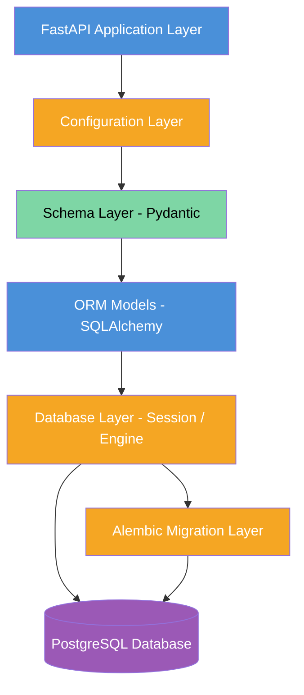
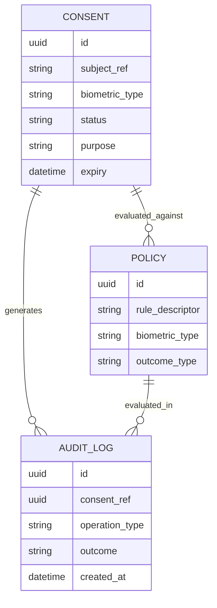
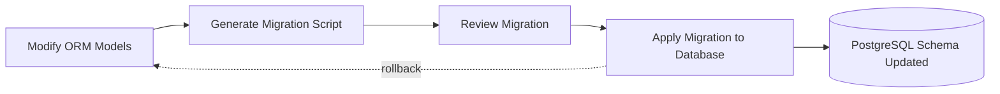

# Week 3 – Backend Foundation & Infrastructure Setup


**Project:** Samsung PRISM Research Project
**Module:** S6 – Biometric Consent & Policy Enforcement Framework
**Author:** Srikesh
**Team:** Team B – Consent Enforcement & Data Governance

---

## Week 3 Objective

> Week 3 focused on establishing the **backend foundation** required to support the future implementation of the Biometric Consent & Policy Enforcement Framework. This phase converts the software design prepared in Week 2 — the architectural blueprints, component diagrams, and workflow specifications — into an **executable backend architecture**, ready to receive business logic in subsequent weeks.

Where Week 2 focused on *design*, Week 3 focuses on *scaffolding*: standing up the project skeleton, the persistence layer, the validation layer, and the migration infrastructure that all future development will build upon.

---

## 1. Week 3 Goals

The following objectives were defined for this phase:

| # | Goal | Outcome |
|---|------|---------|
| 1 | FastAPI project initialization | Backend service scaffolded and runnable |
| 2 | Backend architecture setup | Layered folder structure established |
| 3 | Database layer preparation | SQLAlchemy engine and session management configured |
| 4 | ORM implementation | Declarative models for core entities created |
| 5 | Validation layer | Pydantic schema layer separated from ORM layer |
| 6 | Database migration infrastructure | Alembic configured against shared metadata |
| 7 | Environment configuration | `.env`-based configuration isolation established |

>  **Focus of Week 3:** Infrastructure readiness — not business logic. Consent, Policy, and Access Enforcement logic remain out of scope until the foundation is verified stable.

---

## 2. Backend Project Architecture

The backend follows a **layered architecture**, where each layer has a single responsibility and depends only on the layer directly beneath it. This mirrors the separation of concerns already established in the Week 2 component design, now expressed as an executable structure.



### Why Layered Architecture

- **Separation of concerns** — API, validation, business rules, and persistence remain independent, allowing each to evolve without cascading changes across the system.
- **Maintainability** — a defect or change in the schema layer does not require touching ORM models or database configuration.
- **Scalability** — additional services (Policy Decision Engine, Access Enforcement Module) can be introduced as new layers or modules without restructuring the existing foundation.
- **Testability** — each layer can be unit-tested in isolation, since dependencies flow strictly downward.
- **Alignment with enterprise patterns** — the structure mirrors the layered design already documented in the Week 1 and Week 2 SDD artifacts, ensuring design-to-implementation traceability.

---

## 3. Project Structure

The implementation repository is organized as follows:

```text
implementation/
├── app/
│   ├── api/
│   ├── core/
│   ├── database/
│   ├── models/
│   ├── schemas/
│   ├── services/
│   ├── utils/
│   └── main.py
├── alembic/
│   └── versions/
├── alembic.ini
├── requirements.txt
├── .env.example
├── .gitignore
└── README.md
```

### Folder Responsibilities

| Folder | Purpose | Why It Exists Now |
|--------|---------|--------------------|
| `app/api/` | Houses route definitions and endpoint controllers | Reserved so future Consent, Policy, and Enforcement endpoints have a fixed, predictable location |
| `app/core/` | Application-wide configuration and security utilities | Centralizes settings so no configuration logic is duplicated across modules |
| `app/database/` | Engine creation, session management, declarative base | Isolates persistence wiring from business logic |
| `app/models/` | SQLAlchemy ORM entity definitions | Provides the single source of truth for table structure |
| `app/schemas/` | Pydantic request/response DTOs | Keeps API contracts independent of internal database structure |
| `app/services/` | Business logic layer (future) | Reserved for Consent, Policy, and Enforcement logic in upcoming weeks |
| `app/utils/` | Shared helper functions | Prevents duplication of common logic across services |
| `alembic/` | Migration scripts and version history | Tracks schema evolution independently of application code |

>  Even folders that remain empty in Week 3 (such as `services/`) are intentionally created now, so that the architectural shape of the project is fixed before implementation begins — preventing structural drift in later weeks.

---

## 4. Technology Stack

| Technology | Role | Reason for Selection |
|------------|------|------------------------|
| **Python** | Core language | Mature ecosystem, strong typing support, wide adoption in backend and AI-adjacent systems |
| **FastAPI** | Web framework | High performance, native async support, automatic OpenAPI documentation |
| **SQLAlchemy** | ORM | Mature declarative ORM with strong PostgreSQL support and relationship management |
| **PostgreSQL** | Relational database | ACID compliance, strong support for structured consent and audit metadata |
| **Pydantic** | Data validation | Enforces strict, type-safe request and response contracts |
| **Alembic** | Migration tool | Provides version-controlled, reproducible schema evolution |
| **Uvicorn** | ASGI server | Lightweight, high-performance server for running FastAPI applications |

Each technology was chosen to align with the stack finalized in the Week 1 requirement analysis, ensuring consistency between the approved design and the implemented foundation.

---

## 5. Database Design

Week 3 established the **persistence layer** for the framework by defining the core entities required to support biometric consent governance. No business logic operates on these entities yet — this phase is limited to structural definition.

### 5.1 Entity Overview

| Entity | Purpose |
|--------|---------|
| **Consent** | Represents a biometric consent transaction tied to a subject, capturing status and lifecycle metadata |
| **Policy** | Represents the rules evaluated against a consent record to determine an access decision |
| **Audit Log** | Represents an immutable record of every consent- and policy-related operation for compliance traceability |

### 5.2 Consent Entity

- **Purpose:** Captures the state of a subject's biometric consent at any point in time.
- **Key Fields (conceptual):** identifier, subject reference, biometric type, consent status, purpose, expiry, timestamps.
- **Role in Future Lifecycle:** Serves as the authoritative record consulted by the Policy Decision Engine before any biometric processing request is authorized.

### 5.3 Policy Entity

- **Purpose:** Represents the rule set used to evaluate whether a given consent and request context permits access.
- **Key Fields (conceptual):** identifier, rule descriptor, applicable biometric type, associated action outcomes.
- **Role in Policy Evaluation:** Forms the reference data the Policy Decision Engine will query when producing ALLOW, DENY, or RE-CONSENT REQUIRED outcomes.

### 5.4 Audit Log Entity

- **Purpose:** Provides an immutable, timestamped record of every consent and policy operation.
- **Key Fields (conceptual):** identifier, related consent reference, operation type, outcome, timestamp, integrity hash reference.
- **Role in Compliance:** Supports DPDP Act 2023 and GDPR requirements for traceability and auditability of all consent-related decisions.

### 5.5 Entity Relationship Diagram



---

## 6. ORM Layer

The persistence layer uses SQLAlchemy's **declarative mapping** approach to define entities as Python classes bound to database tables.

Key structural decisions made in Week 3:

| Design Decision | Rationale |
|------------------|-----------|
| **UUID Primary Keys** | Avoids sequential ID enumeration, aligning with privacy-by-design principles for sensitive consent data |
| **Relationships** | Explicit relationships between Consent, Policy, and Audit Log entities preserve referential integrity |
| **Enums** | Constrain fields such as consent status and outcome type to a fixed, predictable set of values |
| **Timezone-Aware Timestamps** | Ensures consistent audit trail behavior across distributed deployments |
| **Indexes** | Applied to frequently queried fields to support efficient consent and audit lookups |
| **Declarative Mapping** | Keeps model definitions readable and centrally maintained against a shared metadata base |

### Why ORM Over Raw SQL

- Reduces the risk of manual SQL errors and injection vulnerabilities.
- Enables schema changes to be tracked in Python code and version-controlled alongside application logic.
- Integrates directly with Alembic for automated migration generation.
- Improves long-term maintainability as the schema grows across future modules (Policy versioning, retention, analytics).

---

## 7. Schema Layer

A dedicated **Pydantic schema layer** was introduced to separate the internal database representation from the external API contract.

| Schema Type | Purpose |
|-------------|---------|
| **Create Schemas** | Define the exact fields required to register a new record, independent of internal storage fields |
| **Update Schemas** | Allow partial modification of a record without exposing immutable fields |
| **Response Schemas** | Define the exact shape of data returned to API consumers, hiding internal-only fields |
| **Common Response Schemas** | Standardize success/error response envelopes across all endpoints |

### Why Separate ORM Models from DTOs

- Prevents internal database structure from leaking into the public API contract.
- Allows the API contract to evolve independently of the underlying schema.
- Enables strict input validation before any data reaches the persistence layer.
- Supports auto-generated OpenAPI documentation with accurate, purpose-specific request/response shapes.

---

## 8. Database Migration

**Alembic** was configured to manage schema evolution independently of application runtime code.

| Capability | Description |
|------------|--------------|
| **Version Control** | Every schema change is captured as a discrete, ordered migration script |
| **Schema Evolution** | New entities or fields can be introduced incrementally without manual database edits |
| **Migration Consistency** | Ensures all environments (local, staging, production) reach an identical schema state |
| **Rollback Support** | Enables safe reversal of a migration if an issue is discovered post-deployment |

### Migration Workflow



---

## 9. Configuration Management

Configuration values required for the application to run are isolated from source code using environment variables.

| Variable | Purpose |
|----------|---------|
| `DATABASE_URL` | Connection string used by SQLAlchemy and Alembic to reach the PostgreSQL instance |
| `SECRET_KEY` | Cryptographic secret used for future JWT-based authentication flows |

### Configuration Isolation

- Local development uses a `.env` file, excluded from version control.
- An `.env.example` template documents required variables without exposing real values.
- Production and development environments consume the same configuration interface, differing only in the values supplied.

>  **Principle:** Configuration values — particularly secrets and connection strings — must never be hardcoded into source files. Hardcoding creates security risk and prevents environment-specific deployment.

---

## 10. Backend Initialization

Week 3 concluded with verification that the backend infrastructure initializes correctly end-to-end.

| Step | Description |
|------|--------------|
| **FastAPI Startup** | Application instance loads without errors and exposes a root health endpoint |
| **Database Initialization** | SQLAlchemy engine establishes a connection using the configured `DATABASE_URL` |
| **Connection Verification** | A successful database connection confirms the persistence layer is reachable |
| **Application Lifecycle** | Startup and shutdown events are handled cleanly by the ASGI server |

>  A successful startup sequence confirms that the infrastructure — application, configuration, ORM, and database connectivity — is ready to support implementation of business modules in future weeks.

---

## 11. Week 3 Deliverables

- ✔ FastAPI initialized
- ✔ Backend architecture established
- ✔ Database layer configured
- ✔ SQLAlchemy models defined
- ✔ Schema layer implemented
- ✔ Alembic configured
- ✔ Initial migration created
- ✔ Environment configuration established
- ✔ Backend startup verified

---

## 12. Challenges Faced

| Challenge | Resolution |
|-----------|------------|
| **Project architecture planning** | Resolved by mapping the Week 2 component design directly onto a folder-per-layer structure, ensuring design-to-code traceability |
| **SQLAlchemy model organization** | Addressed by grouping entities logically and standardizing shared conventions (UUIDs, timestamps) across all models |
| **Pydantic schema separation** | Resolved by defining distinct Create, Update, and Response schemas rather than reusing a single schema across operations |
| **Alembic migration configuration** | Addressed by pointing Alembic's environment configuration to the shared declarative base so future model changes are detected automatically |
| **Environment variable management** | Resolved by introducing an `.env.example` template and excluding actual secrets from version control |
| **Database startup validation** | Addressed by verifying connectivity during application startup before proceeding to further development |

---

## 13. Learning Outcomes

- Practical understanding of **layered backend architecture** and its benefits for large, multi-module systems.
- Deeper familiarity with **ORM abstraction** and its role in maintaining schema integrity.
- Hands-on experience with **migration management** as a discipline separate from application logic.
- Reinforced understanding of **schema validation** as a boundary between external clients and internal storage.
- Practical exposure to **configuration management** best practices in backend systems.
- Broader appreciation for **enterprise backend organization** and how it supports long-term scalability across a multi-team platform like Aegis Agent.

---

## 14. Week 3 Summary

Week 3 successfully established the backend infrastructure required to support the implementation of the Biometric Consent & Policy Enforcement Framework's business modules. The project now has a verified, layered architecture; a structured persistence layer; a validated schema boundary; and a functioning migration pipeline.

With this foundation in place, the project is now prepared for the next implementation phase.

---

<div align="center">

**Samsung PRISM Research Project — Aegis Agent Platform**
Module S6 · Biometric Consent & Policy Enforcement Framework
Week 3 Technical Implementation Report

</div>
