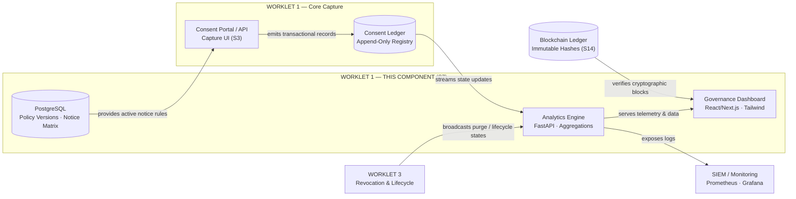
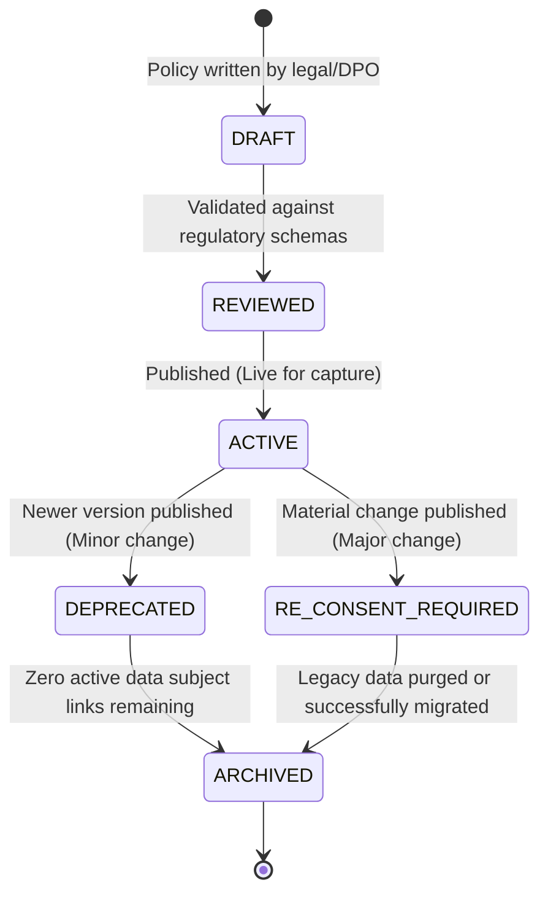
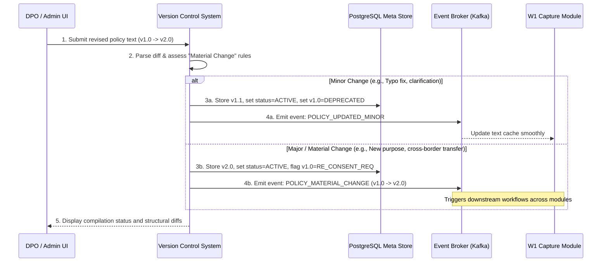
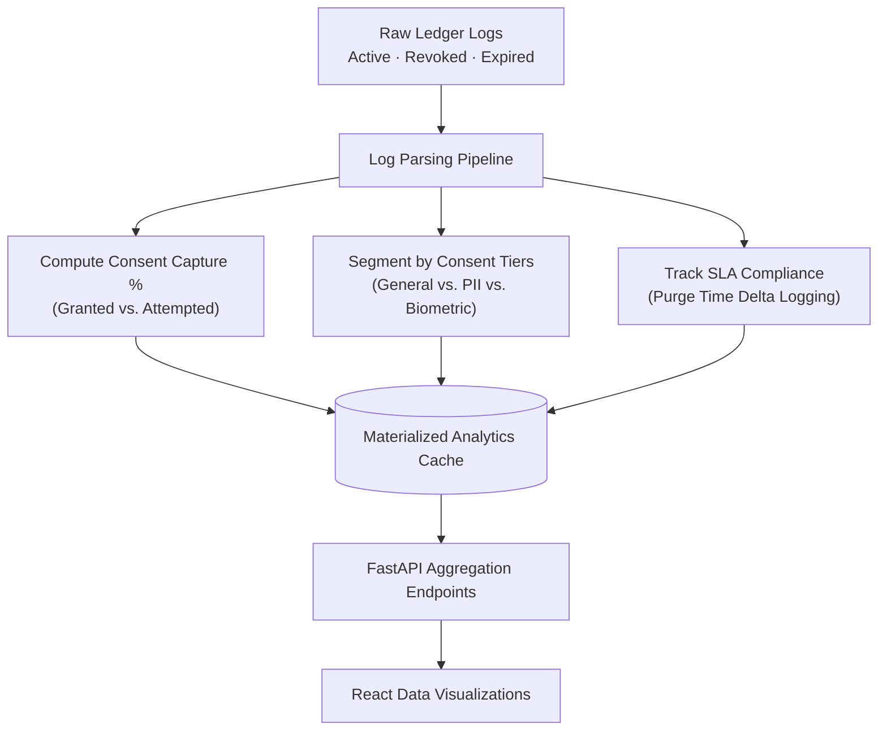
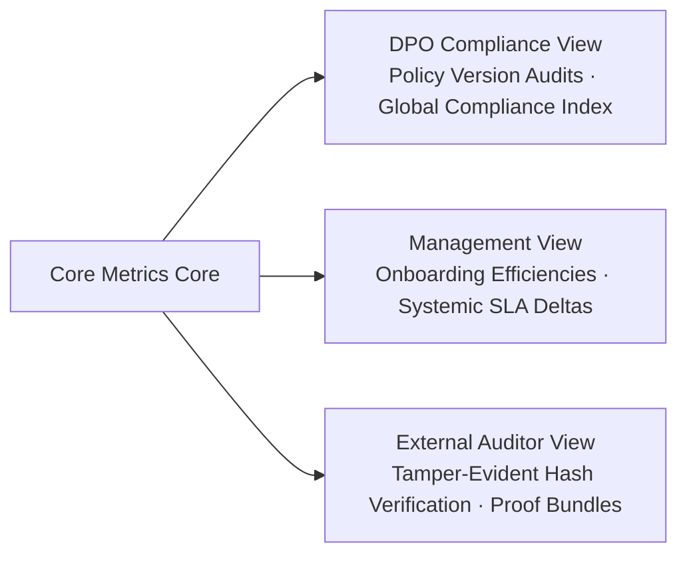
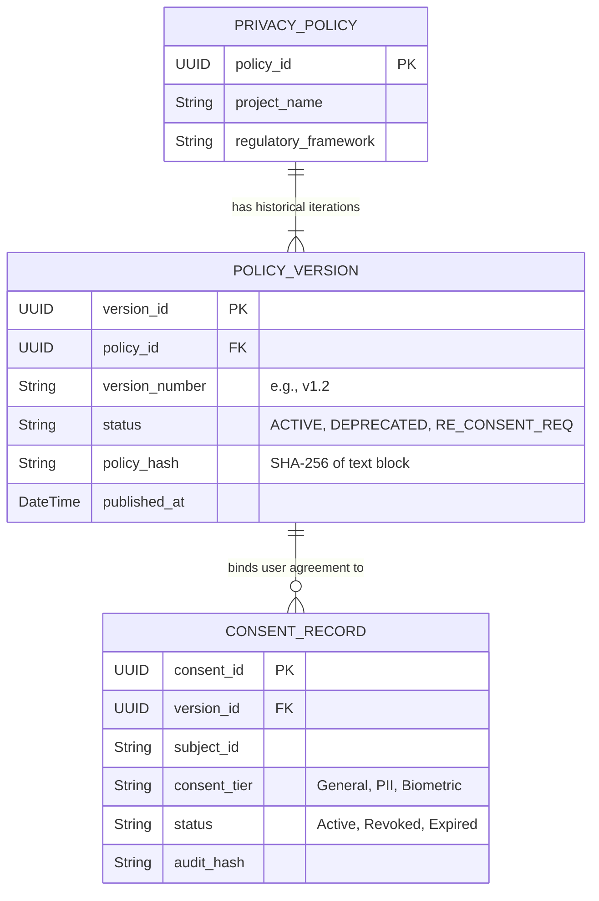
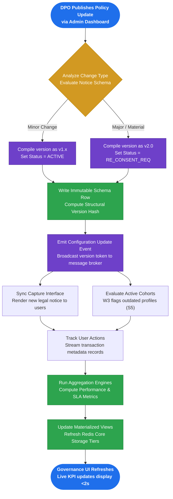

<div align="center">

# Consent Versioning & Policy Version Control + Consent Analytics & Governance Dashboard

### The version control state-engine and visualization command center of **PRISM CMP**

**Worklet 1 — Consent Collection, Mapping & Auto Metadata Generation**
Aegis Agent · AI-Driven Consent Governance & Privacy Enforcement Platform

<br>


</div>

---

> [!IMPORTANT]
> **The thesis in one line.** Privacy policies and consent frameworks are living structures, not static text files. While other components capture consent or execute purges, **this module acts as the "brain" that tracks how privacy rules evolve over time and provides Data Protection Officers (DPOs) with the visual command center to monitor global compliance.**

---

## Table of Contents

| # | Section |
|---|---|
| 1 | [What This Topic Actually Is](#1-what-this-topic-actually-is-plain-decode) |
| 2 | [Where This Lives in the Project](#2-where-this-lives-in-the-project) |
| 3 | [The Policy Versioning State Machine](#3-the-policy-versioning-state-machine) |
| 4 | [The Governance Pipeline & Change Management](#4-the-governance-pipeline--change-management) |
| 5 | [The Two Hard Problems](#5-the-two-hard-problems-historical-reconstruction-vs-aggregation-latency) |
| 6 | [Consent Analytics Engine & Metric Derivation](#6-consent-analytics-engine--metric-derivation) |
| 7 | [Granular Auditing & Reporting Tiers](#7-granular-auditing--reporting-tiers) |
| 8 | [Data Model & a Robust Versioned Schema](#8-data-model--a-robust-versioned-schema) |
| 9 | [Week 2 & 3 Deliverable: Versioning Model & Implementation](#9-week-2--3-deliverable-versioning-model--dashboard-wireframes) |
| 10| [Open Problem & Research Direction](#10-open-problem--research-direction) |
| 11| [Regulatory Mapping](#11-regulatory-mapping) |
| 12| [Glossary](#12-glossary) |
| 13| [Overall Workflow: Policy Update to Dashboard Refresh](#13-overall-workflow-policy-update-to-dashboard-refresh) |

---

## 1. What This Topic Actually Is (Plain Decode)

This topic represents the **systemic governance and visualization layer** of Worklet 1. It encompasses everything required to manage the lifecycle of a legal/privacy policy document and evaluate compliance health across all data repositories. It is split into three foundational pillars:

| Pillar | What it means | What triggers it |
|--------|---------------|------------------|
| **Policy Version Control** | Treating privacy notices like code. When a legal policy changes, it receives an immutable version identifier. The system tracks exactly which users agreed to which specific notice iteration, removing historical ambiguity. | Legal changes, new R&D purposes, or regulatory revisions. |
| **Consent Analytics Engine** | Processing metadata from millions of transactional consent actions to compute system health KPIs in real time (e.g., capture rates, active consent distributions, and compliance velocity). | Ingestion of raw consent tokens or real-time state changes from the network. |
| **Governance Dashboard** | The visual command center (DPO Web Console) providing continuous visibility into compliance indices, tracking SLA deadlines, and serving as a one-click export mechanism for regulatory audit packages. | DPO reviews, administrative checks, or preparation for regulatory audits. |

> [!NOTE]
> **The unifying idea:** If consent state and scope form the access-control truth for the data layer, **this component provides the versioned rulebook and the lens to inspect, verify, and report on that truth.**

---

## 2. Where This Lives in the Project

This component is the W1 deliverable named **"Governance Dashboard & Analytics."** It serves as the analytical layer of **Worklet 1**, reading transaction states from the core registries and summarizing operations for the presentation layer.



> [!NOTE]
> **Architectural Boundary:** This module does not perform on-device biometric or document PII scrubbing. Instead, it tracks the metadata generated by those actions. It serves as a centralized hub: the backend models notice version parameters, while the dashboard exposes visual performance metrics against targeted project success metrics.

---

## 3. The Policy Versioning State Machine

Privacy policies progress through strict control states before being exposed to a Data Subject or enforcing compliance rules at the storage tier:



| Rule | Detail |
|------|--------|
| **Immutability Principle** | Once a policy reaches the `ACTIVE` state, its text, layout, and schema variables are frozen permanently to protect historical records. |
| **The Ingestion Rule** | The Consent Capture portal can only render and bind new transactions to a policy currently in the `ACTIVE` state. |
| **The Purge / Migration Triggers** | When a policy transitions to `RE_CONSENT_REQUIRED`, an event cascade instructs Worklet 3 to evaluate whether downstream user data must be isolated or flagged for re-consent. |

---

## 4. The Governance Pipeline & Change Management

When a policy is modified, the version control system must evaluate the impact of the change. Changes are treated as either **Minor** or **Major (Material)**:



### Strategic Analysis: Handling Change Classifications

| Property | Minor Change (v1.0 -> v1.1) | Major Change (v1.0 -> v2.0) |
|----------|----------------------------------------|----------------------------------------|
| **Structural Impact** | None. Text or cosmetic adjustments only. | Alters the legal basis, purpose, or data types collected. |
| **System Reaction** | Graceful fallback. Existing consents remain valid. | Restricts downstream processing until fresh consent is secured. |
| **Consent State Action** | Retained as `ACTIVE`. | Flags target cohorts as `PENDING_RE_CONSENT`. |
| **Downstream Cascade** | Minimal notification logging. | Dispatches re-consent alerts via communication channels. |

---

## 5. The Two Hard Problems: Historical Reconstruction vs. Aggregation Latency

Simultaneously managing historical version control and live performance metrics creates two complex data engineering challenges:

<table>
<tr>
<th width="50%">Problem 1 — Historical Reconstruction</th>
<th width="50%">Problem 2 — Dashboard Aggregation Latency</th>
</tr>
<tr>
<td>

*"How do you accurately map consent records back to ancient versions of a policy if data entities are modified over time?"*

**Resolution:** Implement an **Event-Sourced Snapshotted Schema**. The policy configuration database uses append-only rows with cryptographic hashes verifying the content block. User transactions explicitly log the immutable `policy_hash` alongside the `ConsentID`. This ensures structural audits are based on mathematical constants rather than mutable lookup parameters.

</td>
<td>

*"How do you maintain a dashboard loading speed of under 2 seconds while scanning millions of records for real-time metric updates?"*

**Resolution — Materialized Views & Time-Bucket Cache:** Avoid running heavy relational aggregate computations directly on transactional tables. Utilize database triggers or micro-batch pipelines to update structured tables hourly. Combine this approach with an in-memory Redis layer for high-velocity counters, ensuring the frontend interface remains highly responsive.

</td>
</tr>
</table>

---

## 6. Consent Analytics Engine & Metric Derivation

The analytics layer transforms transactional log sequences into clear, actionable compliance signals.



### Core Metrics Equations

* **Consent Capture Efficiency (Ecc):** Tracks system onboarding health against the minimum targeted >=99% operational capture baseline.
    * `Ecc = (Total Successfully Signed Consents / Total Project Enrollment Capture Attempts) * 100`

* **Systemic Purge Accuracy (Asp):** Evaluates asset compliance across distinct infrastructure segments to support the targeted >=98% platform traceability goal.
    * `Asp = (Successfully Scrubbed or Purged Associated Assets / Total Assets Identified with Invalidated Consent IDs) * 100`

* **SLA Processing Delta (Delta_SLA):** Measures real-time processing duration to ensure the platform meets the strict 24-hour revocation purge timeline.
    * `Delta_SLA = T_ErasureCertificateGeneration - T_RevocationRequestReceipt <= 24 Hours`

---

## 7. Granular Auditing & Reporting Tiers

The system isolates reporting view criteria depending on corporate operational focus, protecting structural system metrics while surfacing relevant compliance data:



> [!IMPORTANT]
> **Data Minimization Rule:** To prevent compliance reporting layers from becoming privacy liabilities, the dashboard processes and exports **only anonymized metadata, structural counters, and cryptographic hash evidence.** Raw personal information remains locked within secure processing zones and is never exposed on analytical graphs.

---

## 8. Data Model & a Robust Versioned Schema

### Conceptual PostgreSQL Schema Blueprint (Relational Meta Store)

```sql
-- Tracks parent policies representing specific legal frameworks or R&D tracks
CREATE TABLE privacy_policies (
    policy_id UUID PRIMARY KEY DEFAULT gen_random_uuid(),
    project_id VARCHAR(100) NOT NULL,
    policy_name VARCHAR(255) NOT NULL,
    created_at TIMESTAMP WITH TIME ZONE DEFAULT CURRENT_TIMESTAMP
);

-- Houses explicit, immutable historical versions of policies
CREATE TABLE policy_versions (
    version_id UUID PRIMARY KEY DEFAULT gen_random_uuid(),
    policy_id UUID REFERENCES privacy_policies(policy_id),
    major_version INT NOT NULL,
    minor_version INT NOT NULL,
    policy_text TEXT NOT NULL,
    policy_hash VARCHAR(64) NOT NULL, -- SHA-256 validation marker
    status VARCHAR(50) NOT NULL,      -- DRAFT, ACTIVE, DEPRECATED, RE_CONSENT_REQ
    change_type VARCHAR(20) NOT NULL, -- MINOR, MAJOR
    published_at TIMESTAMP WITH TIME ZONE,
    UNIQUE(policy_id, major_version, minor_version)
);

-- Binds transactional records directly to the active policy version
CREATE TABLE consent_records (
    consent_id UUID PRIMARY KEY DEFAULT gen_random_uuid(),
    subject_id VARCHAR(100) NOT NULL,
    version_id UUID REFERENCES policy_versions(version_id),
    consent_tier VARCHAR(50) NOT NULL, -- GENERAL, PII, BIOMETRIC
    status VARCHAR(50) NOT NULL,       -- ACTIVE, SUSPENDED, REVOKED, EXPIRED
    signed_at TIMESTAMP WITH TIME ZONE DEFAULT CURRENT_TIMESTAMP,
    audit_hash VARCHAR(64) NOT NULL    -- Cryptographic link to ledger
);
```

### AuditHash Validation Matrix
To secure global reporting metrics, this module implements the enhanced, deterministic, length-prefixed verification format:

`AuditHash = SHA256(LengthPrefix(SubjectID) || LengthPrefix(Status) || LengthPrefix(ProjectID) || LengthPrefix(VersionID))`

The dashboard validates these transactional blocks against the append-only record stream. Any variation in string length or ordering immediately flags the metric row as **"Compromised"** in the administrative UI.

---

## 9. Week 2 & 3 Deliverable: Versioning Model & Dashboard Wireframes

This section fulfills the Week 2 requirements for establishing the conceptual foundation of the version control system and drafting the user interface architecture for the DPO.

### 9.1 Consent Versioning Conceptual Model (Entity-Relationship)

The versioning model ensures that every consent record is strictly bound to the exact legal language active at the time of signing. 



### 9.2 DPO Governance Dashboard Wireframes

Below is the structural blueprint for the React/Next.js frontend. The interface is designed for high-density information scanning by Compliance Officers.

#### View 1: Global Health & Analytics Overview
```text
+-----------------------------------------------------------------------------------+
|  [Logo] PRISM CMP              | Dashboard | Policy Versions | Audit Logs | [User] |
+-----------------------------------------------------------------------------------+
|  GLOBAL COMPLIANCE HEALTH                                     [Export DPDP Report]|
+-----------------------------------------------------------------------------------+
|  +--------------------+  +--------------------+  +-----------------------------+  |
|  | Consent Capture    |  | SLA Purge Rate     |  | Total Active Subjects       |  |
|  | 99.4%              |  | 100%               |  | 14,203                      |  |
|  | ▲ 0.2% this week   |  | (All < 24 hrs)     |  | 8,000 PII | 6,203 Biometric |  |
|  +--------------------+  +--------------------+  +-----------------------------+  |
+-----------------------------------------------------------------------------------+
|  CONSENT LIFECYCLE TRENDS (Line Chart)                                            |
|  |                                                                                |
|  |   /\      /---  (Active)                                                       |
|  |  /  \----/                                                                     |
|  | /             ___ (Revoked)                                                    |
|  |/___/\________/___                                                              |
|  +-----------------------------------------------------------------------------+  |
+-----------------------------------------------------------------------------------+
```

#### View 2: Policy Version Control & Re-Consent Management
```text
+-----------------------------------------------------------------------------------+
|  POLICY VERSION MANAGEMENT                                  [ + Draft New Policy ]|
+-----------------------------------------------------------------------------------+
|  Active Policies                                                                  |
|  -------------------------------------------------------------------------------  |
|  Project       | Version | Status   | Active Consents | Actions                   |
|  SEED Lab R&D  | v2.1    | ACTIVE   | 8,402           | [View Diff] [Deprecate]   |
|  Voice AI Set  | v1.0    | ACTIVE   | 3,100           | [View Diff] [Deprecate]   |
|  -------------------------------------------------------------------------------  |
|                                                                                   |
|  Re-Consent Pipeline (Pending Action)                                             |
|  -------------------------------------------------------------------------------  |
|  Legacy Version | Impacted Subjects | Migration Status | Actions                  |
|  SEED Lab v1.5  | 1,204             | 45% Re-consented | [Send Alerts] [Purge]    |
|  SEED Lab v2.0  | 89                | 90% Re-consented | [Send Alerts] [Purge]    |
+-----------------------------------------------------------------------------------+
```
## 9.3 Week 3 Deliverable: Implemented Governance UI & Analytics Engine

Building upon the conceptual wireframes from Week 2, the Week 3 implementation delivers a fully functional, production-ready stack for Worklet 1.

### Implementation Stack & Architecture
* **Frontend Dashboard (`frontend/app/page.tsx`):** Built with Next.js 14 and Tailwind CSS, styled using a warm, editorial aesthetic (`#FDFBF7` backgrounds, stone-gray containers, and terracotta accents) to replace harsh stark-white elements.
* **Analytics Visualization:** Features a zero-dependency, responsive SVG Area Chart tracking rolling 12-month consent capture performance with interactive hover metrics.
* **Backend Aggregation API (`backend/main.py`):** FastAPI service providing endpoints for policy version registries, state tracking, and SHA-256 audit-hash verification.

### Actualized Dashboard Architecture

```text
+-----------------------------------------------------------------------------------+
|  Aegis Agent · S7 Governance                                 • All systems operational|
+-----------------------------------------------------------------------------------+
|  Consent Versioning Dashboard                                                     |
|  DPDP / GDPR policy lifecycle — real-time governance view                         |
|                                                                                   |
|  +--------------------+  +--------------------+  +-----------------------------+  |
|  | CONSENT CAPTURE    |  | SLA PURGE TIME     |  | ACTIVE DATA SUBJECTS        |  |
|  | 99.9%              |  | < 24h              |  | 1.2M                        |  |
|  | Last 30 days       |  | Avg. across regions|  | Across all policies         |  |
|  +--------------------+  +--------------------+  +-----------------------------+  |
|                                                                                   |
|  +-----------------------------------------------------------------------------+  |
|  | Compliance Index Trend                  Peak: 99.9% | 12-Mo Avg: 97.4%      |  |
|  | Rolling 12-month consent capture score  Status: Compliant (DPDP / GDPR)     |  |
|  | [Interactive SVG Area Chart with Terracotta Gradient Fill & Trend Points]   |  |
|  +-----------------------------------------------------------------------------+  |
|                                                                                   |
|  Policy Version Registry                                  [ ALL ] [ ACTIVE ]      |
|  -------------------------------------------------------------------------------  |
|  POLICY NAME              | VERSION | JURISDICTION | STATUS   | ACTIONS           |
|  Global Consent Notice    | v2.1    | GDPR         | ACTIVE   | [Export Report]   |
|  DPDP Data Processing     | v1.3    | DPDP         | ACTIVE   | [Export Report]   |
|  -------------------------------------------------------------------------------  |
+-----------------------------------------------------------------------------------+
```
---

## 10. Open Problem & Research Direction

> [!NOTE]
> **Limitation.** Real-time tracking across thousands of distributed clients introduces processing gaps, meaning data metrics can experience synchronization skew.

| Actionable Mitigation | Technical Execution |
|------------|-----|
| **Sliding-Window Aggregations** | Implement windowed processing using analytical tools to manage minor data delays cleanly. |
| **Cryptographic Block Ingestion** | Use atomic transactions to tie the validation state directly to ledger entry confirmations. |
| **Statistical Drift Projection** | Introduce analytical estimation tracking to alert operators if system validation delays deviate from normal baseline patterns. |

---

## 11. Regulatory Mapping

| Core Obligation | DPDP Act 2023 Alignment | GDPR Equivalence | Module Implementation Coverage |
|---|---|---|---|
| **Notice Version Verification** | Section 5 (Requirement of Notice) | Article 13/14 (Information to be provided) | Enforces precise matching between the current system rule configuration and individual signed consent actions. |
| **Demonstrable Accountability** | Section 6 (Consent Validity Tracking) | Article 7(1) (Demonstration of Consent) | Provides real-time query engines and dashboard visualizations to confirm system-wide compliance. |
| **Automated SLA Metric Controls** | Section 12 (Data Subject Erasure Auditing) | Article 17 (Right to Erasure Proofs) | Tracks background task performance to confirm distributed data purges finish within the required 24-hour limit. |

---

## 12. Glossary

| Term | Full form | One-line meaning |
|------|-----------|------------------|
| **VCS** | Version Control System | Software component managing historical updates and change trees. |
| **DPO** | Data Protection Officer | The primary corporate officer responsible for system privacy health. |
| **SLA** | Service Level Agreement | Explicit structural timelines governing operational performance guarantees. |
| **KPI** | Key Performance Indicator | A standardized metric used to evaluate system operational health. |
| **Material Change** | — | A major update that fundamentally impacts data collection terms, triggering user re-consent. |
| **Event Sourcing** | — | Architectural pattern where state changes are stored as a sequence of immutable events. |

---

## 13. Overall Workflow: Policy Update to Dashboard Refresh

The system lifecycle journey from the moment an administrator alters a privacy policy rule to the live metrics dashboard updating automatically across the network interface.



### Phase Breakdown

| Phase | Steps Involved | Operational Objective |
|---|---|---|
| **1 · Author & Classify** | Policy Draft -> Change Evaluation -> Version Compilation | Guarantees changes are structurally evaluated before being deployed across the ingestion system. |
| **2 · Broadcast & Coordinate** | Event Broadcast -> Ingestion Sync -> Enforcement Cascade | Updates the global system rules simultaneously, ensuring active collection forms mirror backend expectations. |
| **3 · Parse & Aggregate** | Metadata Stream -> Running Calculation -> Cache Update | Transforms raw audit hashes into scannable charts without introducing latency bottlenecks. |
| **4 · Visual Verification** | View Segmentation -> Live Refresh -> Export Compilation | Exposes system health indices to administrators, ensuring clear evidence reporting. |

---

<div align="center">

### Key Takeaways

**1.** *"Control the version, protect the data"* — Snapped relational structures remove compliance gaps across complex operational workflows.
**2.** *Clear visibility breeds confidence* — High-speed metric pipelines ensure system adherence remains continuously auditable.

<br>

**Worklet 1 · PRISM CMP · Samsung Research**

</div>
