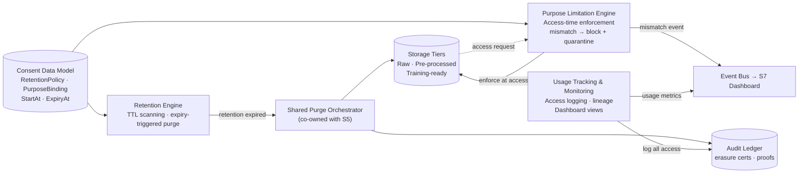

# Data Lifecycle & Retention Management

**Owner:** N D Jitendra 
**Sub-topic:** S8 — Data Retention & Purpose Limitation Management + Dataset Usage Tracking & Monitoring 
**Status:** In Progress 
**Last Updated:** 2026-07-08

---

## 1. Scope

**In scope:**
- Retention policy definition and automated enforcement across all storage tiers (raw, pre-processed, training-ready)
- Retention-expiry-triggered deletion cascades via the shared purge orchestrator (co-owned with S5)
- Purpose limitation enforcement at data access / query / pipeline ingestion time
- Dataset usage tracking — logging every access, transformation, and downstream use of consented data
- Usage monitoring dashboard views (shared dashboard platform with S7, separate view)
- Erasure certificate generation for retention-expiry purges
- Integration with the consent data model fields: `StartAt`, `ExpiryAt`, `PurposeID`, `PurposeVersion`

**Out of scope:**
- Revocation-triggered purges (owned by S5; shared purge orchestrator is co-owned)
- Purpose *change* events and re-consent triggers (owned by S5)
- Biometric-tier-specific policy decisions (owned by S6)
- Consent version history and governance dashboard platform (owned by S7; S8 contributes usage views only)
- Consent capture UI / mobile app (Worklet 1)
- PII detection and redaction engine (Worklet 2)

---

## 2. Objective

This component enforces the *back half* of the consent lifecycle — ensuring data is automatically purged when its retention period lapses, that data consented for purpose X is never used for purpose Y, and that every dataset usage is tracked and auditable. S5 handles explicit consent state changes (revocation, re-consent); S8 handles continuous, time-based and scope-based enforcement. Together they form the two halves of data lifecycle management within Team B's consent enforcement engine. The project PDF mandates ≥ 98% traceability between consent records and associated datasets, ≥ 99% consent governance accuracy, and 100% auditability — all of which depend on S8's enforcement and tracking capabilities.

---

## 3. Design / Architecture

The component is structured around three engines that share the consent data model and the team's event bus:

**Retention Engine** — periodically scans `ExpiryAt` against current time. Expired records transition to `EXPIRED` and are forwarded to the shared purge orchestrator for deletion across all storage tiers, followed by erasure certificate generation.

**Purpose Limitation Engine** — intercepts every data access request. Each request must declare a `PurposeID`; the engine checks it against the active `ConsentPurposeBinding`. Mismatch → block access, quarantine the asset, emit an audit event, and alert the DPO.

**Usage Tracking & Monitoring** — observes all data access events, enriches them with consent context (who accessed what, under which purpose, with what consent status), and feeds the S7 governance dashboard's usage monitoring view.

---

## 4. Interfaces Exposed

| Interface | Called by | Purpose |
|---|---|---|
| `checkPurpose(AssetUUID, PurposeID, PurposeVersion)` → allow / block | S5, S6, any processing pipeline | Purpose limitation check at point of use |
| `getRetentionStatus(ConsentID)` → active / nearing_expiry / expired | S5, S7 dashboard | Query current retention state of a consent record |
| `triggerRetentionPurge(ConsentID)` → purge job ID | Retention Scanner (internal), admin override | Manually or automatically trigger retention-expiry purge |
| `getUsageLog(AssetUUID / ConsentID, timeRange)` → usage events | S7 dashboard, DPO portal, audit export | Retrieve usage history for a specific asset or consent |
| `getUsageMetrics(ProjectID, timeRange)` → aggregated stats | S7 governance dashboard | Aggregated usage statistics for dashboard views |
| `emitRetentionEvent(event)` → void | Internal | Publish retention/purpose events to the shared event bus (consumed by S7) |

---

## 5. Interfaces Consumed

| Dependency | Source | Purpose |
|---|---|---|
| `ConsentRecord` (status, StartAt, ExpiryAt, PurposeID, PurposeVersion) | `contracts/consent-data-model.md` | Core data model for retention and purpose evaluation |
| `ConsentPurposeBinding` (ConsentID, AssetUUID, PurposeID, PurposeVersion) | `contracts/consent-data-model.md` | Purpose limitation enforcement lookups |
| Consent State Machine (transitions → EXPIRED → PURGED) | `contracts/consent-state-machine.md` / S5 | Retention-expiry state transitions |
| Policy Decision Interface (`isActionAllowed`) | `contracts/policy-decision-interface.md` / S6 | Policy decisions that feed into purpose enforcement |
| Event / Audit Schema | `contracts/event-audit-schema.md` / S7 | Schema for events S8 emits to the S7 dashboard |
| Shared Purge Orchestrator | S5 (co-owned) | Shared deletion cascade — S5 triggers on revocation, S8 triggers on retention expiry |

---

## 6. Data Model Additions

Proposed additions to `consent-data-model.md` (to be reviewed by all four owners before merge):

- **`RetentionPolicy`** — `PolicyID`, `ProjectID`, `ConsentTier` (General / PII / Biometric), `StorageTier` (Raw / PreProcessed / TrainingReady), `RetentionDuration`, `MaxRetentionDuration` (regulatory ceiling), `PurgeMethod` (Delete / CryptoShred / Anonymize), `AutoRenewable` (boolean)
- **`RetentionState`** (extends ConsentRecord) — `ConsentID`, `CurrentRetentionStatus` (Active / NearingExpiry / Expired / PurgeQueued / Purged), `ExpiryAt`, `LastCheckedAt`, `PurgeJobID`, `ErasureCertificateID`
- **`UsageRecord`** (append-only, hash-chained) — `UsageID`, `AssetUUID`, `ConsentID`, `PurposeID`, `PurposeVersion`, `AccessorID`, `AccessorType` (user / service / pipeline), `AccessType` (Read / Transform / Train / Export), `ConsentStatusAtAccess`, `Timestamp`, `PrevUsageHash`, `ResultAction` (Allowed / Blocked / Quarantined)
- **`PurposeViolationRecord`** — `ViolationID`, `AssetUUID`, `ConsentID`, `DeclaredPurposeID` vs. `BoundPurposeID`, `Action` (Blocked / Quarantined), `EscalatedTo` (DPO notification ID), `Timestamp`

---

## 7. DPDP / GDPR Mapping

| Section / Article | Obligation | How this component addresses it |
|---|---|---|
| DPDP S.6 (Consent — purpose-specific) | Consent must be specific to the purpose of processing | Purpose Limitation Engine enforces purpose binding at every data access point; mismatch → block |
| DPDP S.8 (Retention obligation) | Data fiduciary shall not retain data beyond the period necessary | Retention Engine auto-purges data when `ExpiryAt` lapses; per-tier retention policies prevent over-retention |
| DPDP S.12 (Security safeguards) | Reasonable security safeguards required | AES-256 encrypted storage tiers; crypto-shredding on purge; hash-chained audit logs |
| DPDP S.13 (Retention limitation) | Data shall not be retained longer than necessary for the purpose | Automated retention scanning + deletion; hard ceiling via `MaxRetentionDuration` |
| DPDP S.17 (Breach notification) | Notify Board and data principal of breaches | Purpose violation events trigger DPO alerts; usage logs provide breach investigation evidence |
| GDPR Art. 5(1)(b) (Purpose limitation) | Data shall not be further processed incompatibly with original purpose | Purpose Limitation Engine checks `PurposeID` binding at access time |
| GDPR Art. 5(1)(e) (Storage limitation) | Data kept no longer than necessary | Retention Engine enforces time-bound storage with automated purge |
| GDPR Art. 17 (Right to erasure) | Erasure when purpose served or consent withdrawn | Retention-expiry purge (S8) + revocation purge (S5) via shared orchestrator |
| GDPR Art. 25 (Privacy by design) | Data protection by design and by default | Purpose enforcement is built into the data access path; retention is automated, not manual |
| GDPR Art. 30 (Records of processing) | Maintain records of processing activities | Usage Tracking Engine logs every access with consent context, purpose, and accessor identity |

---

## 8. Research Notes & Benchmarks

| Platform | What they do | What's different in our approach |
|---|---|---|
| **OneTrust** | Privacy management & consent automation; retention scheduling with automated deletion | OneTrust works with enterprise data maps and global policies; we enforce at per-consent, per-tier granularity with crypto-shredding |
| **BigID** | Data discovery, consent & compliance; ML-driven classification and purpose-of-processing labeling | BigID is discovery-first and flags issues post-hoc; we are enforcement-first — blocking access in real time before data is returned |
| **Privitar** | Data privacy platform with dynamic masking & anonymization | Privitar provides anonymization tools; we add purpose-binding enforcement on top of anonymized data at the access layer |
| **Securiti.ai** | AI-driven privacy compliance; automated data lifecycle management and consent orchestration | Securiti.ai offers broad DSPM across enterprise; we focus specifically on consent-bound retention with per-asset cryptographic proof of erasure |
| **TrustArc** | Data privacy platform & consent management; retention policy templates and compliance reporting | TrustArc is policy-template driven; our retention engine is consent-record driven with per-asset granularity and hash-chained audit trails |

**Key differentiators of S8's approach:**
1. Retention is per-consent, per-purpose, per-storage-tier — not a global policy
2. Purpose enforcement is real-time at the access path, not post-hoc flagging
3. Every purge produces a cryptographic erasure certificate with hash-chained evidence
4. Usage tracking provides full lineage from consent to every downstream data use

---

## 9. Open Questions / Risks

- **Shared Purge Orchestrator ownership:** S5 and S8 co-own one orchestrator (per README). Who maintains the codebase? How are simultaneous revocation-triggered and retention-triggered purges for the same asset resolved?
- **Retention extension on re-consent:** When a subject re-consents (new version), does the retention window reset from the new `StartAt`, or does the original `ExpiryAt` hold? Legal implications under DPDP S.13.
- **Training data after expiry:** If data was already ingested into a trained model before retention expired, what is the obligation? Consent-gated ingestion prevents this prospectively, but legacy models are an open problem (machine unlearning research frontier).
- **Dashboard interface with S7:** README proposes one dashboard platform, two views. Need to confirm: does S8 push pre-aggregated metrics, or does S7 pull raw usage events?
- **Per-tier retention durations:** Can different storage tiers have different retention durations for the same consent record (e.g., raw at 6 months, training-ready at 12 months)? If so, data model needs per-tier `ExpiryAt`.
- **Cross-border retention ceilings:** GDPR and DPDP may impose different maximum retention periods. Which `MaxRetentionDuration` applies for subjects covered by both?
- **Third-party deletion propagation:** When retention expires on assets shared with third parties, how do we enforce downstream deletion? Contractual deletion-propagation requests apply but are hard to verify.

---

## 10. Status Log

| Date | Update |
|---|---|
| 2026-07-08 | Added the required contents in accordance w/ the contributor's template |