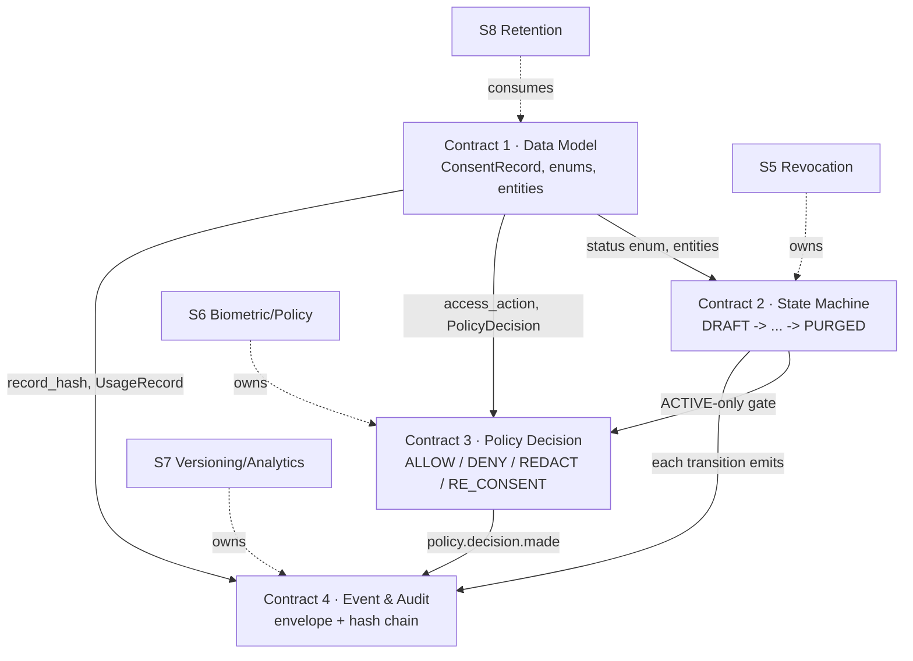

# `contracts/` — Team B Shared Interface Layer

> **Aegis Agent · Team B — Dynamic Consent Enforcement Framework (S5–S8)**
> The source of truth every module (S5, S6, S7, S8) must conform to before it agrees with itself.

Team B is **not four separate projects** — it is **one consent-enforcement engine** with four modules that read and write the **same consent state**. These four contracts are the interfaces that keep the modules from silently diverging. Interface-first, so the four modules can be built in parallel and still integrate.

---

## The four contracts

| # | Contract | Defines | Owner | Reviewed by | Status |
|---|---|---|---|---|---|
| 1 | [`consent-data-model.md`](consent-data-model.md) | Canonical `ConsentRecord` + all related entities, enums, invariants | **Shared** (custodian S5) | all four | Proposed `v1.0.0` |
| 2 | [`consent-state-machine.md`](consent-state-machine.md) | The 7 legal consent states and every permitted transition | **S5** Vishaal | all four | Proposed `v1.0.0` |
| 3 | [`policy-decision-interface.md`](policy-decision-interface.md) | The runtime "is this action allowed?" PDP request/response + algorithm | **S6** Srikesh | all four | Proposed `v1.0.0` |
| 4 | [`event-audit-schema.md`](event-audit-schema.md) | Event envelope, event catalog, and the tamper-evident audit hash chain | **S7** Nilesh | all four | Proposed `v1.0.0` |

## How they fit together

## Working agreement (the one control that matters)

> [!WARNING]
> **Four-owner review gate.** Any change to any file in `contracts/` MUST be reviewed and approved by **all four owners (S5, S6, S7, S8)** before merge. This is the single control that prevents the four modules from silently diverging. Each contract carries its own change-control and version-history section.

- **Versioning:** semver. Minor = backward-compatible (new optional field, new enum value, clarification). Major = breaking (rename, type change, new required field, removed value) and requires every consuming module to update in the same integration window.
- **Normative language:** all four use RFC 2119 (`MUST`/`SHOULD`/`MAY`). A module violating a `MUST` is non-conformant and is not integrated.

## Reconciliation summary (Week-2 audit)

These contracts were synthesized from the four members' Week-2 design docs, which contained real divergences. Each contract's **Reconciliation notes** section documents exactly what was harmonized. Headlines:

- **Three conflicting `ConsentRecord` definitions** (S5 vs S6 vs S7) → one canonical model (Contract 1 §11).
- **Purpose as free text (S6)** → versioned `(purpose_id, purpose_version)` everywhere.
- **"Policy" terminology collision:** S6's runtime *authorization* rules vs S7's *legal notices* → split into `AuthorizationPolicy` vs `NoticeVersion`.
- **Two consent state machines (S5 vs S6)** → one canonical 7-state machine; S6's `RE_CONSENT_REQUIRED` reclassified as a PDP decision, not a state (Contract 2 §10).
- **Weak XOR audit hash** → length-prefixed, domain-separated SHA-256 with record chaining; unifies S5's and S7's differing preimages (Contract 4 §6).
- **Corrected DPDP citations:** erasure/retention = **§8(7)** (+ Rules 2025 Rule 8); breach = **§8(6)** — fixing the GDPR-flavored numbers in the drafts.
- **Framing fixes flagged:** S7's doc is mislabeled "Worklet 1"; S5's still carries "Worklet 3" badges — Team B / S5–S8 is the canonical framing.

## Open decisions pending mentor confirmation
Team-A/Team-B minting boundary · purge-orchestrator custody (S5/S8) · re-consent retention reset · S7-pull vs S8-push metrics · per-tier retention windows. See Contract 1 §12.
