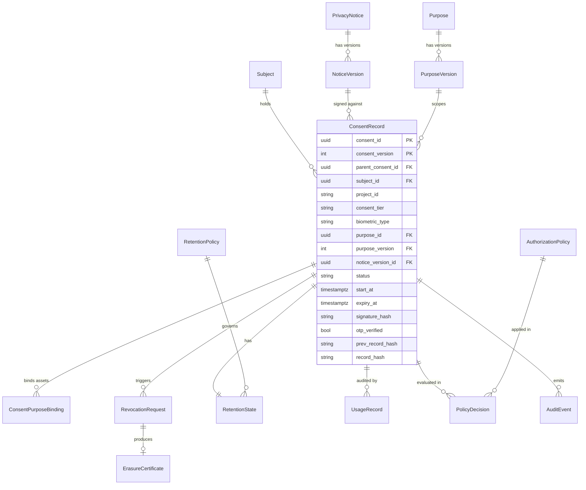

# Contract 1 — Canonical Consent Data Model

> **Aegis Agent · Team B — Dynamic Consent Enforcement Framework (S5–S8)**
> The single source of truth for the shape of consent state that S5, S6, S7, and S8 read and write.

| Field | Value |
|---|---|
| **Contract ID** | `TEAMB-C1-DATA-MODEL` |
| **Version** | `1.0.0` (Week-2 baseline) |
| **Status** | **Proposed** — pending ratification by all four owners + mentor confirmation of the Team-A/Team-B boundary |
| **Primary owner** | Shared (all four owners); editorial custodian: **S5 · Vishaal Pillay** |
| **Reviewers (merge gate)** | S5 · S6 · S7 · S8 — **all four required** |
| **Consumed by** | [`consent-state-machine.md`](consent-state-machine.md), [`policy-decision-interface.md`](policy-decision-interface.md), [`event-audit-schema.md`](event-audit-schema.md) |
| **Last updated** | 2026-07-10 |

**Normative language.** The key words **MUST**, **MUST NOT**, **SHOULD**, **SHOULD NOT**, and **MAY** are used per [RFC 2119](https://www.rfc-editor.org/rfc/rfc2119). A module that violates a **MUST** is non-conformant and MUST NOT be integrated.

---

## 1. Purpose

Four modules operate on **one** body of consent state. Before this contract, each member's design document defined its own `ConsentRecord` with incompatible field names, types, and enums (see [§11 Reconciliation](#11-reconciliation-notes--what-changed-from-each-members-doc)). This document freezes **one** canonical model so the four modules agree *with each other* — not just each with itself.

**In scope:** entity shapes, field names, types, constraints, enumerations, identity/lineage rules, and the ownership matrix for every field.

**Out of scope:** transition rules (→ [Contract 2](consent-state-machine.md)), the runtime authorization verb (→ [Contract 3](policy-decision-interface.md)), event/audit wire format (→ [Contract 4](event-audit-schema.md)), storage of raw media (object storage, referenced by URI only), and consent-*capture* UI (Team A / Worklet 1).

---

## 2. Design principles (normative)

1. **Event-sourced, append-only.** `ConsentRecord` state is the projection of an append-only event log (Contract 4). Rows representing consent state MUST NOT be destructively mutated except for the controlled `PURGED` tombstoning in §5.1. History is preserved through events, not overwrites.
2. **Purpose is a first-class, versioned entity** — never a free-text string. Every purpose reference MUST be `(purpose_id, purpose_version)`. This is the single most important correction relative to the members' drafts.
3. **Tokens, not PII, in shared/audit surfaces.** Identifiers crossing module boundaries or entering audit/event streams MUST be opaque tokens (UUIDs, hashes). Raw biometric or PII payloads never enter PostgreSQL, events, or logs — only object-storage URIs and hashes.
4. **One naming convention.** Physical column and JSON field names are `snake_case`; entity/type names are `PascalCase`; enum values are `UPPER_SNAKE`. See [§9](#9-naming--convention-rules).
5. **Three-tier consent, independently revocable.** `consent_tier ∈ {GENERAL, PII, BIOMETRIC}`. A subject MAY hold independent, independently-revocable consent per tier (S5's granular-revocation requirement).
6. **Every asset is bound to a consent version.** The `(consent_id, consent_version) → asset_uuid → (purpose_id, purpose_version)` binding is the traversal key that makes orchestrated purge, lineage, and purpose enforcement possible.
7. **Extensibility without breakage.** New optional fields MAY be added in a minor version. Renames, type changes, and new required fields are breaking (major version) and require the full four-owner gate.

---

## 3. Entity map



**Ownership legend.** `PrivacyNotice`/`NoticeVersion` and `Purpose`/`PurposeVersion` are **authored upstream** (Team A / Worklet-1 capture, S7 for notice versioning) and are **read-only** to Team B enforcement. Team B **references** them; it does not mint them. This boundary is an [open question](#12-open-questions--decisions-pending) pending mentor sign-off.

---

## 4. Canonical enumerations

These enums are **closed sets**. Adding a value is a minor version bump; removing/renaming is breaking.

| Enum | Values | Notes |
|---|---|---|
| `consent_tier` | `GENERAL`, `PII`, `BIOMETRIC` | Independently revocable. Replaces S6's implicit "biometric-only" world view. |
| `biometric_type` | `FACE`, `VOICE`, `FINGERPRINT`, `IRIS`, `OTHER` | **Required iff** `consent_tier = BIOMETRIC`; MUST be `NULL` otherwise. Folds in S6's free-text `biometric_type`. |
| `consent_status` | `DRAFT`, `PRESENTED`, `ACTIVE`, `SUSPENDED`, `REVOKED`, `EXPIRED`, `PURGED` | **Canonical lifecycle — Contract 2 governs transitions.** This is S5's machine; it supersedes S6's `REGISTERED/UPDATED/RECONSENT_REQUIRED` states. |
| `purpose_status` | `DRAFT`, `ACTIVE`, `DEPRECATED`, `RETIRED` | Lifecycle of a purpose version. |
| `notice_status` | `DRAFT`, `REVIEWED`, `ACTIVE`, `DEPRECATED`, `RE_CONSENT_REQUIRED`, `ARCHIVED` | S7's notice/policy-version lifecycle. Distinct from `consent_status`. |
| `change_type` | `MINOR`, `MATERIAL` | Classification of a notice/purpose change (S7). `MATERIAL` drives re-consent. |
| `storage_tier` | `EDGE_CACHE`, `RAW`, `PRE_PROCESSED`, `TRAINING_READY`, `VECTOR_INDEX`, `OBJECT_STORE`, `BACKUP` | Tiers the purge cascade must traverse (S5 §4, S8 retention). |
| `purge_method` | `HARD_DELETE`, `CRYPTO_SHRED`, `ANONYMIZE`, `REDACT`, `TOMBSTONE` | How a purge is executed per tier/asset. |
| `retention_status` | `ACTIVE`, `NEARING_EXPIRY`, `EXPIRED`, `PURGE_QUEUED`, `PURGED` | S8 `RetentionState`. |
| `lawful_basis` | `CONSENT`, `LEGITIMATE_USE`, `LEGAL_OBLIGATION` | DPDP 2023 §6 (consent) / §7 (legitimate uses). Team B assumes `CONSENT` unless flagged. |
| `access_action` | `READ`, `TRANSFORM`, `TRAIN`, `EXPORT`, `DELETE` | The action a caller requests (Contract 3). |

> [!NOTE]
> `RE_CONSENT_REQUIRED` is a **`notice_status`** and a **PDP decision** (Contract 3) — it is **NOT** a `consent_status`. S6's state diagram wrongly modeled it as a consent state; re-consent is a *transition that mints a new consent version*, not a resting state (see Contract 2 §6).

---

## 5. Core entities

### 5.1 `ConsentRecord` — the spine

The current authoritative metadata for one consent, at one version, for one subject/tier/purpose. Identity is the composite **`(consent_id, consent_version)`**. Re-consent creates a **new version row** with `parent_consent_id` set to the prior `consent_id` (lineage), never an in-place resurrection.

| Field | Type | Constraints | Owner (writes) | Notes |
|---|---|---|---|---|
| `consent_id` | `UUID` | PK part, `NOT NULL` | Capture (W1) | Stable across versions of the same consent lineage root. |
| `consent_version` | `INT` | PK part, `>= 1`, `NOT NULL` | S5 | Incremented on re-consent. |
| `parent_consent_id` | `UUID` | FK -> `ConsentRecord.consent_id`, nullable | S5 | Re-consent lineage; `NULL` for the original grant. |
| `subject_id` | `UUID` | `NOT NULL`, indexed | Capture (W1) | Opaque subject token — never raw PII. |
| `project_id` | `VARCHAR(100)` | `NOT NULL`, indexed | Capture (W1) | Scoping/tenancy key. |
| `consent_tier` | `consent_tier` | `NOT NULL` | Capture (W1) | See enums. |
| `biometric_type` | `biometric_type` | `NULL` unless tier=`BIOMETRIC` | S6 | Enforced by `CHECK`. |
| `purpose_id` | `UUID` | FK -> `PurposeVersion`, `NOT NULL` | Capture (W1) | **Versioned purpose, not free text.** |
| `purpose_version` | `INT` | FK -> `PurposeVersion`, `NOT NULL` | Capture (W1) | Binds the exact purpose iteration. |
| `notice_version_id` | `UUID` | FK -> `NoticeVersion`, `NOT NULL` | S7 | The exact notice the subject signed (S7's `version_id`). |
| `scope` | `JSONB` | `NOT NULL` default `'{}'` | Capture (W1) | Structured scope descriptor (data categories, regions). |
| `status` | `consent_status` | `NOT NULL` | S5 | Governed by Contract 2. |
| `start_at` | `TIMESTAMPTZ` | `NOT NULL` | S5 | Effective start (used for retention window). |
| `expiry_at` | `TIMESTAMPTZ` | nullable | S5 / S8 | TTL lapse -> `EXPIRED` (Contract 2). |
| `signature_hash` | `VARCHAR(64)` | nullable | Capture (W1) | SHA-256 of signature artifact; proof, not PII. |
| `otp_verified` | `BOOLEAN` | `NOT NULL` default `false` | Capture (W1) | Identity-verification gate for destructive actions. |
| `legal_hold` | `BOOLEAN` | `NOT NULL` default `false` | S5 | Blocks purge even on revocation (S5 §7). |
| `created_at` | `TIMESTAMPTZ` | `NOT NULL` default `now()` | S5 | |
| `updated_at` | `TIMESTAMPTZ` | `NOT NULL` default `now()` | S5 | Projection timestamp only; not an audit substitute. |
| `prev_record_hash` | `VARCHAR(64)` | nullable | S5 | Hash chain (Contract 4). |
| `record_hash` | `VARCHAR(64)` | `NOT NULL` | S5 | `SHA256(event_hash ‖ prev_record_hash)` (Contract 4 §6). |

**Invariants (MUST hold):**
- `INV-1` `biometric_type IS NOT NULL` **iff** `consent_tier = 'BIOMETRIC'`.
- `INV-2` `consent_version = 1` **iff** `parent_consent_id IS NULL`.
- `INV-3` Only a `status = 'ACTIVE'` record MAY authorize processing (Contract 2 / Contract 3).
- `INV-4` `expiry_at`, when present, MUST be `> start_at`.
- `INV-5` A `(subject_id, project_id, consent_tier, purpose_id)` tuple MUST have **at most one** row whose `status ∈ {ACTIVE, SUSPENDED, PRESENTED}` (no two concurrently-live consents for the same scope). Enforced by a partial unique index.

```sql
CREATE TYPE consent_tier   AS ENUM ('GENERAL','PII','BIOMETRIC');
CREATE TYPE biometric_type AS ENUM ('FACE','VOICE','FINGERPRINT','IRIS','OTHER');
CREATE TYPE consent_status AS ENUM ('DRAFT','PRESENTED','ACTIVE','SUSPENDED','REVOKED','EXPIRED','PURGED');

CREATE TABLE consent_record (
    consent_id        UUID           NOT NULL,
    consent_version   INT            NOT NULL CHECK (consent_version >= 1),
    parent_consent_id UUID           NULL REFERENCES consent_record(consent_id),
    subject_id        UUID           NOT NULL,
    project_id        VARCHAR(100)   NOT NULL,
    consent_tier      consent_tier   NOT NULL,
    biometric_type    biometric_type NULL,
    purpose_id        UUID           NOT NULL,
    purpose_version   INT            NOT NULL,
    notice_version_id UUID           NOT NULL,
    scope             JSONB          NOT NULL DEFAULT '{}',
    status            consent_status NOT NULL,
    start_at          TIMESTAMPTZ    NOT NULL,
    expiry_at         TIMESTAMPTZ    NULL,
    signature_hash    VARCHAR(64)    NULL,
    otp_verified      BOOLEAN        NOT NULL DEFAULT FALSE,
    legal_hold        BOOLEAN        NOT NULL DEFAULT FALSE,
    created_at        TIMESTAMPTZ    NOT NULL DEFAULT now(),
    updated_at        TIMESTAMPTZ    NOT NULL DEFAULT now(),
    prev_record_hash  VARCHAR(64)    NULL,
    record_hash       VARCHAR(64)    NOT NULL,
    PRIMARY KEY (consent_id, consent_version),
    FOREIGN KEY (purpose_id, purpose_version)
        REFERENCES purpose_version (purpose_id, purpose_version),
    CONSTRAINT biometric_type_iff_biometric_tier CHECK (
        (consent_tier = 'BIOMETRIC' AND biometric_type IS NOT NULL) OR
        (consent_tier <> 'BIOMETRIC' AND biometric_type IS NULL)),
    CONSTRAINT expiry_after_start CHECK (expiry_at IS NULL OR expiry_at > start_at)
);

-- INV-5: at most one live consent per (subject, project, tier, purpose)
CREATE UNIQUE INDEX uq_live_consent
    ON consent_record (subject_id, project_id, consent_tier, purpose_id)
    WHERE status IN ('PRESENTED','ACTIVE','SUSPENDED');

CREATE INDEX ix_consent_subject  ON consent_record (subject_id);
CREATE INDEX ix_consent_project  ON consent_record (project_id);
CREATE INDEX ix_consent_status   ON consent_record (status);
CREATE INDEX ix_consent_expiry   ON consent_record (expiry_at) WHERE status = 'ACTIVE';
```

**Canonical JSON representation** (API + event payloads):

```json
{
  "consent_id": "8f4b1c22-0e2a-4f7d-9a1e-2c3b4d5e6f70",
  "consent_version": 2,
  "parent_consent_id": "8f4b1c22-0e2a-4f7d-9a1e-2c3b4d5e6f70",
  "subject_id": "b1d9e2a0-5c11-4a3e-8f2b-0a1c2d3e4f50",
  "project_id": "cmp-multimodal-2026",
  "consent_tier": "BIOMETRIC",
  "biometric_type": "FACE",
  "purpose_id": "0a1b2c3d-4e5f-6071-8293-a4b5c6d7e8f9",
  "purpose_version": 3,
  "notice_version_id": "d4c3b2a1-0000-4a5b-9c8d-7e6f5a4b3c2d",
  "scope": { "data_categories": ["face_embedding"], "regions": ["IN"] },
  "status": "ACTIVE",
  "start_at": "2026-07-01T09:00:00Z",
  "expiry_at": "2027-07-01T09:00:00Z",
  "signature_hash": "b94d27b9934d3e08a52e52d7da7dabfac484efe37a5380ee9088f7ace2efcde9",
  "otp_verified": true,
  "legal_hold": false,
  "record_hash": "a3f5c7d9e1b2648f0a1c2d3e4f50617283948576a0b1c2d3e4f5061728394857"
}
```

### 5.2 `Purpose` / `PurposeVersion` — versioned purpose (upstream, read-only to Team B)

A processing purpose and its immutable versions. Team B **reads** these; a `MATERIAL` change mints a new `PurposeVersion` and triggers re-consent (Contract 2 §6).

| Entity | Key fields | Notes |
|---|---|---|
| `Purpose` | `purpose_id` PK, `project_id`, `name`, `created_at` | The logical purpose (e.g., "employee face verification"). |
| `PurposeVersion` | `(purpose_id, purpose_version)` PK, `description`, `lawful_basis`, `status` (`purpose_status`), `change_type`, `purpose_hash` (SHA-256), `published_at` | Immutable once `ACTIVE`. |

### 5.3 `NoticeVersion` — the exact notice signed (owned by S7)

S7's `privacy_policies` / `policy_versions`, renamed to avoid collision with S6's authorization "policy" (see [§11](#11-reconciliation-notes--what-changed-from-each-members-doc)). Immutable once `ACTIVE`; lifecycle governed by Contract 2 §7.

| Field | Type | Notes |
|---|---|---|
| `notice_version_id` | `UUID` PK | S7's `version_id`. |
| `notice_id` | `UUID` FK | Parent `PrivacyNotice`. |
| `major_version`, `minor_version` | `INT` | `UNIQUE(notice_id, major, minor)`. |
| `notice_text` | `TEXT` | Frozen at `ACTIVE`. |
| `notice_hash` | `VARCHAR(64)` | SHA-256 content marker. |
| `status` | `notice_status` | See enums. |
| `change_type` | `change_type` | `MATERIAL` => re-consent cascade. |
| `published_at` | `TIMESTAMPTZ` | |

### 5.4 `ConsentPurposeBinding` — asset ↔ consent ↔ purpose (S5 §6)

The traversal key for purge, lineage, and purpose-limitation enforcement.

| Field | Type | Constraints |
|---|---|---|
| `binding_id` | `UUID` | PK |
| `consent_id` | `UUID` | FK -> `ConsentRecord.consent_id` |
| `consent_version` | `INT` | FK part |
| `asset_uuid` | `UUID` | The bound multimodal asset (object-store reference), indexed |
| `purpose_id` / `purpose_version` | `UUID` / `INT` | FK -> `PurposeVersion` |
| `bound_at` | `TIMESTAMPTZ` | |

> **Uniqueness:** one active binding per `(asset_uuid, purpose_id)`. A purpose *change* re-binds under a new `(purpose_id, purpose_version)`.

### 5.5 `RevocationRequest` (S5) & `ErasureCertificate` (S5)

| `RevocationRequest` | Type | Notes |
|---|---|---|
| `revocation_id` | `UUID` PK | Idempotency root: all cascade steps keyed by `(revocation_id, asset_uuid)`. |
| `consent_id` / `consent_version` | `UUID` / `INT` | Target. |
| `tier` | `consent_tier` | Scope-aware / granular revocation (S5 §7). `NULL` => all tiers. |
| `requested_at` | `TIMESTAMPTZ` | |
| `sla_deadline` | `TIMESTAMPTZ` | `requested_at + 24h` (platform SLA). |
| `state` | `VARCHAR` | `RECEIVED · GATED · DISCOVERING · EXECUTING · CERTIFYING · COMPLETED · PARTIALLY_FAILED` (Contract 4 event set). |

| `ErasureCertificate` | Type | Notes |
|---|---|---|
| `certificate_id` | `UUID` PK | |
| `revocation_id` | `UUID` FK | Nullable — retention-expiry purges (S8) also produce certificates without a revocation. |
| `retention_job_id` | `UUID` FK | Present for retention-triggered purges (S8). |
| `consent_id` | `UUID` FK | |
| `asset_hashes` | `TEXT[]` | Hashes only — **no raw asset data**. |
| `per_tier_timestamps` | `JSONB` | `{ storage_tier: completed_at }`. |
| `method` | `purge_method` | |
| `signed_by` | `VARCHAR` | Signing authority (service/DPO key id). |
| `issued_at` | `TIMESTAMPTZ` | |

### 5.6 Retention & usage (S8)

| Entity | Key fields | Notes |
|---|---|---|
| `RetentionPolicy` | `policy_id` PK, `project_id`, `consent_tier`, `storage_tier`, `retention_duration`, `max_retention_duration` (regulatory ceiling), `purge_method`, `auto_renewable` | **Per-tier** retention (open question OQ-5): a single consent MAY have different `expiry_at` per `storage_tier`. |
| `RetentionState` | `consent_id` PK/FK, `retention_status`, `expiry_at`, `last_checked_at`, `purge_job_id`, `erasure_certificate_id` | Projection of retention scanning. |
| `UsageRecord` | `usage_id` PK, `asset_uuid`, `consent_id`, `purpose_id`, `purpose_version`, `accessor_id`, `accessor_type` (`USER·SERVICE·PIPELINE`), `access_action`, `consent_status_at_access`, `result_action` (`ALLOWED·BLOCKED·QUARANTINED·REDACTED`), `occurred_at`, `prev_usage_hash`, `usage_hash` | Append-only, hash-chained. Feeds Contract 4 + S7 dashboard. |
| `PurposeViolationRecord` | `violation_id` PK, `asset_uuid`, `consent_id`, `declared_purpose_id`, `bound_purpose_id`, `action`, `escalated_to`, `occurred_at` | Emitted on purpose mismatch (Contract 3 `DENY` w/ reason `PURPOSE_MISMATCH`). |

### 5.7 Authorization policy & decision (S6 — schema here, semantics in Contract 3)

Renamed from S6's `PolicyRule`/`PolicyDecision` to **`AuthorizationPolicy`**/`PolicyDecision` to disambiguate from S7's legal notices.

| `AuthorizationPolicy` | Type | Notes |
|---|---|---|
| `policy_id` | `UUID` PK | |
| `name` | `VARCHAR` | |
| `description` | `TEXT` | |
| `applies_to_tier` | `consent_tier` | Scope of the rule. |
| `allowed_purpose_id` | `UUID` | Purpose the rule authorizes. |
| `effect` | `VARCHAR` | `ALLOW·DENY·REDACT` (base effect; obligations in Contract 3). |
| `priority` | `INT` | Deterministic ordering for rule evaluation. |

`PolicyDecision`: `decision_id` PK, `consent_id` FK, `policy_id` FK, `decision` (Contract 3 enum), `reason_code`, `obligations` `JSONB`, `evaluated_at`, `audit_id` FK. **Append-only.**

### 5.8 `AuditEvent` (wire format in Contract 4)

Append-only, hash-chained, **tokens only**. Full envelope and event catalog live in [Contract 4](event-audit-schema.md); the table here is its persisted projection: `event_id` PK, `event_type`, `producer`, `consent_id`, `occurred_at`, `payload` `JSONB`, `prev_record_hash`, `record_hash`.

---

## 6. Field-ownership matrix

Who is authoritative for writing each part of the shared state. Reads are open to all four.

| Entity / field group | Authoritative writer | Readers |
|---|---|---|
| `ConsentRecord.status` transitions | **S5** (via state machine) | S6, S7, S8 |
| `ConsentRecord` identity/purpose/notice/tier at creation | Capture (Team A / W1) — mirrored read-only into Team B | all |
| `biometric_type`, biometric-tier specifics | **S6** | all |
| `notice_version_id`, `NoticeVersion.*` | **S7** | all |
| `RevocationRequest`, `ErasureCertificate`, `legal_hold`, `parent_consent_id` | **S5** | all |
| `RetentionPolicy`, `RetentionState`, `UsageRecord`, `PurposeViolationRecord` | **S8** | all |
| `AuthorizationPolicy`, `PolicyDecision` | **S6** | all |
| `AuditEvent` (append) | producer of the event (S5/S6/S8) | S7, S14 |

> [!WARNING]
> **Purge orchestrator is co-owned by S5 and S8.** Both write purge progress for the *same* `asset_uuid`. Concurrency rule: purge steps are keyed by `(job_id, asset_uuid)` and MUST be idempotent; a per-asset advisory lock (`pg_advisory_xact_lock` on `hash(asset_uuid)`) serializes a revocation-triggered and a retention-triggered purge on the same asset. Resolves S8 open question #1.

---

## 7. Identity, lineage & re-consent

- **Consent identity** = `(consent_id, consent_version)`. `consent_id` is stable across a re-consent lineage; `consent_version` increments.
- **Re-consent** (Contract 2 §6) mints a **new row**: the resurrected grant is a new lineage member created with `parent_consent_id` = the prior record's `consent_id` and `consent_version = prev + 1`. The prior record remains in its terminal state (`REVOKED`/`EXPIRED`) and MAY proceed to `PURGED`.
- **Purge policy interaction:** if data was `PURGED` on expiry, re-consent governs **future** capture only — it cannot resurrect purged data (S5's explicit warning). Contract 2 encodes this.

---

## 8. Cross-contract references

| This model defines | Used by |
|---|---|
| `consent_status` enum + `ConsentRecord` | Contract 2 (transitions), Contract 3 (`ALLOW` gate) |
| `access_action`, `consent_tier`, `PolicyDecision`, `AuthorizationPolicy` | Contract 3 (request/response) |
| `prev_record_hash` / `record_hash`, `AuditEvent`, `UsageRecord` | Contract 4 (hash chain + catalog) |
| `ConsentPurposeBinding`, `RetentionState` | Contract 3 (purpose check), Contract 4 (retention events) |

---

## 9. Naming & convention rules

- Physical columns and JSON keys: `snake_case`. Entity/type names in prose: `PascalCase`. Enum values: `UPPER_SNAKE`.
- Timestamps: `TIMESTAMPTZ`, UTC, RFC 3339 in JSON (`...Z`).
- Identifiers: `UUID` v4 unless externally supplied. No sequential integer PKs on shared entities.
- Durations: ISO-8601 (`P180D`) or explicit `interval`.
- **No abbreviation drift:** `purpose_id` (never `purposeId`, `purpose`, `pid`); `consent_id` (never `consentId`, `cid`).

---

## 10. DPDP 2023 / GDPR anchoring (verified)

> Citations verified against the DPDP Act 2023 bare act (July 2026). These **correct** the GDPR-flavored section numbers in the source drafts — see [§11](#11-reconciliation-notes--what-changed-from-each-members-doc).

| Obligation | DPDP 2023 | GDPR | Model support |
|---|---|---|---|
| Valid consent (free, specific, informed, unambiguous) | **§6(1)** | Art. 7 | `notice_version_id`, `purpose_id/version`, `signature_hash`, `otp_verified` |
| Withdrawal as easy as giving | **§6(4)** | Art. 7(3) | `RevocationRequest`; Contract 2 `ACTIVE->REVOKED` |
| Cease processing on withdrawal | **§6(6)** | Art. 7(3) | `status` gate (INV-3) |
| Erase on withdrawal / purpose served | **§8(7)** | Art. 17 | `ErasureCertificate`, purge cascade, `RetentionState` |
| Retention limitation | **§8(7)** + DPDP Rules 2025 **Rule 8** | Art. 5(1)(e) | `RetentionPolicy.max_retention_duration`, retention scan |
| Purpose limitation | **§6** (purpose-specific consent) | Art. 5(1)(b) | `ConsentPurposeBinding`, purpose versioning |
| Security safeguards | **§8(5)** | Art. 32 | crypto-shred, hash chain, tokens-only |
| Notice | **§5** | Art. 13/14 | `NoticeVersion`, `notice_hash` |

---

## 11. Reconciliation notes — what changed from each member's doc

This is the audit trail of divergences found across the four Week-2 documents and how they were resolved. **These are corrections; owners should review the mapping for their own module.**

### 11.1 Three conflicting `ConsentRecord` definitions → one

| Source | What it had | Resolution |
|---|---|---|
| **S5 (Vishaal.md §8)** | `PascalCase`; `PurposeID/PurposeVersion`, `ConsentTier`, `ParentConsentID`, `PrevEventHash` | **Adopted as the spine.** Renamed to `snake_case`; `PrevEventHash` -> `prev_record_hash` + `record_hash` (Contract 4). |
| **S6 (Srikesh.md §8)** | `consent_id, subject_id, biometric_type, purpose (VARCHAR), consent_status, created_at, expiry_date` | **`purpose` VARCHAR is dropped** — replaced by `purpose_id/purpose_version`. `biometric_type` retained but constrained to `tier=BIOMETRIC`. `consent_status` values realigned to the canonical 7-state set. `expiry_date DATE` -> `expiry_at TIMESTAMPTZ`. |
| **S7 (Nilesh.md §8)** | `consent_records(version_id FK -> policy_versions, consent_tier, audit_hash)` | **`version_id` adopted** as `notice_version_id`. `audit_hash` folded into the Contract 4 hash chain. `policy_versions` -> `NoticeVersion` (rename, §11.3). |
| **S8 (Jitu.md §5)** | Consumed `ConsentRecord(status, StartAt, ExpiryAt, PurposeID, PurposeVersion)` + `ConsentPurposeBinding` | **Already aligned to S5** — used as the compatibility target. Retention/usage entities adopted verbatim (snake_cased). |

### 11.2 Purpose as free text → versioned entity
S6 modeled `purpose` as a `VARCHAR`. S5 and S8 modeled it as `(PurposeID, PurposeVersion)`. **Canonical: versioned.** Rationale: purpose-limitation enforcement (S8) and purpose-change re-consent (S5) are impossible against a mutable string. *Action for S6:* update the Policy Decision Engine to key on `purpose_id`.

### 11.3 "Policy" terminology collision (S6 ↔ S7)
Both used "policy" for different things: **S6** = runtime *authorization* rules; **S7** = *legal privacy notices/versions*. Canonical split: **`AuthorizationPolicy`** (S6) vs **`PrivacyNotice`/`NoticeVersion`** (S7). Every contract uses these disambiguated names.

### 11.4 Divergent state sets → one machine (detail in Contract 2)
S6's `REGISTERED/UPDATED/RECONSENT_REQUIRED` and S5's `DRAFT…PURGED` were different machines. Canonical = S5's. `RECONSENT_REQUIRED` reclassified as a **PDP decision** (Contract 3), not a consent state. `REGISTERED`->`PRESENTED/ACTIVE`; `UPDATED`-> an `ACTIVE` self-transition or a new version.

### 11.5 Mislabeling (framing) — flagged, not blocking
- **S5 (Vishaal.md):** still carries **"Worklet 3"** badges/`W1–W4` framing. Per project memory, the Worklet label is deprecated; Team B / S5–S8 is canonical. *Recommend re-framing the doc header.*
- **S7 (Nilesh.md):** headed **"Worklet 1 — Consent Collection"** and calls itself the "W1 deliverable." S7 is a **Team B / S5–S8** component. This is a **material mislabel** that misplaces the module in the architecture. *Recommend correction before Saturday review.*
- **S6:** two files (`Srikesh.md`, `Week2.md`). `Srikesh.md` is the fuller design and is treated as canonical here; `Week2.md` should be folded in or archived to remove ambiguity.

---

## 12. Open questions / decisions pending

| # | Question | Raised by | Blocks |
|---|---|---|---|
| OQ-1 | Team-A/Team-B boundary: who **mints** `ConsentRecord`, `Purpose`, `NoticeVersion` vs. who reads them? Model assumes Capture (W1) mints, Team B enforces. | README, S6/S7 overlap | Integration (M3) |
| OQ-2 | Purge-orchestrator codebase custody (S5 vs S8) — resolved *logically* in §6; needs a repo/owner decision. | S8 #1 | W4 purge APIs |
| OQ-3 | Re-consent retention reset: does `expiry_at` reset from new `start_at`, or does the original hold? (DPDP §8(7)). | S8 #2 | Retention engine |
| OQ-4 | Does S8 **push** pre-aggregated metrics or does S7 **pull** raw `UsageRecord`s? Affects Contract 4 consumer model. | S7/S8 | W6 analytics |
| OQ-5 | Per-`storage_tier` `expiry_at` (raw 6mo vs training-ready 12mo)? If yes, `RetentionState` needs per-tier rows. | S8 #5 | Data model minor bump |
| OQ-6 | Cross-border `max_retention_duration` when a subject is covered by both DPDP and GDPR — which ceiling wins? | S8 #6 | Policy config |

---

## 13. Change control

- Any change to this file requires a PR reviewed and approved by **all four owners** (S5, S6, S7, S8) before merge — the single control preventing silent divergence (per team README).
- **Minor** (backward-compatible: new optional field, new enum value, doc clarification): version `1.x.0`.
- **Major** (breaking: rename, type change, new required field, removed enum value): version `2.0.0`, and every consuming module MUST be updated in the same integration window.
- Every merged change appends a row to §14 and emits a `contract.updated` audit event.

## 14. Version history

| Version | Date | Change | Author |
|---|---|---|---|
| 1.0.0 | 2026-07-10 | Initial canonical baseline reconciling S5–S8 Week-2 drafts. | Team B (custodian S5) |
