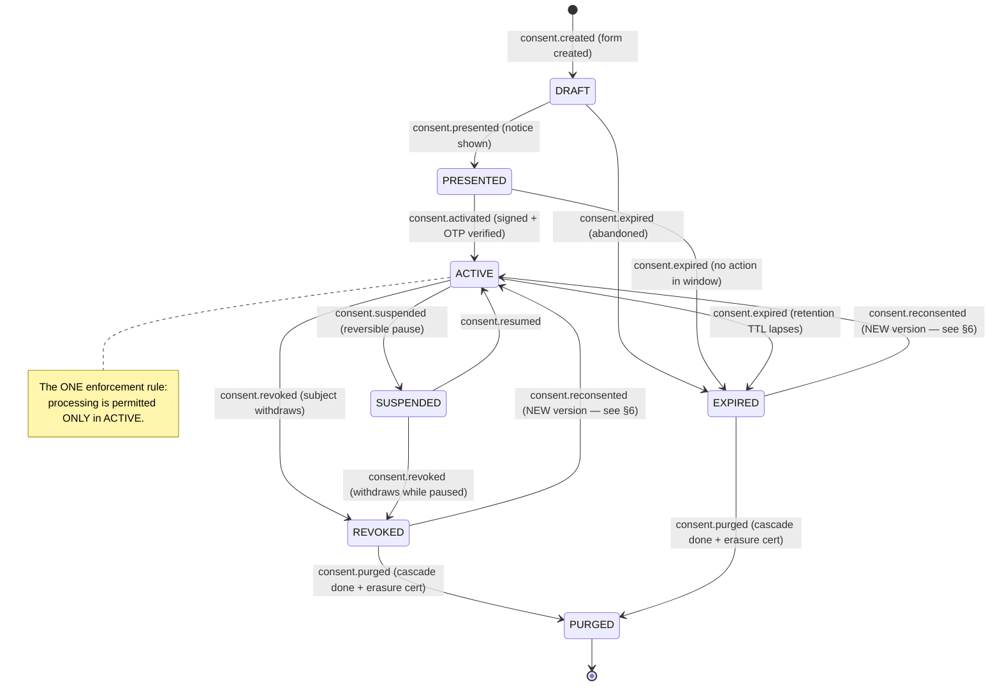
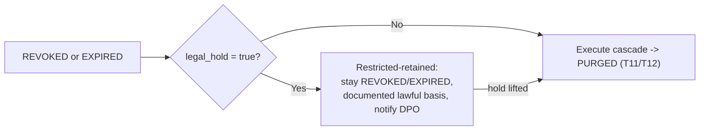
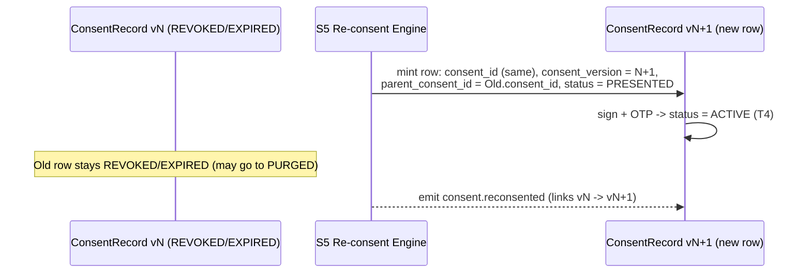
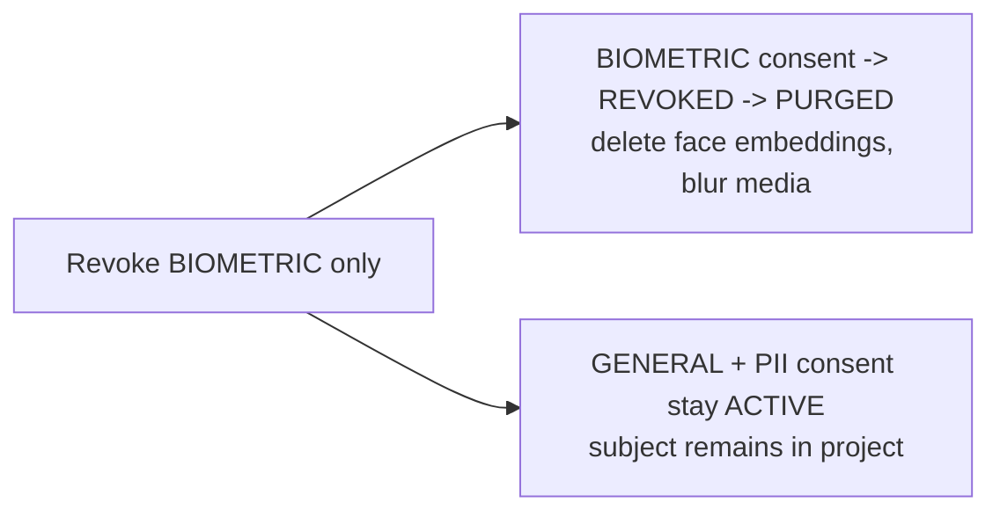
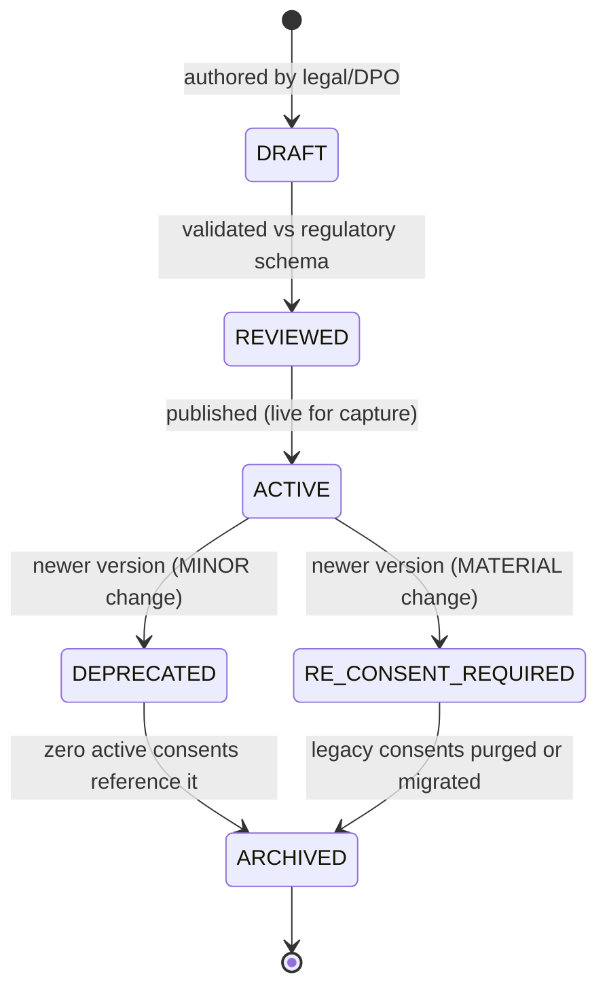

# Contract 2 — Consent State Machine

> **Aegis Agent · Team B — Dynamic Consent Enforcement Framework (S5–S8)**
> The one legal set of consent states and the only permitted transitions between them. If a module moves consent between states, it does so **only** as defined here.

| Field | Value |
|---|---|
| **Contract ID** | `TEAMB-C2-STATE-MACHINE` |
| **Version** | `1.0.0` (Week-2 baseline) |
| **Status** | **Proposed** — pending four-owner ratification |
| **Primary owner** | **S5 · Vishaal Pillay** (Dynamic Consent Management Engine) |
| **Reviewers (merge gate)** | S5 · S6 · S7 · S8 — all four required |
| **Depends on** | [`consent-data-model.md`](consent-data-model.md) (`consent_status`, `ConsentRecord`) |
| **Emits into** | [`event-audit-schema.md`](event-audit-schema.md) (every transition emits an event) |
| **Read by** | [`policy-decision-interface.md`](policy-decision-interface.md) (the `ACTIVE`-only gate) |
| **Last updated** | 2026-07-10 |

**Normative language** per [RFC 2119](https://www.rfc-editor.org/rfc/rfc2119).

---

## 1. Purpose

Consent has a **lifetime, not just a creation moment**. Capture (Worklet 1) creates it; **Team B enforces every consequence that follows when its state or scope changes.** This contract defines the finite state machine (FSM) that all four modules share. It exists because the Week-2 drafts contained **two different consent machines** (S5's and S6's) plus a **third policy-versioning machine** (S7) that risked being conflated with consent state (see [§10 Reconciliation](#10-reconciliation-notes)).

**In scope:** the 7 canonical consent states, every legal transition, its trigger, guard, actor, emitted event, and side-effects; re-consent semantics; legal-hold and tier-scoped behavior; and the *separate* notice-version lifecycle.

**Out of scope:** field shapes (→ Contract 1), the runtime allow/deny verb (→ Contract 3), event wire format (→ Contract 4).

---

## 2. The canonical consent state machine

> [!IMPORTANT]
> **The single enforcement invariant.** Processing of a subject's data is permitted **only** when the governing `ConsentRecord.status = ACTIVE`. Every other state — including `SUSPENDED` — blocks all downstream access. Contract 3's Policy Decision Interface enforces this at runtime; this contract defines when a record is *in* `ACTIVE`.

---

## 3. State catalog

| State | Meaning | Processing permitted? | Terminal? | DPDP 2023 / GDPR anchor |
|---|---|:---:|:---:|---|
| `DRAFT` | Consent form created, not yet shown to the subject. | No | No | — |
| `PRESENTED` | Notice (a specific `notice_version_id`) shown; awaiting signature + OTP. | No | No | §5 notice / Art. 13–14 |
| `ACTIVE` | Valid, current grant. **The only processing-permitted state.** | **Yes** | No | §6(1) / Art. 6–7 |
| `SUSPENDED` | Reversible pause; **data retained, processing halted.** | No | No | ≈ GDPR Art. 18 (restriction). DPDP: nearest analogue is withdrawal under §6. |
| `REVOKED` | Subject withdrew consent. Processing gated immediately; deletion cascade pending. | No | No* | §6(4)/§6(6) / Art. 7(3) |
| `EXPIRED` | Retention TTL lapsed or presentation abandoned. Deletion cascade pending. | No | No* | §8(7) / Art. 5(1)(e), 17 |
| `PURGED` | Deletion cascade complete; erasure certificate issued. Tombstone only — no PII remains. | No | **Yes** | §8(7) / Art. 17 |

\* `REVOKED` and `EXPIRED` are **not terminal**: they proceed to `PURGED`, or spawn a new `ACTIVE` lineage member via re-consent (§6).

> [!NOTE]
> **`SUSPENDED` vs `EXPIRED` is a deliberate policy choice, not an implementation detail.** `SUSPENDED` **retains** data (restriction of processing); `EXPIRED` puts the record on the path to **purge**. Choosing "suspend-and-retain" vs "expire-and-purge" for a given trigger is a governance decision recorded per project.

---

## 4. Normative transition table

This table is the **authoritative** definition. A transition not listed here is **illegal** and MUST be rejected by S5's engine. Every transition emits exactly one event (Contract 4) and is applied as an append to the event log; `ConsentRecord.status` is the projection.

| # | From | To | Trigger event | Guard (MUST hold) | Actor | Emits (Contract 4) | Side-effects |
|---|---|---|---|---|---|---|---|
| T1 | `[*]` | `DRAFT` | form created | — | Capture (W1) | `consent.created` | Row minted, `consent_version=1`. |
| T2 | `DRAFT` | `PRESENTED` | notice shown | `notice_version.status = ACTIVE` | Capture (W1) | `consent.presented` | Binds `notice_version_id`. |
| T3 | `DRAFT` | `EXPIRED` | abandonment | `now > created_at + draft_ttl` | System | `consent.expired` | Eligible for purge. |
| T4 | `PRESENTED` | `ACTIVE` | signed + verified | `otp_verified = true` **AND** `signature_hash` present **AND** notice still `ACTIVE` | Subject | `consent.activated` | `start_at := now`; retention window opens. |
| T5 | `PRESENTED` | `EXPIRED` | no action in window | `now > presented_at + presentation_ttl` (default 30d) | System | `consent.expired` | Eligible for purge. |
| T6 | `ACTIVE` | `SUSPENDED` | reversible pause | actor authorized (subject/DPO) | Subject/DPO | `consent.suspended` | Processing halts; **data retained**. |
| T7 | `SUSPENDED` | `ACTIVE` | resume | pause conditions cleared | Subject/DPO | `consent.resumed` | Processing re-permitted. |
| T8 | `ACTIVE` | `REVOKED` | subject withdraws | `otp_verified = true` (destructive-action re-auth) | Subject | `consent.revoked` | **Gate processing NOW**; open `RevocationRequest`, 24h SLA. |
| T9 | `SUSPENDED` | `REVOKED` | withdraws while paused | `otp_verified = true` | Subject | `consent.revoked` | As T8. |
| T10 | `ACTIVE` | `EXPIRED` | retention TTL lapses | `now >= expiry_at` | System (S8 scan) | `consent.expired` | Forward to purge orchestrator. |
| T11 | `REVOKED` | `PURGED` | cascade complete | `legal_hold = false` **AND** all assets processed | S5/S8 orchestrator | `consent.purged` | Issue `ErasureCertificate`. |
| T12 | `EXPIRED` | `PURGED` | cascade complete | `legal_hold = false` **AND** all assets processed | S8/S5 orchestrator | `consent.purged` | Issue `ErasureCertificate`. |
| T13 | `REVOKED` | `ACTIVE`† | re-consent | new valid grant captured | Subject | `consent.reconsented` | **New version** (§6). |
| T14 | `EXPIRED` | `ACTIVE`† | re-consent | new valid grant **AND** target data not already purged for *resurrection* | Subject | `consent.reconsented` | **New version** (§6). |

† T13/T14 do **not** mutate the `REVOKED`/`EXPIRED` row in place — see §6.

> [!CAUTION]
> **Forward-recovery, not rollback.** Deletion (`→ PURGED`) is irreversible. If a purge cascade fails unrecoverably, the `RevocationRequest.state` becomes `PARTIALLY_FAILED`, the DPO is alerted, and the record does **not** silently return to `ACTIVE`. Recovery means governance and re-attempt — never `undo`.

---

## 5. Legal hold — a guard, not a state

A **legal hold** blocks deletion even after revocation or expiry. To keep the canonical set at 7 states, legal hold is modeled as the boolean guard `ConsentRecord.legal_hold`, **not** a separate state:

- **"Restricted-retained"** = `(status ∈ {REVOKED, EXPIRED}) ∧ legal_hold = true`. The orchestrator MUST check `legal_hold` **before** applying any purge step (T11/T12 guard). When the hold lifts, the transition to `PURGED` resumes automatically.

---

## 6. Re-consent semantics — new version, never resurrection

The logical arrows T13/T14 (`REVOKED/EXPIRED → ACTIVE`) are a **lineage** operation, not a row flip. Physically:

**Rules (MUST):**
- `R1` Re-consent creates a **new** `ConsentRecord` version (Contract 1 §7); the prior record is never mutated back to `ACTIVE`.
- `R2` The new version references a **current** `notice_version_id` and a **current** `(purpose_id, purpose_version)`. Re-consent against a `DEPRECATED` notice is illegal.
- `R3` If the prior version's data was already `PURGED`, re-consent governs **future capture only** — it MUST NOT attempt to restore purged data (S5's stated policy). Crypto-shredded data is unrecoverable by design.
- `R4` `consent.reconsented` carries both `from_consent_version` and `to_consent_version` for lineage audit.

---

## 7. Tier-scoped (granular) transitions

The three tiers (`GENERAL`, `PII`, `BIOMETRIC`) are **independently revocable**. A revocation MAY target one tier; the state machine runs **per (consent lineage, tier)**:

- A `RevocationRequest.tier = NULL` revokes **all** tiers of the lineage; a non-null `tier` revokes only that tier's record. The purge cascade is **parameterized by the revoked tier** (S5 §7).

---

## 8. Concurrency, idempotency & projection

- **Event-sourced projection.** `status` is a deterministic projection of the append-only event log. Two consumers replaying the same events MUST compute the same state.
- **Idempotent transitions.** Applying the same transition event twice (same `event_id`) MUST be a no-op. Purge steps are keyed by `(job_id, asset_uuid)` (Contract 1 §6).
- **Ordered quiescing.** On T8/T9 (revocation), processing MUST be gated **before** the discovery/deletion phase begins, so no derived data is produced mid-purge.
- **Single-writer for status.** Only S5's engine writes `status` transitions; other modules request transitions via events, they do not mutate `status` directly.

---

## 9. The *separate* notice-version lifecycle (S7) — do not conflate

S7's "Policy Versioning State Machine" governs the **`NoticeVersion`** entity (Contract 1 §5.3) — a legal document's lifecycle — **not** consent state. It is included here so the two machines are never confused. Its `RE_CONSENT_REQUIRED` transition is the upstream trigger that *causes* consent-level re-consent (§6), but it is a state of a **notice**, not of a **consent**.

| Notice transition | Consent-level consequence |
|---|---|
| `ACTIVE → DEPRECATED` (MINOR) | Existing consents **remain `ACTIVE`**; capture uses the new text going forward. |
| `ACTIVE → RE_CONSENT_REQUIRED` (MATERIAL) | Emits `notice.version.published{change_type: MATERIAL}`; S5 flags affected cohorts and drives re-consent (§6). Existing consents are **not** silently invalidated — they are marked for re-consent. |

> [!NOTE]
> **Immutability principle (S7):** once a `NoticeVersion` is `ACTIVE`, its text/hash are frozen. Capture MUST bind new consents only to an `ACTIVE` notice version.

---

## 10. Reconciliation notes

### 10.1 S6's consent machine → mapped onto canonical
S6 (Srikesh.md §5) defined `REGISTERED → ACTIVE → UPDATED → EXPIRED/REVOKED → RECONSENT_REQUIRED → ACTIVE`. Mapping:

| S6 state | Canonical resolution |
|---|---|
| `REGISTERED` | Collapses into `PRESENTED` then `ACTIVE` (T2→T4). Not a separate canonical state. |
| `UPDATED` | **Not a state.** A metadata update is an `ACTIVE` self-event; a *material* change is a re-consent (new version, §6). |
| `RECONSENT_REQUIRED` | **Reclassified as a PDP decision** (Contract 3), not a consent state. It is what the engine *returns* when consent is missing/expired/revoked — the record's own state stays `EXPIRED`/`REVOKED`. |
| no `SUSPENDED` | Added — required for GDPR Art. 18 restriction. |
| no `DRAFT`/`PURGED` | Added — `DRAFT` for pre-presentation; `PURGED` for the post-erasure tombstone. |

*Action for S6:* treat `RE_CONSENT_REQUIRED` as an output verb, and read `status` from the canonical enum rather than maintaining a local biometric-only lifecycle.

### 10.2 S7's policy machine → kept, but separated
S7's versioning machine is valid and **retained** as the `NoticeVersion` lifecycle (§9). The correction is **scope**: it governs notices, not consents. S7's own SQL already used a separate `consent_records.status ∈ {ACTIVE, SUSPENDED, REVOKED, EXPIRED}` — aligned, but missing `DRAFT/PRESENTED/PURGED`; those are added by this contract.

### 10.3 S5 is the canonical basis
S5's machine (Vishaal.md §3) is adopted essentially verbatim, with two precision additions: legal hold expressed as a guard (§5) and re-consent expressed as an explicit lineage operation (§6) rather than a bare `REVOKED → ACTIVE` arrow.

---

## 11. Worked example — tap to purged (happy path)

| Step | Transition | Event | Guarantee |
|---|---|---|---|
| Subject taps *Revoke* | T8 `ACTIVE → REVOKED` | `consent.revoked` | Verified requester; processing gated immediately. |
| Quiesce + discover | (within `REVOKED`) | `revocation.discovering` | No derived data mid-purge. |
| Per-asset delete/crypto-shred | (within `REVOKED`) | `revocation.asset_purged` (per asset) | Idempotent, tier-scoped, hold-aware. |
| Cascade complete | T11 `REVOKED → PURGED` | `consent.purged` + `ErasureCertificate` | Tamper-evident proof, within 24h SLA. |

---

## 12. Change control & version history

Changes require the **four-owner** merge gate. A new/removed state or transition is a **major** bump (every module's FSM logic changes). Adding a guard clarification is **minor**.

| Version | Date | Change | Author |
|---|---|---|---|
| 1.0.0 | 2026-07-10 | Canonical 7-state machine; reconciled S5/S6/S7; legal-hold-as-guard; re-consent-as-new-version; separated notice lifecycle. | S5 · Vishaal Pillay |
