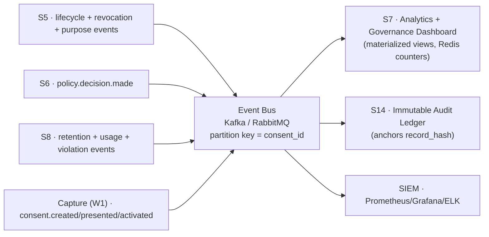

# Contract 4 — Event & Audit Schema

> **Aegis Agent · Team B — Dynamic Consent Enforcement Framework (S5–S8)**
> The one wire format for every event the engine emits, and the tamper-evident hash chain that makes the audit trail provable. S5/S6/S8 **produce**; S7 dashboards and the S14 ledger **consume**.

| Field | Value |
|---|---|
| **Contract ID** | `TEAMB-C4-EVENT-AUDIT` |
| **Version** | `1.0.0` (Week-2 baseline) |
| **Status** | **Proposed** — pending four-owner ratification |
| **Primary owner** | **S7 · Nilesh Pratap Singh Deora** (Governance & Analytics) |
| **Co-author of hash design** | **S5 · Vishaal Pillay** (AuditHash critique adopted here) |
| **Reviewers (merge gate)** | S5 · S6 · S7 · S8 — all four required |
| **Depends on** | [`consent-data-model.md`](consent-data-model.md), [`consent-state-machine.md`](consent-state-machine.md), [`policy-decision-interface.md`](policy-decision-interface.md) |
| **Last updated** | 2026-07-10 |

**Normative language** per [RFC 2119](https://www.rfc-editor.org/rfc/rfc2119).

---

## 1. Purpose

The four modules are decoupled through **events**: state transitions (Contract 2), policy decisions (Contract 3), and retention/usage actions all emit events onto a shared bus. S7 turns them into dashboards and compliance metrics; S14 anchors them in an immutable ledger. This contract fixes **one** envelope and **one** hashing standard so that:

1. Every producer emits the **same** event shape.
2. The audit trail is **tamper-evident** — any alteration is mathematically detectable.
3. The trail is **erasure-safe** — it can honor "right to be forgotten" while remaining immutable, because it carries **no PII** (S5's Problem 1).

**In scope:** event envelope, event-type catalog, hashing/chaining standard, delivery semantics, consumer contracts, verification.

**Out of scope:** entity storage (Contract 1), transition legality (Contract 2), the decision verb (Contract 3), dashboard UI layout (S7 implementation).

---

## 2. Design principles (normative)

1. **Tokens only — never PII.** Every event and audit record carries opaque identifiers, hashes, and enums **only**. Raw biometric/PII payloads and object bytes MUST NOT appear in events (S5 §5). This is what makes the immutable ledger exempt from erasure.
2. **Append-only + hash-chained.** Audit records are never updated or deleted; each chains to its predecessor (§6).
3. **At-least-once delivery, idempotent consumers.** The bus MAY redeliver; consumers MUST deduplicate on `event_id`.
4. **Producer-authoritative.** The module that owns the state change is the sole producer of its events (Contract 1 §6 ownership matrix).
5. **Schema-versioned.** Each event carries `event_version`; consumers MUST tolerate unknown optional fields (forward-compatible).

---

## 3. Canonical event envelope

Every event on the bus MUST conform to this envelope (CloudEvents-aligned). Event-specific data goes in `payload` (tokens only).

```json
{
  "event_id": "e7c1a9d2-0b34-4c56-9a78-1b2c3d4e5f60",
  "event_type": "consent.revoked",
  "event_version": "1.0",
  "occurred_at": "2026-07-10T10:30:00Z",
  "producer": "s5",
  "project_id": "cmp-multimodal-2026",
  "subject_id": "b1d9e2a0-5c11-4a3e-8f2b-0a1c2d3e4f50",
  "consent_id": "8f4b1c22-0e2a-4f7d-9a1e-2c3b4d5e6f70",
  "consent_version": 2,
  "purpose_id": "0a1b2c3d-4e5f-6071-8293-a4b5c6d7e8f9",
  "purpose_version": 3,
  "notice_version_id": "d4c3b2a1-0000-4a5b-9c8d-7e6f5a4b3c2d",
  "asset_uuid": null,
  "status": "REVOKED",
  "correlation_id": "rev-1771...",
  "causation_id": "e6b0...(the event that caused this)",
  "trace_id": "00-4bf92f...-01",
  "payload": { "tier": "BIOMETRIC", "sla_deadline": "2026-07-11T10:30:00Z" },
  "prev_record_hash": "9f2c...64hex",
  "record_hash": "a3f5...64hex"
}
```

| Field | Type | Req | Notes |
|---|---|:--:|---|
| `event_id` | UUID | ✔ | Idempotency key; unique per event. |
| `event_type` | enum (§5) | ✔ | Dotted, `domain.action`. |
| `event_version` | string | ✔ | Semver of the payload schema. |
| `occurred_at` | RFC 3339 UTC | ✔ | Producer clock; monotonic per `consent_id`. |
| `producer` | `s5·s6·s7·s8·capture·s14` | ✔ | Emitting module. |
| `project_id` | string | ✔ | Tenancy/scoping. |
| `subject_id` | UUID (token) | ✔ | Never raw PII. |
| `consent_id` / `consent_version` | UUID / int | ✔ | Partition key = `consent_id`. |
| `purpose_id` / `purpose_version` | UUID / int | ◐ | When applicable. |
| `notice_version_id` | UUID | ◐ | When applicable. |
| `asset_uuid` | UUID | ◐ | Per-asset events (purge/usage). |
| `status` | `consent_status` | ◐ | Lifecycle events. |
| `correlation_id` | string | ✔ | Ties saga steps / a request chain together. |
| `causation_id` | string | ◐ | The event/command that caused this one. |
| `trace_id` | W3C traceparent | ◐ | Distributed tracing. |
| `payload` | object | ✔ | Event-specific, tokens only. |
| `prev_record_hash` / `record_hash` | 64-hex | ✔ | Hash chain (§6). |

---

## 4. Producer → consumer topology



- **Topic naming:** `aegis.teamb.<domain>` (e.g. `aegis.teamb.consent`, `aegis.teamb.revocation`, `aegis.teamb.retention`, `aegis.teamb.policy`, `aegis.teamb.usage`).
- **Partitioning:** by `consent_id` — guarantees per-consent ordering (required for correct state projection).
- **DLQ:** a poison event routes to `aegis.teamb.<domain>.dlq` after N retries; DLQ depth is a dashboard alert.

---

## 5. Event-type catalog

The **closed** set of Team-B event types. Adding a type is a minor bump; renaming/removing is major.

| `event_type` | Producer | Emitted when (Contract ref) | Key `payload` fields |
|---|---|---|---|
| `consent.created` | capture | T1 (C2) | `consent_tier` |
| `consent.presented` | capture | T2 | `notice_version_id` |
| `consent.activated` | capture | T4 | `start_at` |
| `consent.suspended` | S5 | T6 | `reason` |
| `consent.resumed` | S5 | T7 | — |
| `consent.revoked` | S5 | T8/T9 | `tier`, `sla_deadline` |
| `consent.expired` | S5/S8 | T3/T5/T10 | `cause` (`abandon`/`ttl`) |
| `consent.purged` | S5/S8 | T11/T12 | `erasure_certificate_id`, `method` |
| `consent.reconsented` | S5 | T13/T14 | `from_consent_version`, `to_consent_version` |
| `purpose.changed` | S5 | C1 §5.4 rebind | `old_purpose_version`, `new_purpose_version` |
| `revocation.requested` | S5 | saga start (C2 §11) | `revocation_id`, `tier` |
| `revocation.discovering` | S5 | asset discovery | `revocation_id` |
| `revocation.asset_purged` | S5/S8 | per asset | `revocation_id`, `asset_uuid`, `method` |
| `revocation.completed` | S5 | cascade done | `revocation_id`, `erasure_certificate_id` |
| `revocation.partially_failed` | S5 | unrecoverable step (C2 caution) | `revocation_id`, `failed_asset_uuid`, `escalated_to` |
| `policy.decision.made` | S6 | every PDP call (C3 §4) | `decision`, `reason_code`, `obligations`, `decision_id` |
| `retention.nearing_expiry` | S8 | scan threshold | `expiry_at` |
| `retention.expired` | S8 | TTL lapse | `retention_job_id` |
| `retention.purged` | S8 | retention purge done | `erasure_certificate_id`, `storage_tier` |
| `purpose.violation.detected` | S8 | purpose mismatch (C3 rung 5) | `declared_purpose_id`, `bound_purpose_id`, `action` |
| `usage.recorded` | S8 | every data access | `access_action`, `accessor_type`, `result_action` |
| `notice.version.published` | S7 | notice lifecycle (C2 §9) | `notice_version_id`, `change_type` |
| `contract.updated` | any | contract merge (C1 §13) | `contract_id`, `from_version`, `to_version` |

---

## 6. The tamper-evident audit hash chain

### 6.1 Why the source XOR scheme was replaced (S5's critique, adopted)

> [!WARNING]
> **Original (source deck):** `AuditHash = hash(SubjectList ⊕ ConsentStatus ⊕ ProjectID ⊕ MediaID)`.
> XOR (⊕) is **commutative and associative**, so field ordering is lost (Subject, Status, Project become interchangeable) and identical inputs cancel — the binding is cryptographically weak and forgeable.

### 6.2 Canonical event hash (length-prefixed, domain-separated)

Let `LP(x) = uint32_be(bytelen(x)) ‖ utf8(x)`, with `NULL` encoded as `uint32_be(0xFFFFFFFF)` (distinct from empty string `LP("")`). Let `DS = "AEGIS-TEAMB-AUDIT-EVENT-v1"`.

```
event_hash = SHA256(
    LP(DS)              ‖
    LP(event_id)        ‖ LP(event_type)      ‖ LP(event_version) ‖
    LP(occurred_at)     ‖ LP(producer)        ‖ LP(project_id)    ‖
    LP(subject_id)      ‖ LP(consent_id)      ‖ LP(consent_version) ‖
    LP(status)          ‖ LP(purpose_id)      ‖ LP(purpose_version) ‖
    LP(notice_version_id) ‖ LP(asset_uuid)    ‖
    LP(canonical_json(payload))
)
```

`canonical_json` = RFC 8785 (JCS) canonicalization: keys sorted, no insignificant whitespace, canonical number/string forms.

### 6.3 Record chaining (whole-ledger tamper-evidence)

```
DS_CHAIN        = "AEGIS-TEAMB-AUDIT-CHAIN-v1"
record_hash[0]  = SHA256( LP(DS_CHAIN) ‖ LP(event_hash[0]) ‖ LP(GENESIS) )   # GENESIS = 64 hex zeros
record_hash[n]  = SHA256( LP(DS_CHAIN) ‖ LP(event_hash[n]) ‖ LP(record_hash[n-1]) )
```

Each record chains to the previous, so altering any historical event invalidates **every** subsequent `record_hash` — the whole chain is tamper-evident, not just individual rows. The `ConsentRecord.record_hash` (Contract 1) and `UsageRecord.usage_hash` (Contract 1 §5.6) use this same construction over their own per-entity chains.

> [!NOTE]
> **This resolves the S5↔S7 divergence.** S5's preimage used `MediaID`; S7's used `VersionID`. The canonical preimage above includes **both** `asset_uuid` (media) **and** `notice_version_id` (version) in a fixed field order — no field is dropped and ordering is pinned, so both prior schemes are subsumed unambiguously.

### 6.4 Erasure vs. immutability (S5's Problem 1, formalized)
Because the chain stores **only** hashes/tokens/certificate references — never PII — a subject can be fully erased from the data plane while the audit chain remains immutable and complete. **You delete the data and keep the proof.** The ledger is not "personal data" and is therefore not itself subject to erasure.

---

## 7. Delivery semantics & ordering

- **At-least-once** delivery; consumers dedupe on `event_id`. Effective once-per-effect via idempotent handlers.
- **Per-`consent_id` ordering** guaranteed by partition key. Cross-consent ordering is **not** guaranteed; consumers MUST rely on `occurred_at` + `causation_id`, not arrival order, for cross-entity reasoning.
- **Backpressure:** producers MUST NOT block their synchronous path on emit (Contract 3 latency budget). Emit asynchronously after the authoritative DB write; the DB is the source of truth, the bus is propagation (S6 consistency rule).

---

## 8. Consumer contracts

### 8.1 S7 — analytics & governance dashboard
- Consumes all topics; maintains **materialized views** + Redis counters for a <2s dashboard (S7's target).
- Computes the platform KPIs from the event stream:
  - **Consent Capture Efficiency** = signed / attempted.
  - **Systemic Purge Accuracy** = assets purged / assets bound to invalidated consents (target ≥ 98% traceability).
  - **SLA Delta** = `T(consent.purged) − T(consent.revoked)` MUST be ≤ 24h.
- **Data-minimization rule (S7):** dashboards/exports display anonymized metadata, structural counters, and hash evidence **only** — never raw PII.
- **OQ (Contract 1 OQ-4):** whether S7 **pulls** raw `usage.recorded` events or S8 **pushes** pre-aggregates is unresolved; this contract supports both (S7 may subscribe directly, or S8 may emit `usage.aggregate`).

### 8.2 S14 — immutable audit ledger
- Anchors `record_hash` values (Merkle-batched) into the immutable ledger for external-auditor verification. Stores hashes only.

---

## 9. Verifying the chain

A verifier (auditor view) recomputes, for each record in order:
1. `event_hash' = SHA256(...)` from the stored envelope fields (§6.2).
2. `record_hash' = SHA256(LP(DS_CHAIN) ‖ LP(event_hash') ‖ LP(prev_record_hash))`.
3. Assert `record_hash' == stored record_hash`. Any mismatch flags the row (and all successors) as **COMPROMISED** (S7's "Compromised" UI flag).

Because hashing is length-prefixed and domain-separated, no reordering, truncation, or field-substitution attack can produce a colliding preimage.

---

## 10. Reconciliation notes

| Divergence | Source | Resolution |
|---|---|---|
| Weak XOR AuditHash | source deck (flagged by S5 §8) | Replaced by length-prefixed, domain-separated SHA-256 + record chaining. |
| Hash preimage field set differs (`MediaID` vs `VersionID`) | S5 §8 vs S7 §8 | Canonical preimage includes **both** `asset_uuid` and `notice_version_id` in fixed order (§6.2). |
| S6 `AuditLog(audit_id, consent_id, event_type, event_time, performed_by)` | S6 §8 | Mapped onto the envelope: `event_time→occurred_at`, `performed_by→payload.actor` (tokenized). S6 keeps its local table as the projection; the **wire format** is this envelope. |
| S8 `UsageRecord` hash-chained | S8 §6 | Uses the §6.3 chaining construction; emitted as `usage.recorded`. |
| S7 length-prefixed hash already partially adopted | S7 §8 | Superseded by the unified §6 spec with explicit domain separation + null encoding. |
| Event names ad hoc across docs (`POLICY_UPDATED_MINOR`, etc.) | S7 §4 | Normalized to the dotted catalog (§5): e.g. `notice.version.published{change_type: MINOR}`. |

---

## 11. DPDP 2023 / GDPR mapping

| Obligation | DPDP 2023 | GDPR | Event/audit support |
|---|---|---|---|
| Accountability / records of processing | §8 | Art. 5(2), Art. 30 | full append-only event history + `usage.recorded` |
| Demonstrable consent | §6 | Art. 7(1) | `consent.*` lifecycle chain, hash-verifiable |
| Proof of erasure | §8(7) | Art. 17 | `consent.purged` + `ErasureCertificate` + chain |
| Breach notification evidence | **§8(6)** | Art. 33/34 | `purpose.violation.detected`, tamper-evident logs |
| Security safeguards | §8(5) | Art. 32 | tokens-only, hash chain, immutable ledger |

> [!NOTE]
> Corrects the drafts: DPDP breach notification is **§8(6)** (S8's draft cited §17 — that is exemptions) and there is no standalone "retention §13" (that is grievance redressal; retention lives in **§8(7)** + DPDP Rules 2025 Rule 8).

---

## 12. Change control & version history

Four-owner merge gate. Changing the envelope, the hash construction, or removing an event type is **major**. Adding an event type or optional payload field is **minor**.

| Version | Date | Change | Author |
|---|---|---|---|
| 1.0.0 | 2026-07-10 | Canonical envelope; full event catalog; unified length-prefixed hash chain (resolves S5↔S7); consumer contracts for S7/S14; corrected DPDP citations. | S7 · Nilesh (hash design w/ S5 · Vishaal) |
