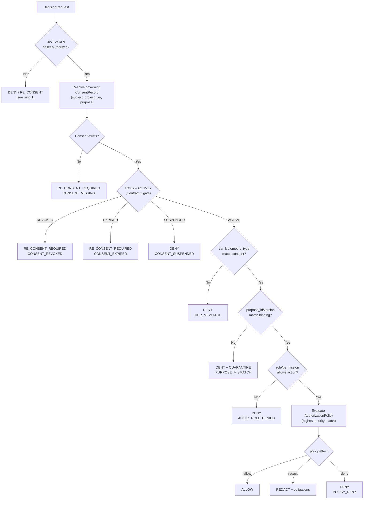

# Contract 3 — Policy Decision Interface

> **Aegis Agent · Team B — Dynamic Consent Enforcement Framework (S5–S8)**
> The one "is this action allowed?" contract. Any service that touches consented data asks **this** interface and obeys the answer.

| Field | Value |
|---|---|
| **Contract ID** | `TEAMB-C3-PDP` |
| **Version** | `1.0.0` (Week-2 baseline) |
| **Status** | **Proposed** — pending four-owner ratification |
| **Primary owner** | **S6 · Srikesh Praveen** (Policy Decision Engine) |
| **Reviewers (merge gate)** | S5 · S6 · S7 · S8 — all four required |
| **Depends on** | [`consent-data-model.md`](consent-data-model.md), [`consent-state-machine.md`](consent-state-machine.md) (`ACTIVE` gate) |
| **Emits into** | [`event-audit-schema.md`](event-audit-schema.md) (`policy.decision.made`) |
| **Called by** | S5 (re-consent verdicts), S8 (`checkPurpose` at point of use), any authorized pipeline/service |
| **Last updated** | 2026-07-10 |

**Normative language** per [RFC 2119](https://www.rfc-editor.org/rfc/rfc2119).

---

## 1. Purpose

This is the **Policy Decision Point (PDP)** for the whole enforcement engine. A service that wants to `READ`, `TRANSFORM`, `TRAIN`, `EXPORT`, or `DELETE` a subject's data submits a **DecisionRequest** describing *who* wants to do *what* to *which resource for what purpose*, and receives a **DecisionResponse** it MUST obey. Enforcement (the Policy Enforcement Point, PEP) is the caller's responsibility; **this contract defines the decision, not the enforcement mechanism.**

The interface is designed so that no downstream service reimplements consent logic locally — a privacy risk S6 explicitly calls out. There is exactly **one** way to ask "is this allowed?".

**In scope:** request/response schema, the decision verb + obligations, the deterministic evaluation algorithm, reason codes, latency/caching rules, and the error model.

**Out of scope:** how a caller applies `REDACT` to pixels (PEP concern), how S5 runs the purge saga (Contract 2), field shapes (Contract 1), event wire format (Contract 4).

---

## 2. The decision verb (canonical) + obligations

A decision has **two** parts: a **verb** (what the caller may do) and zero-or-more **obligations** (what the caller MUST additionally do). This two-part shape is the key correction to S6's flat 5-value list (see [§11](#11-reconciliation-notes)).

### 2.1 Decision verbs — closed set

| Verb | Meaning | Caller MUST |
|---|---|---|
| `ALLOW` | Consent + policy checks passed. | Proceed with the requested action. |
| `DENY` | A check failed (purpose, tier, role, status). | Block the action; surface nothing. |
| `REDACT` | Access permitted **only** through a privacy transformation. | Apply the obligations (e.g. blur face) before use. |
| `RE_CONSENT_REQUIRED` | Consent is missing, expired, revoked, or bound to a superseded notice/purpose. | Block; route the subject to re-consent (Contract 2 §6). |

> [!IMPORTANT]
> **`DELETE` is not a decision verb.** S6's draft listed `DELETE` as a decision outcome. Deletion is an **enforcement action / obligation**, not an answer to "may I access this?". A request whose `requested_action = DELETE` is still answered with `ALLOW`/`DENY`; the *act* of deletion is orchestrated by S5 (revocation) or S8 (retention) per Contract 2. `MASK` (S6) is renamed **`REDACT`** to match the team README's vocabulary; `MASK` is accepted as a deprecated alias on input only.

### 2.2 Obligations — extensible set

Returned in `obligations[]`; each has a `type` and optional `params`.

| Obligation `type` | Attached to | Meaning |
|---|---|---|
| `REDACT_FACE` | `REDACT` | Blur/replace face regions before serving (biometric tier). |
| `REDACT_PII` | `REDACT` | Mask PII spans (text/audio). |
| `MASK_REGION` | `REDACT` | Mask a caller-specified region; `params.regions`. |
| `QUARANTINE_ASSET` | `DENY` | Move the asset to quarantine (purpose violation). |
| `ROUTE_RECONSENT` | `RE_CONSENT_REQUIRED` | Emit a re-consent request for the subject/cohort. |
| `LOG_ELEVATED` | any | Write an elevated-sensitivity `UsageRecord` (Contract 1 §5.6). |

---

## 3. DecisionRequest schema

```json
{
  "request_id": "5c2e...uuid",
  "subject_id": "b1d9e2a0-5c11-4a3e-8f2b-0a1c2d3e4f50",
  "project_id": "cmp-multimodal-2026",
  "consent_id": "8f4b1c22-0e2a-4f7d-9a1e-2c3b4d5e6f70",
  "consent_tier": "BIOMETRIC",
  "biometric_type": "FACE",
  "purpose_id": "0a1b2c3d-4e5f-6071-8293-a4b5c6d7e8f9",
  "purpose_version": 3,
  "requested_action": "READ",
  "resource": { "asset_uuid": "9a8b...", "object_ref": "s3://biometric-media/usr/face-001" },
  "caller": {
    "service_id": "training-pipeline-svc",
    "roles": ["ml.trainer"],
    "permissions": ["biometric.read"],
    "token_sub": "b1d9e2a0-...  (from JWT)"
  }
}
```

**Field rules (MUST):**
- `purpose_id` + `purpose_version` are **required** and versioned — never a free-text purpose string (Contract 1 §2).
- `caller.token_sub` MUST be derived from a validated Keycloak JWT. The engine MUST NOT trust `subject_id` blindly when a token claim binds the caller to a subject (S6 secure-API rule).
- `consent_id` MAY be omitted; the engine resolves the governing consent from `(subject_id, project_id, consent_tier, purpose_id)` using the live-consent uniqueness index (Contract 1 INV-5).

---

## 4. DecisionResponse schema

```json
{
  "decision_id": "DEC-9001-uuid",
  "request_id": "5c2e...uuid",
  "decision": "REDACT",
  "reason_code": "POLICY_REDACT_BIOMETRIC",
  "obligations": [ { "type": "REDACT_FACE", "params": { "method": "gaussian" } } ],
  "consent_version_evaluated": 2,
  "policy_id": "pol-77-uuid",
  "evaluated_at": "2026-07-10T10:31:00Z",
  "audit_id": "AUD-3001-uuid",
  "cacheable": true,
  "cache_ttl_seconds": 30
}
```

**Response rules (MUST):**
- The response MUST be **deterministic**: identical request context + identical stored state ⇒ identical decision (S6 determinism requirement). This makes decisions testable and incident-reconstructable.
- Every decision MUST be persisted (`PolicyDecision`, Contract 1 §5.7) and emit `policy.decision.made` (Contract 4) **before** the caller acts.
- `consent_version_evaluated` pins exactly which consent version produced the verdict (lineage-safe audit).

---

## 5. Deterministic evaluation algorithm

The engine evaluates in this **fixed order** and returns at the first decisive rung (fail-closed):



**Normative steps:**
1. **Authenticate & authorize the caller.** Invalid/expired JWT ⇒ this is an **error**, not a decision (see §8) — respond `401`. A valid caller lacking the action permission ⇒ `DENY / AUTHZ_ROLE_DENIED`.
2. **Resolve consent.** No governing consent ⇒ `RE_CONSENT_REQUIRED / CONSENT_MISSING`.
3. **State gate (Contract 2).** Only `ACTIVE` proceeds. `REVOKED`/`EXPIRED` ⇒ `RE_CONSENT_REQUIRED`; `SUSPENDED` ⇒ `DENY / CONSENT_SUSPENDED`; `legal_hold` restricted ⇒ `DENY / LEGAL_HOLD_RESTRICTED`.
4. **Tier match.** `consent_tier` (and `biometric_type` when biometric) MUST match ⇒ else `DENY / TIER_MISMATCH`.
5. **Purpose match.** `(purpose_id, purpose_version)` MUST match the active `ConsentPurposeBinding` ⇒ else `DENY / PURPOSE_MISMATCH` + `QUARANTINE_ASSET` (records a `PurposeViolationRecord`, Contract 1 §5.6).
6. **Role/permission.** Caller must be permitted for `requested_action` ⇒ else `DENY / AUTHZ_ROLE_DENIED`.
7. **Policy effect.** The highest-`priority` matching `AuthorizationPolicy` yields `ALLOW` / `REDACT` (+obligations) / `DENY`.

> [!CAUTION]
> **Fail-closed.** Any unhandled condition, missing data, or internal ambiguity MUST resolve to `DENY`. Absence of an explicit `ALLOW` is a `DENY`.

---

## 6. Decision matrix (reconciled from S6)

| `status` | Purpose match | Tier match | Role OK | Policy effect | Decision |
|---|:---:|:---:|:---:|---|---|
| `ACTIVE` | Yes | Yes | Yes | allow | `ALLOW` |
| `ACTIVE` | Yes | Yes | Yes | redact | `REDACT` |
| `ACTIVE` | No | — | — | any | `DENY` (PURPOSE_MISMATCH) |
| `ACTIVE` | Yes | No | — | any | `DENY` (TIER_MISMATCH) |
| `ACTIVE` | Yes | Yes | No | any | `DENY` (AUTHZ_ROLE_DENIED) |
| `SUSPENDED` | any | any | any | any | `DENY` (CONSENT_SUSPENDED) |
| `EXPIRED` | any | any | any | any | `RE_CONSENT_REQUIRED` |
| `REVOKED` | any | any | any | any | `RE_CONSENT_REQUIRED` |
| missing | any | any | any | any | `RE_CONSENT_REQUIRED` |
| `REVOKED`/`EXPIRED` + `legal_hold` | any | any | any | any | `DENY` (LEGAL_HOLD_RESTRICTED) |

---

## 7. Reason-code catalog

| `reason_code` | Verb | Meaning |
|---|---|---|
| `CONSENT_ACTIVE_PURPOSE_AUTHORIZED` | `ALLOW` | All checks passed. |
| `POLICY_REDACT_BIOMETRIC` / `POLICY_REDACT_PII` | `REDACT` | Access only via transformation. |
| `CONSENT_MISSING` | `RE_CONSENT_REQUIRED` | No governing consent found. |
| `CONSENT_EXPIRED` | `RE_CONSENT_REQUIRED` | Retention TTL lapsed. |
| `CONSENT_REVOKED` | `RE_CONSENT_REQUIRED` | Subject withdrew. |
| `CONSENT_SUSPENDED` | `DENY` | Processing paused (restriction). |
| `PURPOSE_MISMATCH` | `DENY` | Declared purpose ≠ bound purpose. |
| `TIER_MISMATCH` | `DENY` | Tier/biometric type mismatch. |
| `AUTHZ_ROLE_DENIED` | `DENY` | Caller lacks permission. |
| `LEGAL_HOLD_RESTRICTED` | `DENY` | Under legal hold; access restricted. |
| `POLICY_DENY` | `DENY` | Matching policy's effect is deny. |

---

## 8. Errors vs decisions — a hard boundary

A **decision** (`ALLOW/DENY/REDACT/RE_CONSENT_REQUIRED`) means the engine successfully evaluated. An **error** means it could not. These MUST NOT be conflated:

| HTTP | Condition | Body |
|---|---|---|
| `200` | A decision was produced (including `DENY`). | `DecisionResponse` |
| `400` / `422` | Malformed request / schema validation failed. | `ErrorResponse` |
| `401` | Missing/invalid/expired JWT. | `ErrorResponse` |
| `403` | Caller not permitted to call the PDP at all. | `ErrorResponse` |
| `503` | Engine cannot reach the consent store (fail-closed; caller MUST treat as `DENY`). | `ErrorResponse` |

> A `DENY` is a **successful** `200` response. Returning `403` for a policy denial is a contract violation — `403` is only for "you may not call this API".

---

## 9. Determinism, latency & caching

- **Determinism (MUST):** decisions are a pure function of `(request context, stored consent state, stored policies)`. No wall-clock nondeterminism except the `ACTIVE` expiry check, which uses the consent's `expiry_at`.
- **Latency budget (SHOULD):** synchronous decision path p99 **< 50 ms**, excluding any media transformation (which is PEP-side, post-decision). Keep the path to: validate JWT → load consent (indexed) → load policy → evaluate → persist+emit.
- **Caching (MAY):** a decision MAY be cached for `cache_ttl_seconds` (default ≤ 30s) **only** if `cacheable = true`. The cache MUST be invalidated immediately on any `consent.revoked`, `consent.suspended`, `consent.expired`, or `notice.version.published{MATERIAL}` event (Contract 4). Revocation MUST take effect on the very next decision — stale-allow after revocation is the failure mode this rule exists to prevent.

---

## 10. API surface & consumer bindings

### 10.1 REST (S6-hosted)
```
POST /api/v1/authorize        # evaluate + return DecisionResponse (unifies S6's /policy/evaluate + /enforcement/evaluate)
GET  /api/v1/decisions/{id}   # retrieve a persisted PolicyDecision
```
Auth: `Authorization: Bearer <keycloak_jwt>`. JSON in/out. OpenAPI generated by FastAPI.

### 10.2 S8 binding — `checkPurpose`
S8's `checkPurpose(asset_uuid, purpose_id, purpose_version) → allow|block` is a **specialization** of `POST /api/v1/authorize` with `requested_action = READ|TRANSFORM|TRAIN` and `resource.asset_uuid` set. `block` ≙ `DENY|RE_CONSENT_REQUIRED`. S8 MUST call the PDP rather than reimplement purpose logic locally.

### 10.3 S5 binding — re-consent routing
When the PDP returns `RE_CONSENT_REQUIRED`, the `ROUTE_RECONSENT` obligation causes an event that S5's Re-consent Engine consumes to drive Contract 2 §6. S6 decides; **S5 orchestrates the re-consent workflow.**

---

## 11. Reconciliation notes

| Divergence | Source | Resolution |
|---|---|---|
| Flat 5-value decision set incl. `DELETE` | S6 §6 | Split into **verb** (`ALLOW/DENY/REDACT/RE_CONSENT_REQUIRED`) + **obligations**. `DELETE` is an enforcement action (S5/S8, Contract 2), not a decision verb. |
| `MASK` naming | S6 §6 | Renamed `REDACT` (matches README + S5 "redact/anonymize"). `MASK` accepted as deprecated input alias. |
| Free-text `purpose` in evaluation | S6 §6 | Keyed on `(purpose_id, purpose_version)` (Contract 1 §2). |
| `RE_CONSENT_REQUIRED` as a consent *state* | S6 §5 | It is a **decision output** here; the record's own state stays `EXPIRED/REVOKED` (Contract 2 §10.1). |
| Denial returned as `403` | S6 §9 status codes | Corrected: policy denial is `200` + `DENY`; `403` is reserved for "may not call the PDP". |
| Enforcement logged *after* access | S6 §7 warning (already correct) | Reaffirmed: decision persisted + emitted **before** the caller acts. |

---

## 12. DPDP 2023 / GDPR mapping

| Principle | DPDP 2023 | GDPR | PDP behavior |
|---|---|---|---|
| Purpose limitation | §6 | Art. 5(1)(b) | `PURPOSE_MISMATCH → DENY` + quarantine |
| Cease processing on withdrawal | §6(6) | Art. 7(3) | `REVOKED → RE_CONSENT_REQUIRED`; cache invalidated on revoke |
| Restriction of processing | (≈ §6 withdrawal) | Art. 18 | `SUSPENDED → DENY` |
| Data minimization | §6/§8 | Art. 5(1)(c) | `REDACT` serves least-exposure data |
| Accountability / auditability | §8 | Art. 5(2), 30 | every decision persisted + `policy.decision.made` emitted |

---

## 13. Change control & version history

Four-owner merge gate. Adding a reason code/obligation is **minor**; changing a decision verb, the evaluation order, or the error/decision boundary is **major**.

| Version | Date | Change | Author |
|---|---|---|---|
| 1.0.0 | 2026-07-10 | Verb+obligations model; deterministic ordered algorithm; fail-closed; error/decision boundary; S5/S8 bindings; reconciled S6 draft. | S6 · Srikesh Praveen |
